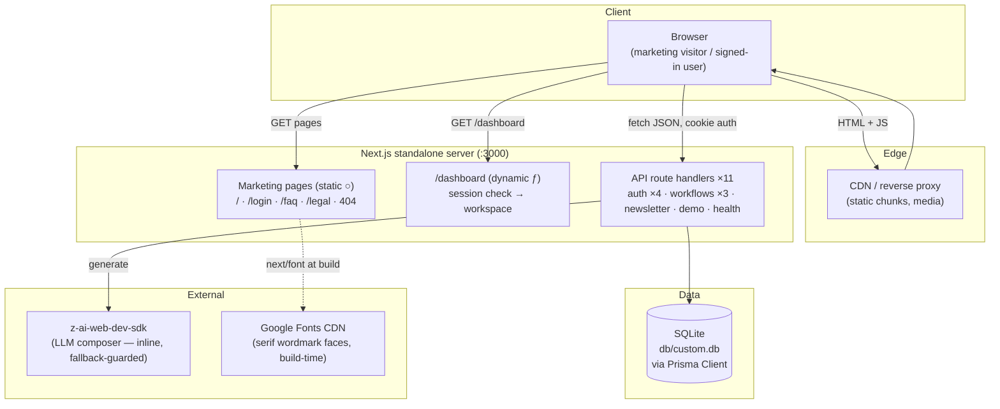
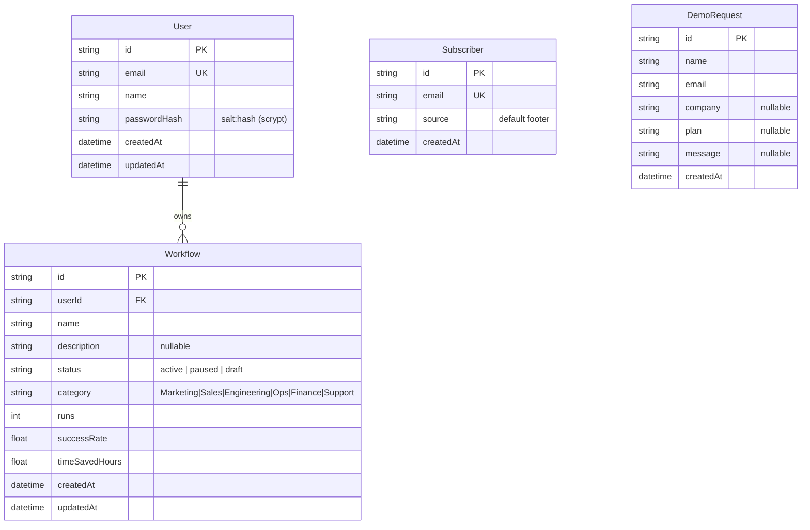

# SAAS Company — Master Project Architecture Document (PAD) v1.0

**Classification:** Internal Engineering Reference
**Status:** DEFINITIVE, PRODUCTION-LOCKED BLUEPRINT
**Companion Documents:** `README.md` (user-facing), `CLAUDE.md` (agent contract), `AGENTS.md` (operator notes)
**Last Updated:** 2026-10-09
**Audience:** Senior Engineers, Tech Leads, DevOps, and Onboarding Engineers
**Rule:** Every architectural decision in this document traces to a specific rationale. Nothing is here "because it's popular."

#### Revision Block — v1.0

- `[NOTE]` **Session 17 remediation (2026-10-08)** — an account-enumeration-
  timing + registration-concurrency + registration-access-control +
  deployment-artifact audit (the first survey of the TIMING side of the
  auth envelope — an identical 401 can still leak existence through
  latency (CWE-208); the first survey of the RACE class on the write
  paths — a TOCTOU window between findUnique and create; the PAD §10
  open registration item, the ledger's oldest MEDIUM; and the §10
  Dockerfile item — see `docs/remediation-plan-session17.md` F1–F4 →
  R1–R5) found and fixed four defects: **the login timing side-channel**
  (probed: the unknown-email path answered in ~3.5ms while the
  wrong-password path burned ~34ms of scrypt — a 9.8x median delta
  behind an otherwise byte-identical 401 INVALID_CREDENTIALS envelope;
  now `dummyPasswordHash()` in `src/lib/auth.ts` — a module-init
  salt:hash decoy whose fixed scrypt cost the login route burns
  unconditionally (`storedHash = user?.passwordHash ?? dummyPasswordHash()`)
  so the timing profile is flat — post-fix probe ratio 1.0x, pinned by
  the suite's first timing pin: 7+7 curl medians under 2.5x — D83);
  **the register TOCTOU race** (probed with 10 truly-parallel
  independent-socket POSTs — undici's single-socket pool SERIALIZES and
  never interleaves: {"201":1,"409":8,"500":1} — the loser hit the
  User.email unique constraint and the unhandled P2002 surfaced as a
  BARE 500 with an empty body and no content-type, the envelope
  contract's worst violation; now `isUniqueConstraintError()` in
  `src/lib/db-errors.ts` + the create catch converting P2002 to the
  exact sequential-duplicate 409 EMAIL_TAKEN — every other error
  rethrows; pinned by the 10-parallel-curl smoke pin — D84); **the
  open registration** (the PAD §10 MEDIUM item since the ledger began —
  any visitor could mint an account; now `registrationOpen()` in
  `src/lib/auth.ts` + the register-route gate: only the exact
  `ALLOW_REGISTRATION="false"` closes the route with 403
  REGISTRATION_CLOSED — default OPEN preserves every existing contract
  (the e2e register specs, the smoke checks, the demo workspace story);
  login stays open on a closed deployment; the login card surfaces the
  message verbatim with ZERO client changes — pinned by the smoke
  second-server boot — D85); and **the missing Dockerfile** (the §10
  LOW item — the standalone artifact was Docker-ready but shipped no
  image recipe; now a multi-stage `Dockerfile` (deps → build → runner)
  + `.dockerignore` + the DEPLOYMENT.md §8 runbook: non-root user, the
  /app/db volume, runtime AUTH_SECRET, the /api/health HEALTHCHECK —
  honestly labeled NOT build-tested in the authoring environment, no
  Docker daemon there — D86). ALSO: the standing battery re-verified —
  word parity 1.0000 on all 8 routes (reference UNCHANGED), the mobile
  nav byte-identical with real-touch contexts (no Tailwind v4 bug; the
  live's burger remains pointer-blocked, D32); the Subscriber upsert +
  DemoRequest model adjudicated CLEAN (no other P2002 exposure); one
  new survey-tooling lesson — a syntax-error crash mid-script can
  ORPHAN a boot-and-kill server block (the zombie then answers a later
  run's fresh boot on the same port — the EADDRINUSE is silently
  swallowed and the health check sees the STALE process; the smoke
  closed-gate server moved to its own :3220). Gate: **388 checks**
  (126 unit incl. the dummy-hash + registration-gate + db-errors pins +
  197 e2e unchanged + 65 smoke incl. the timing-parity + race-envelope +
  closed-gate pins); 20 screenshots refreshed (VLM-verified).
`[NOTE]` **Session 18 remediation (2026-10-08)** — a deployment-honesty
  audit (the first survey of what the DEPLOYMENT's own signals can see:
  the health probe, the boot warning, the Docker first-run, and the rate
  limiter's trust model — see `docs/remediation-plan-session18.md` F1–F4
  → R1–R5) found and fixed four defects: **the DB-blind health probe**
  (probed: a server booted with an unwritable DATABASE_URL answered
  `/api/health` 200 `status:ok` while `POST /api/auth/login` returned a
  BARE 500 — the Docker HEALTHCHECK inherited the blindness and a
  corrupted volume reported healthy forever; now the envelope carries
  `db: "up"|"down"` from a `SELECT 1` raced against 1.5s via the S15
  `withTimeout` seam, the STATUS deliberately stays 200 in both states —
  a broken DB is not repaired by a restart, failing the healthcheck would
  only manufacture restart loops; the field is the alerting signal,
  pinned by smoke — D87); **the silent AUTH_SECRET fallback** (probed:
  importing auth.ts in production with no AUTH_SECRET produced ZERO
  runtime output — the docs-only warning; now `src/instrumentation.ts`
  (Next's official boot hook) writes the FORGEABLE warning DIRECTLY to
  fd 2 — three Next-16 discoveries en route: route-module console output
  is captured and never reaches the log; `process.stderr.write` is
  captured too; and the async `import("node:fs")` compiles to the
  turbopack chunk loader which races at boot — only the STATIC import +
  `fs.writeSync(2, …)` reliably lands; pinned by 6 unit pins incl. the
  standalone-boot reality — D88); **the broken Docker first-run story**
  (the S17 runbook's one-off init `--entrypoint npx … prisma db push`
  could not work — the runner stage ships neither the prisma CLI nor
  `prisma/schema.prisma`, and a fresh named volume mounted EMPTY: every
  query 500s while health said ok; now the build stage pushes the schema
  into `/app/db/custom.db` and the runner COPYs it — Docker's
  copy-on-first-mount seeds a fresh NAMED volume with zero init commands;
  bind mounts document the checkout-based path; plus the
  first-account-before-closing-registration note — D89); and **the
  half-documented rate-limiter IP trust model** (`clientIpOf()` trusts
  the first X-Forwarded-For hop verbatim — directly exposed deployments
  accept client-supplied values and a header-rotating script mints a
  fresh auth bucket per request; DEPLOYMENT.md §2 + the README
  troubleshooting row now state the inverse — front every public
  deployment with a proxy that OVERWRITES XFF — D90). ALSO: the standing
  battery re-verified — word parity 1.0000 on all 8 routes (reference
  UNCHANGED), the mobile nav byte-identical with real-touch contexts (no
  Tailwind v4 bug; the live's burger remains pointer-blocked, D32), and
  the live LOGIN re-verified with the operator credentials (D62 holds:
  sign-in redirects to `/`, navbar unchanged, `/dashboard` renders the
  SPA 404 even authenticated); ONE NEW SURVEY DISCOVERY — `next build`
  COPIES the repo `.env` into `.next/standalone/` (a standalone-directory
  deployment ships the build-time .env including AUTH_SECRET; the Docker
  path is unaffected — .dockerignore excludes it); ONE ZOMBIE-SERVER
  recurrence caught by the parity battery itself (a stale :3030 process
  served OLD-build HTML against regenerated chunks — word parity
  collapsed to 0.0000 with concatenated words, the gotcha-26 signature;
  resolved by the fresh-port move — the kill+wait pattern proved
  unreliable in this sandbox). +7 checks (6 unit instrumentation pins +
  1 smoke health-db pin; gate: 395 = 132 unit + 66 smoke + 197 e2e); 20
  screenshots refreshed (VLM-verified ×5). DOCUMENTED: PAD ledger D87–D90,
  §7 counts, §8.2/8.3 notes, §11 key files, AGENTS gotcha 32, SKILL
  v2.17.0 lessons 44–45, remediation plan session18, session log 31.

- `[NOTE]` **Session 20 remediation (2026-10-09)** — a method-and-payload
  audit (the first systematic survey of the METHOD-MISMATCH layer — what
  the wire carries when a request uses a method the route does NOT
  export, the framework-owned answer that sits BELOW every handler — and
  the first survey of the REQUEST-SIZE layer — whether anything caps a
  POST body before the parse; see `docs/remediation-plan-session20.md`
  F1–F3 → R1–R4) found and fixed two defects: **the method-mismatch
  bare-405 violation** (probed: 11 method-mismatch requests — GET on
  the six POST-only routes, POST on the two GET-only routes,
  PUT/PATCH/DELETE on workflows, HEAD on a POST-only route — all
  answered a BARE `405` with an EMPTY body, NO content-type, NO `Allow`
  header, and NO `Cache-Control`, violating the "no route returns bare
  JSON" invariant on the one layer `apiRoute` never sees; the
  security-header set DOES cover framework answers, verified in the
  catalog; now `methodGuard(allow)` + `optionsGuard(allow)` in
  `src/lib/api.ts`: every route file exports a guard for each
  unimplemented method — the 405 `METHOD_NOT_ALLOWED` envelope with the
  RFC 9110 §15.4.6 `Allow` header the bare framework answer never
  carried, `private, no-store` and `application/json` arriving free via
  the `fail()` seam; the explicit OPTIONS export keeps the preflight
  204 + `Allow` shape honest once the guards exist (Next's auto-answer
  enumerates exports and would over-report) — D93); and **the unbounded
  request-size parse** (probed: a 50MB login body was FULLY buffered
  and JSON-parsed in 314ms before validation answered — no ceiling
  anywhere in code or docs, while the largest real payload is < 2KB
  and the rate limits cap frequency, never size; now
  `bodyTooLarge(request)` + `MAX_JSON_BODY_BYTES` (128KB — 60x the
  largest legitimate payload) in `src/lib/api.ts`, placed immediately
  BEFORE `request.json()` in each of the 7 body-parsing handlers —
  exactly where the memory is consumed; a declared over-ceiling body
  answers `413 PAYLOAD_TOO_LARGE` (re-probed: the 50MB body now
  rejected in 91ms without buffering); chunked bodies without a
  declaration fall through to the parse path — the residual is the
  proxy's to close, documented in DEPLOYMENT.md §2 — D94). ALSO: the
  standing battery re-verified — word parity 1.0000 on all 8 routes
  (reference UNCHANGED; BOTH sides rendered in Chromium — this
  session's own tooling lesson: a raw-fetch word-parity probe reads
  the live's un-hydrated SPA shell and collapses to ~0.07), the mobile
  nav byte-identical with a REAL tap (7 rows — 6 anchors + the Log In
  button — every row exactly 44px; no Tailwind v4 bug; the live's
  burger remains pointer-blocked, D32), the live LOGIN re-verified
  (D62 holds; the SPA-404 adjudication moved to the RENDERED content —
  the server status is 200 for any route); adjudicated CLEAN with
  evidence: the unknown-API-route layer (the branded 404 page), the
  OPTIONS auto-answer layer, the cookie-attribute layer (httpOnly /
  SameSite=Lax / secure-in-production re-verified in code), the scrypt
  parameters, the register-409 by-design trade-off, and the dependency
  currency (npm audit: the documented F10 chain only; npm outdated:
  majors only). +23 checks (8 unit api-guards pins + 15 smoke
  method/payload pins; gate: 436 = 145 unit + 94 smoke + 197 e2e); 20
  screenshots refreshed (VLM-verified ×5 — after adjudicating three
  check-prompt drifts: the hero-fold expectation, the login card's
  ACTUAL S-logo/"Welcome to SAAS Company" contract, and the card's
  Google→or→email element order). DOCUMENTED: PAD ledger D93–D94, §7
  counts, §11 key files, AGENTS gotcha 34, SKILL v2.19.0 lessons
  48–49, DEPLOYMENT.md §2 body-cap note, remediation plan session20,
  session log 35.

- `[NOTE]` **Session 21 remediation (2026-10-09)** — a data-volume audit
  (the first systematic survey of the OUTPUT side of the wire — what a
  response may RETURN, what a page query may FETCH, and what the client
  may RENDER; the OUTPUT twin of S20's request-size survey; see
  `docs/remediation-plan-session21.md` F1–F3 → R1–R4) found and fixed
  two defects: **the unbounded workflows list** (probed on a probe-only
  DB with 400 seeded workflows: `GET /api/workflows` answered a
  **134.5KB body** — `findMany` with no `take`, no pagination, linear
  growth with no ceiling anywhere — and `GET /dashboard` mounted **400
  article cards (9,649 DOM nodes)** while the runs chart sensibly
  sliced to 8 but the LIST rendered everything; now
  `MAX_WORKFLOW_LIST = 100` in `src/lib/workflow.ts` rides SQL `take`
  in both the GET route and the dashboard page query — the wire-level
  cap, not a client slice — with the envelope gaining an additive
  top-level `meta` sibling of `data` (`ok()` in `src/lib/api.ts` now
  accepts `{ headers, meta }`): the capped GET ships
  `meta: { total, stats }` — the TRUE total and the honest
  server-side aggregates (`count` + `count(active)` + `_sum` runs/
  timeSavedHours + `_avg` successRate via the pure
  `statsFromAggregate()` normalizer) — because a ceiling without
  honest aggregates would silently turn the four stat cards into
  subset summaries; the client's `refresh()` consumes `meta` when
  present with the list-derived memo as the FALLBACK (the e2e
  error-boundary mocks fulfill with bare arrays and keep working);
  the list header reads the TRUE total; and a capped workspace renders
  the honest truncation note "Showing the 100 most recent of N
  workflows."; re-probed: the 400-workflow GET now answers **100 rows /
  33.7KB with `meta.total: 400`** and the dashboard mounts **100
  articles (2,584 DOM nodes)** with the note visible — D95); and
  **the unthrottled workflow creation** (`POST /api/workflows` was the
  ONLY unthrottled mutation in the app — auth, newsletter, demo, and
  generate all carry limiters, so a script minted unbounded rows with
  one tiny JSON POST each; now `workflowRateLimit(userId)` in
  `src/lib/rate-limit.ts` — 30 creates per USER per 15 minutes, the
  `generateRateLimit` pattern (keyed by the authenticated user, not
  the IP), overridable via `WORKFLOW_RATE_LIMIT_MAX` — guards the
  route AFTER the session check and BEFORE the body parse, answering
  the 429 `RATE_LIMITED` envelope with the S15 `Retry-After` contract;
  the client's existing failure-class contract surfaces it as the
  composer's error banner — D96). ALSO: the standing battery
  re-verified — word parity 1.0000 on all 8 routes (reference
  UNCHANGED), the mobile nav byte-identical with a REAL tap (7 rows —
  6 anchors + the Log In button — every row exactly 44px; no Tailwind
  v4 bug; the live's burger remains pointer-blocked, D32), the live
  LOGIN re-verified (D62 holds); adjudicated CLEAN with evidence: the
  PATCH numeric-integrity layer (`runs`/`successRate`/
  `timeSavedHours` are server-controlled and not patchable), the SEO
  static-asset layer (og-image a real 1200×630 PNG; manifest valid;
  robots/sitemap the honest SUPERSET semantics — the live's allow-all
  protects nothing because it has no real API or dashboard), the
  logging-hygiene layer (the probe server's log after the full survey
  traffic: boot banner only, zero PII), the hero-video layer (1.9MB,
  muted + playsInline + aria-hidden), and the dependency currency
  (npm audit: the documented F10 chain only; npm outdated: majors
  only). +20 checks (11 unit pins — the meta-carrying `ok()` ×4, the
  ceiling/normalizer ×4, the limiter ×3 — and 9 smoke pins — the
  ceiling ×5 incl. `meta.total`/`meta.stats` + the no-store pin + the
  limiter trip ×3; gate: 456 = 156 unit + 103 smoke + 197 e2e); 20
  screenshots refreshed (VLM-verified ×5 — after adjudicating the
  FOURTH check-prompt drift: the login chip's actual LIGHT
  slate-100→200 gradient read against a prompt that said "gradient
  slate"; the deterministic evidence — the untouched login-card bytes
  + word parity 1.0000 — adjudicated). DOCUMENTED: PAD ledger D95–D96,
  §7 counts, §11 key files, AGENTS gotcha 35, SKILL v2.20.0 lessons
  50–51, DEPLOYMENT.md §3 env row, remediation plan session21, session
  log 38.

- `[NOTE]` **Session 22 remediation (2026-10-09)** — a mutation-concurrency
  audit (the first systematic survey of the RACE class on the UPDATE/
  DELETE side — the twin of S17's register race, which closed CREATE's
  P2002 window but left the `[id]` routes running read-check-act; plus
  the S21-suggested performance-budget survey; see
  `docs/remediation-plan-session22.md` F1–F2 → R1–R2) found and fixed
  one defect + one pin gap: **the `[id]` mutation race (unclassified
  P2025)** — the PATCH/DELETE routes ran `findFirst` (ownership) →
  `request.json()` (a window WIDE enough to stream a full under-ceiling
  body) → `update`/`delete` by bare `id`, and NOTHING in the codebase
  classifies P2025 (record-not-found). Probed on a probe-only DB
  (`db/probe-s22.db`, gotcha-30 discipline): a ~100KB PATCH body
  streamed at 60KB/s parses for ~1.7s; a DELETE fired at +0.7s commits
  mid-parse; the PATCH's `update()` throws P2025 and the apiRoute
  wrapper answers the **500 INTERNAL_ERROR envelope** — **3/3 tries**
  (a legitimate two-tab user — rename in one tab, delete in the other —
  sees "Something went wrong on our side"); the parallel
  DELETE‖DELETE double-fire answered 500 in 2/5 probe tries
  (nondeterministic — the same user action answered 404 OR 500 on
  scheduling luck). The fix closes the race **by construction, not by
  catching its symptom**: the writes themselves carry the ownership
  predicate — PATCH rides `updateMany({ where: { id, userId }, data })`
  (`count === 0` → the honest 404 the sequential miss always answered;
  a follow-up `findFirst` returns the row the smoke pins expect) and
  DELETE rides `deleteMany({ where: { id, userId } })` (one atomic
  query; the double-fire loser deterministically reads 404). The
  empty-patch `{}` body keeps its long-standing 200 + row contract via
  a special case (Prisma's `updateMany({data:{}})` is a no-op returning
  count 0 EVEN FOR AN EXISTING ROW — probed — it cannot distinguish
  "no fields" from "no row") — D97. **The cross-user ownership pin gap**
  — the IDOR guard was enforced by the `findFirst` pre-check but NO
  wire-level pin anywhere proved user A cannot read/patch/delete user
  B's row (the suites only ever acted as the row's owner); with the
  ownership now living in the write's WHERE clause, a dropped `userId`
  regression would have been caught by NOTHING. The new smoke battery
  registers users B and C (fresh per-user creation buckets) and pins
  GET/PATCH/DELETE ×404 + the survived row + both races — D98. ALSO:
  the performance layer surveyed and adjudicated CLEAN (Chromium-
  rendered on the drift server: landing TTFB 22ms / LCP 732ms /
  860 DOM nodes; login LCP 188ms / 6.3KB; dashboard LCP 120ms /
  314 DOM nodes — the S21 ceiling holding; the 2.2MB transfer is the
  reference's own 1.9MB hero video, a parity asset), the SEO surface
  re-verified (sitemap 200 `application/xml` ×8 routes; robots the
  honest superset semantics; og-image a real 1200×630 PNG), and the
  PATCH/DELETE limiter question adjudicated a NON-finding (no row
  growth — the S21 rationale was unbounded data growth, not write
  frequency; limiters would tax the UI's own pause/resume/delete
  flows). +14 smoke checks (the cross-user battery ×4, the empty-patch
  contract ×2, Race B ×3 — the deterministic RED: the raced PATCH
  answered 500 pre-fix — Race A ×2, the B/C setup ×3; TWO mid-execution
  pin bugs caught BY the pins: curl's `-w '%{http_code}'` writes NO
  trailing newline so a concatenated `cat c*` can never match
  `^200$`, and a bash `${f/c/r}` substitution rewrote the first 'c' in
  the mktemp PATH, not the c<index> stem — the S21 pin-bug family);
  gate: 470 = 156 unit + 117 smoke + 197 e2e; 20 screenshots refreshed
  (VLM ×5 — after adjudicating the FIFTH check-prompt drift: a
  FAIL-with-empty-DEVIATIONS verdict on the dashboard shot, disproven
  by the open-description probe confirming every contract element; the
  deterministic evidence — untouched dashboard bytes + e2e 197 green —
  adjudicated). DOCUMENTED: PAD ledger D97–D98, §7 counts, §11 key
  files, AGENTS gotcha 36, CLAUDE session-22 context + the stale
  stack-table counts fixed, README 470 badge + the concurrency row,
  SKILL v2.21.0 lessons 52–53, remediation plan session22, session log
  41.

- `[NOTE]` **Session 23 remediation (2026-10-09)** — a client-side
  failure-class honesty audit (the CLIENT twin of S22's server race —
  the "optimistic-UI semantics" candidate the Session-42 log suggested;
  see `docs/remediation-plan-session23.md` F1–F2 → R1–R2) found and
  fixed two defects: **the missing honest-404 dispatch (F1)** — S22
  made the raced PATCH/DELETE answer the honest 404, but the client's
  catch treated it exactly like a network fault: the banner rendered
  **"Could not update that workflow. Try again."** — a LIE (the row is
  gone server-side; every retry 404s forever) — and the ghost row
  stayed mounted (the refresh only ran on success). Probed with two
  browser contexts (tab B deletes a row through the UI; tab A pauses
  the deleted row): the retry-lie banner + the ghost, RED-confirmed.
  The fix gives the 404 class its own UI contract (the S13
  401-sentinel's pattern — a failure class that must not wear the
  retry banner): PATCH-404 → the row is dropped locally + a re-sync +
  the polite `role="status"` announce "… is no longer in the
  workspace."; DELETE-404 → the IDEMPOTENT-SUCCESS contract ("… was
  already removed." — the row being gone is what Delete asked for);
  plus the `SessionExpired` early-return in every catch (the
  documented "the banner never renders for 401s" contract is now
  enforced by construction) — D99. **The refresh() in-flight ordering
  guard (F2)** — no guard against overlapping responses: two
  concurrent actions on different rows (Pause A + Delete B — busyId
  only guards the same row) fire two refresh GETs, and a delayed
  STALE response landing last overwrote the truth — probed
  deterministically (route-delay the first post-mutation GET by
  1200ms: the list first showed B gone, then the stale snapshot
  landed and **B resurrected**). The fix is a `useRef` sequence
  counter — a response superseded by a NEWER refresh is dropped
  before any setState; the newest server truth always wins — D100.
  ALSO fixed (survey-tooling, the gotcha-30 family's newest member):
  the standard capture script's error-boundary mock used the glob
  `**/api/workflows` which does NOT match `/api/workflows/[id]` — the
  mock's own Pause-click escaped to the REAL server and paused a
  dev-DB row (the S22 sessions' closing "canonical" checksum passed
  because it covers names/rows, not statuses); the mock now covers the
  [id] routes, and the dev DB was re-seeded to canonical with the
  before/after verification — the 20-shot refresh left it canonical.
  ALSO adjudicated CLEAN (this session's evidence): the 401 redirect
  contract (the S13 pins re-verified), the composer degrade path
  (D80), the SEO surface (sitemap 200 ×8 routes; robots superset;
  og-image 1200×630), the dependency currency (the documented F10
  chain only; majors only). +3 e2e checks (the session23-honesty
  suite: the two-context ghost-row pins ×2 + the delayed-stale-GET
  resurrection pin; ONE mid-execution pin bug caught BY the pins:
  Next.js's route announcer is itself a role=alert element carrying
  the page title — an unfiltered alert-count pin can never pass;
  filter by text, the session-lifecycle pattern); gate: 473 = 156
  unit + 117 smoke + 200 e2e; 20 screenshots refreshed (VLM ×5 —
  after adjudicating the SIXTH check-prompt drift: a "missing 3
  workflow cards" verdict on the dashboard shot, disproven by the
  900px viewport cut — the cards extend below the fold by design;
  prompt corrected to state the viewport). DOCUMENTED: PAD ledger
  D99–D100, §7 counts, §11 key files (incl. the dashboard-app
  client-dispatch row + the new spec row + the stale 103 smoke count
  fixed to 117), AGENTS gotcha 37, CLAUDE session-23 context, README
  473 badge + the client-honesty row, SKILL v2.22.0 lessons 54–55,
  remediation plan session23, session log 43.

- `[NOTE]` **Session 24 remediation (2026-10-09)** — a temporal-and-
  placement-honesty audit (the S44 log's suggested surfaces — the
  banner lifecycle and a performance-budget hook — surveyed first,
  then extended to their CLASS: the TEMPORAL dimension of client state
  and the PLACEMENT dimension of the first-run database story; see
  `docs/remediation-plan-session24.md` F1–F3 → R1–R3) found and fixed
  three defects: **the client hang class** (no client fetch carried a
  timeout — a black-holed request, the CLIENT twin of S15's server-
  side hang D78, neither resolved nor rejected: probed RED with a
  never-fulfilling route, the dashboard's busyId spinner was STILL
  engaged after 8s with NO banner and no recovery — and the same class
  on the login card, the newsletter footer, and the demo form; now
  `fetchWithTimeout()` in `src/lib/client-fetch.ts` — an
  AbortController + setTimeout wrapper (20s, above every legitimate
  flow incl. the server's own 10s SDK ceiling) riding ALL five client
  fetch sites, converting the hang into the existing S12 network-
  fault contract (banner + busy release) — D101); **the stale-banner
  class** (the two error surfaces outlived the condition they describe
  — a failed compose's error stayed mounted after a SUCCESSFUL
  unrelated pause, and a failed pause's global banner stayed mounted
  after a SUCCESSFUL compose: probed RED in both directions, a retry
  invitation rendered after the network demonstrably recovered — the
  S13/S23 lie-by-staleness family; now every action start clears BOTH
  surfaces — D102); and **the seed-placement class** (the first-run
  `db:push`/`db:seed` relied on env resolution OUTSIDE the app's
  tested seam — RED-confirmed in vivo when this sandbox's
  shell-exported absolute `DATABASE_URL` + parent `.env` (gotcha 1)
  redirected the seed's write OUTSIDE the repo while the app opened
  `<repo>/db/custom.db` (a 0-byte file) and login answered P2021
  INTERNAL_ERROR; now `parseEnvValue()` + `selectDatabaseUrl()` +
  `resolveCliDatabaseUrl()` in `src/lib/db-path.ts` — the deterministic
  precedence (explicit process env → the repo's own .env → the
  documented default, every value through the anchor logic, non-SQLite
  passthrough preserved) — with the seed printing `seed-target:` and
  `scripts/prisma-with-db.ts` routing db:push/migrate/reset with the
  same resolution + a `[db] DATABASE_URL=` line — D103). ALSO: the
  standing battery re-verified — word parity 1.0000 on all 8 routes
  (the 8th being the 404 route — both sides render the identical
  16-word card; /demo is the clone's superset route, excluded from
  the parity set by design), the mobile nav byte-identical with a REAL
  tap (7 rows × 44px; no Tailwind v4 bug; the live's burger remains
  pointer-blocked, D32), the live LOGIN re-verified (D62 holds), the
  SEO surface re-verified (sitemap 200 application/xml ×8; robots
  superset; og-image 1200×630; manifest.json valid), the dependency
  currency re-adjudicated (the documented F10 chain only; majors
  only). Adjudicated CLEAN/non-findings: the login rate-limit UX (the
  429 surfaces the server's honest message), the capture clients'
  passthrough, the performance-budget hook (preventive tooling, not a
  defect — a future-session candidate), banner AUTO-dismiss (adjudicated
  AGAINST — a persistent banner cleared by the next action beats a
  timer), and the refresh-rejection banner precision (safe by
  construction — the toggle body derives from the row's last-known
  status, making retry idempotent). +13 checks (8 unit: the client-
  fetch pins ×3 incl. a REAL hung TCP socket — the mock-based variant
  couldn't observe the abort rejection — and the env-selection pins ×5;
  1 smoke: the seed-target placement pin; 4 e2e: the session24-temporal
  suite — the two clock-driven hang pins (Playwright's clock API makes
  the 20s ceiling cost milliseconds) + the two staleness pins); gate:
  486 = 164 unit + 118 smoke + 204 e2e; 20 screenshots refreshed (VLM
  ×5 — after adjudicating the SEVENTH and EIGHTH check-prompt drifts:
  a "the hero CTA is Book a Demo not Get Started" verdict, disproven
  by the landing spec's pinned CTA roles (Book a Demo IS the hero's
  primary pill; Get Started lives in the navbar), and a "footer
  missing" verdict on the demo shot, disproven by the geometry probe —
  footerTop 1009 > the 900px viewport; both prompts corrected to the
  ACTUAL contracts). DOCUMENTED: PAD ledger D101–D103, §7 counts, §11
  key files (client-fetch + its test, the db-path selection seams, the
  seed + wrapper rows, the new spec row), AGENTS gotcha 38 + the
  invariant line naming the client timeout, CLAUDE session-24 context,
  README 486 badge + the temporal-honesty row, SKILL v2.23.0 lessons
  56–57, remediation plan session24, session log 45.

- `[NOTE]` **Session 27 remediation (2026-10-09)** — a stat-honesty +
  paint-budget audit (the S50 log's three suggested surfaces — the
  unpinned TTFB/FCP budget families, the composed-vs-charted
  cross-surface consistency audit, and the first-run story under the
  empty-workspace boundary shapes — surveyed first, then extended to
  the class they belong to; see `docs/remediation-plan-session27.md`)
  found and fixed one defect and shipped the paint-budget extension:
  **(F1) the success-rate stat card's average-of-averages fallacy** —
  the card labeled "Avg success rate" rendered Prisma's
  `_avg successRate`: the UNWEIGHTED mean over workflows.
  RED-confirmed with the extreme probe shape (1 row: 12,000 runs @
  60% + 4 rows: 3 runs @ 100%): the card displayed **92.0%** while the
  workspace's true (run-weighted) success rate is **60.0%** — a
  32-point divergence displayed directly beside "Total runs 12,012"
  (the reading it invites: "92% of my 12,012 runs succeed" — off by
  ~4,000 runs). Even the seeded workspace diverged at the rendered
  decimal (unweighted 99.2% vs run-weighted 99.3–99.5% on the
  survivors). The adjudication: the run-weighted share IS the
  workspace's success rate — `Σ(runs × successRate) / Σ(runs)` — the
  S21 honesty family's own law ("a capped list without honest
  aggregates silently turns the stat cards into subset summaries")
  applied to the weighting: a stat card must carry the workspace's
  TRUTH, never a mean that erases the champion's weight. The fix
  (D108): the pure `weightedSuccessRate()` seam in
  `src/lib/workflow.ts` (null iff Σruns = 0 → the documented 100
  mapping); the GET route's and the dashboard page's `Promise.all`
  gain the two-column rate-rows fetch (dropping `_avg` — the weighting
  math rides the shared seam, one definition); the client's fallback
  memo weights identically over the visible rows; the meta field
  renames `avgSuccessRate` → `successRate` (name/value coherence on
  the wire — a field named "avg" carrying a weighted rate would be
  the S26 chart lie one layer down) and the label renders "Success
  rate" (the S26 label-names-its-criterion law). The smoke's 105
  volumetric probe rows change successRate 99.5 → **50** — at 99.5
  both formulas render 99.5% (pinning nothing); at 50 the unweighted
  mean says 52.7% and the run-weighted truth 93.1% — the new wire pin
  is DISCRIMINATING (a regression to the unweighted computation is a
  guaranteed smoke failure, the S22 dropped-`userId` pattern).
  **(F2) the paint-milestone budgets shipped (the S50 suggestion):**
  TTFB ≤ 500ms + FCP ≤ 1000ms on landing/login/dashboard and the
  authed-dashboard LCP ≤ 1000ms (measured 7–30ms / 136–196ms / 152ms;
  the S25/S26 generous-margin discipline — the budget catches GROSS
  regressions) — D109. **(F3) the pin gaps closed:** the chart's
  client-refresh path (a UI compose/delete updates the chart through
  `refresh()`'s meta.topRuns consumption WITHOUT a reload —
  session26-chart-rank pinned the reload path only) and the first-run
  story (a fresh registered user's empty-workspace render: "No data
  yet." / "No workflows yet — compose your first one above." / stat
  cards 0/0/0/100.0% with the "Success rate" label — the boundary
  shapes probed live at 0/1/8/9 rows, all honest, none previously
  gated). ALSO fixed (survey tooling, caught THIS session): the
  standing capture script's section-14 bug — after the mobile section
  the desktop page sat on /accessibility, so the resilience-shot
  Pause click found no button and timed out, and the finally's
  `process.exit(0)` SWALLOWED the in-flight error: the S26 run
  refreshed only 17 of 20 shots and still exited 0 (the exit code
  lied — the completion log line is the check, never the exit code
  alone); the script now re-navigates to /dashboard before the shot
  and never exits 0 from a finally. ADJUDICATED non-findings
  (documented so a future session does not re-litigate blind): the
  boundary shapes themselves (0/1/8/9 all render honestly — the note
  appears exactly past the cap, the one-row runs=0 bar rides the
  adjudicated 4% floor with its honest "0" label); the
  empty-workspace "100.0%" rate (the documented S21 null → 100
  mapping — vacuously true, adjacent surfaces carry the "No data
  yet." truth); the volumetric cross-surface consistency (stat cards
  vs chart vs list vs DB truth all match exactly — total runs 8,170 /
  active 110 / hours 23 / the DB top-8 charted / the newest-100
  listed / the champion charted but not listed — pinned since
  S21/S26, re-verified live at 25/25 probe verdicts). ALSO: the
  standing battery re-verified — word parity 1.0000 on all 8 routes
  (reference UNCHANGED), the mobile nav byte-identical with a REAL
  tap (7 rows × 44px; no Tailwind v4 bug; the live's burger remains
  pointer-blocked, D32), the live LOGIN re-verified (D62 holds), the
  SEO surface re-verified (sitemap 200 application/xml ×8; robots
  superset; og-image 1200×630; manifest valid). +6 unit (the
  `weightedSuccessRate` seam pins + the renamed-field
  `statsFromAggregate` pins), +1 smoke (the discriminating
  run-weighted rate pin), +11 e2e (4 stat-honesty pins in
  `session27-stat-honesty.spec.ts` + 7 paint-milestone pins); RED
  observed on the pre-fix build (unit 8 — the seam does not exist +
  the renamed field; e2e: the label "Avg success rate" ≠ "Success
  rate", `meta.stats.successRate` undefined, and the rendered rate
  99.2% ≠ the run-weighted 99.3%; the client-refresh and paint pins
  pass by design). Gate: 511 → **529 = 176 unit + 124 smoke + 229
  e2e**; 20 screenshots GENUINELY refreshed this cycle (VLM ×5 all
  PASS on the first run — both S26 lessons encoded in the prompts:
  the animated-gradient single-frame tolerance and the strict verdict
  format; the dashboard check confirms the "Success rate" label @
  99.5% and the ranked chart). DOCUMENTED: PAD ledger D108–D109, §7
  counts, §11 key files, AGENTS gotcha 41 + counts + the invariant
  line naming the run-weighted rate, CLAUDE session-27 context,
  README 529 badge + the success-rate row, SKILL v2.26.0 lessons
  62–63, remediation plan session27, session log 52.

- `[NOTE]` **Session 26 remediation (2026-10-09)** — a chart-ranking +
  transfer-budget audit (the S48 log's three suggested surfaces — the
  chart's top-8-by-runs vs recency question, the keyboard-focus sub-tab
  order audit, and the Lighthouse-style JS-transfer budget — surveyed
  first, then extended to the class they belong to; see
  `docs/remediation-plan-session26.md`) found and fixed one defect with
  a two-layer mechanism and shipped the transfer-budget extension:
  **(F1/F1b) the chart's selection-criterion lie** — the runs chart
  under the heading "Runs by workflow" charted `workflows.slice(0, 8)` —
  the 8 most RECENT rows, mirroring the list — not the top 8 BY RUNS.
  RED-confirmed with the champion probe (a 12-row probe workspace whose
  OLDEST row carries 12,000 runs — 13x the top displayed row): the
  champion rendered INVISIBLE, every bar a 4%–7.5% stub, because the
  `maxRuns` denominator came from a row the chart never displayed — the
  bar-length encoding carried no information exactly when a runs
  ranking is meaningful. The chart answered "what did I create lately"
  while its title promised "which workflows run the most" (the
  adjudication: the heading's promise governs — the S21/S25 honesty
  family; the LIST already owns the recency contract, and the reference
  has no dashboard (D1/D62) so this is superset quality, no parity
  constraint). The DEEPER lie found while designing the fix: at >100
  workflows the client's `workflows` state is the CAPPED newest-100
  list — every old high-run row sits OUTSIDE the cap, so ANY
  client-side ranking ranks only the newest 100 (the smoke suite's own
  111-row workspace: the champion "Anomaly scan on billing events",
  3,422 runs, 31 days old, is invisible to the newest-100 cap — ZERO
  seeded rows inside it). The fix is SERVER-SIDE (the S21 stat-cards
  precedent extended to the ranking surface): `meta.topRuns` — the top
  `CHART_ROWS` by runs across the FULL workspace (ties broken newest
  first, the list's own convention), joined into the GET route's
  existing `Promise.all` and the dashboard page's initial-paint
  `Promise.all` (`initialTopRuns` — TRUE at any volume from the first
  paint); the client keeps `rankByRuns()` as the strictly-optional
  FALLBACK seam (the error-boundary e2e mocks fulfill with bare arrays
  and keep working); `maxRuns` becomes the CHARTED max (the top bar
  renders the full track — 100%); the truncation note now names the
  criterion ("Showing the top 8 of {total} workflows by runs." —
  `text-white/50`, the S25 contrast law; the LIST keeps its own
  recency note — the two surfaces stay independent); `CHART_ROWS` moved
  to `src/lib/workflow.ts` so the server loaders and the client share
  one constant. **(F2 — adjudicated CLEAN)** the keyboard-focus
  tab-order audit: `/` reaches 34 interactive elements, every one
  focus-styled, no order anomalies; `/login` 6/6; the authed dashboard
  27/28 — the 28th is the disabled Compose button, correctly skipped
  (disabled = not focusable); the one focusable `div` is the
  testimonial strip's `scrollable-region-focusable` — the documented
  D63 SHARED axe item (the live ships it identically; parity law); the
  features-tab trio and the pricing toggle use the legitimate
  `aria-pressed` toggle-button pattern (reachable by Tab, operable by
  Enter/Space — not a tablist defect). Non-finding, documented so a
  future session does not re-litigate it blind. **(F3/R2) the
  JS-transfer budget pins** — the S25 budgets covered DOM nodes and
  LCP; nothing pinned the SCRIPT BYTES: measured via ResourceTiming
  (standalone, localhost) landing scripts 172KB/10 files, login
  152KB/9, the authed dashboard 177KB/11 (the 2,214KB landing total is
  dominated by the 1,898KB hero video — the reference's own parity
  asset); a bundle bloat (an accidental full-library import) would have
  passed all 493 checks while doubling the site's JS — now
  `performance-budget.spec.ts` pins scripts ≤ 400KB per route (2.3–2.6x
  the measured values — the S25 generous-ceiling discipline; the pins
  are preventive tooling, GREEN on this build by design). ALSO: the
  standing battery re-verified — word parity 1.0000 on all 8 routes
  (reference UNCHANGED), the mobile nav byte-identical with a REAL tap
  (7 rows × 44px; no Tailwind v4 bug; the live's burger remains
  pointer-blocked, D32), the live LOGIN re-verified (D62 holds), the
  SEO surface re-verified (sitemap 200 application/xml ×8; robots
  superset; og-image 1200×630; manifest valid). +6 unit (the
  `rankByRuns` seam pins), +5 smoke (the 111-row topRuns wire pins —
  the champion + the runner-up + the probe-row tail), +7 e2e (4
  ranking pins in `session26-chart-rank.spec.ts` + 3 transfer-budget
  pins); RED observed on the pre-fix build (unit 6/6 — the seam does
  not exist; e2e: the first chart row the most RECENT row, the champion
  crowded out by runs=0 rows, the top bar at 61.57% of the track — and
  the transfer pins pass by design). Gate: 493 → **511 = 170 unit +
  123 smoke + 218 e2e**; 20 screenshots refreshed (VLM ×5 — after
  adjudicating the ELEVENTH and TWELFTH check-prompt drifts: a
  single-frame capture of the ANIMATED gradient heading caught a
  white-dominant instant and the prompt called the gradient "missing"
  (a time-sampled probe proved the 14s animation RUNNING — 8 distinct
  positions over 3.2s; the gotcha-15/24 single-frame family), and the
  prompt invented a "dashboard mockup with browser chrome" INSIDE the
  hero — the hero's video is the full-bleed looping BACKGROUND
  (`section video`, pinned by src), the mockup is a separate
  below-the-fold section, and the "scroll indicator" the VLM saw at
  the bottom is the hero's own by-design element — both disproven by
  the specs + the geometry probe; the meta-lesson re-applied: write
  the check prompt FROM the spec's pinned assertions, never from
  memory). DOCUMENTED: PAD ledger D106–D107, §7 counts, §11 key files,
  AGENTS gotcha 40 + counts + the invariant line, CLAUDE session-26
  context, README 511 badge + the chart-ranking row, SKILL v2.25.0
  lessons 60–61, remediation plan session26, session log 49.

- `[NOTE]` **Session 25 remediation (2026-10-09)** — a runs-chart honesty
  + observability audit (the S46 log's two suggested surfaces — the
  performance-budget hook and an a11y deep-dive on the runs chart —
  surveyed first, then extended to their class; see
  `docs/remediation-plan-session25.md`) found and fixed two defects and
  shipped the budget hook: **(F1) the chart truncation lie** — the runs
  chart renders `slice(0, 8)` and with a 12-row probe workspace it
  silently showed 8 bars with NO note while the heading read "Runs by
  workflow" (the workflow LIST received its honest truncation note in
  Session 21 R1 precisely because "a ceiling that lies is worse than no
  ceiling" — the chart's own ceiling never got the same honesty; now
  `CHART_ROWS` + the S21-pattern note "Showing the 8 most recent of
  {total} workflows." with the TRUE server-side total — D104). **(F3)
  the chart's missing list semantics** — the rows were div soup: a
  screen reader read the texts but never announced "list, 8 items"; now
  a semantic `ul`/`li` (preflight resets the styling — visually
  identical; the S46 a11y deep-dive surface, with the axe-core scan of
  the logged-in dashboard returning ZERO violations pre- and post-fix
  after the contrast catch below — D105). ALSO caught mid-execution BY
  the probe: **the note's first draft used `text-white/40`** — the
  post-fix axe scan flagged it at 3.5:1 on the dark card (below the
  4.5:1 floor), and the SAME latent violation lived in the LIST's
  Session-21 note (never rendered in any scan because it needs a
  >100-row workspace); BOTH notes are now `text-white/50` (5.3:1 — the
  S10/D59 axe lesson re-applied). **(R3) the performance-budget hook**
  (the S46 suggestion, adjudicated preventive tooling in S24 — now
  shipped): `tests/e2e/performance-budget.spec.ts` pins the S21/S22
  ceilings into the gate — landing DOM ≤ 1200 (measured 860), landing
  LCP ≤ 1500ms (measured 388), login LCP ≤ 800ms (measured 192), the
  authed dashboard DOM ≤ 500 (measured ~314) — deliberately generous
  2–4x margins (the budget's job is GROSS regressions, not
  milliseconds); plus the `WORKFLOW_RATE_LIMIT_MAX=50` webServer
  insurance pin (the AUTH/GENERATE pattern — the new chart spec mints 6
  rows per run through the create API). ADJUDICATED non-findings: the
  4%-floor clamp (runs 3 and 60 render identical 4% bars against a
  6,000 max — a 20x difference visually erased — but the exact values
  render in the adjacent label row: the adjacent exact value is the
  honest contract, the floor is a visibility minimum). ALSO: the
  standing battery re-verified — word parity 1.0000 on all 8 routes
  (reference UNCHANGED), the mobile nav byte-identical with a REAL tap
  (7 rows × 44px; no Tailwind v4 bug; the live's burger remains
  pointer-blocked, D32), the live LOGIN re-verified (D62 holds), the
  SEO surface re-verified (sitemap 200 application/xml ×8; robots
  superset; og-image 1200×630; manifest valid), the dependency
  currency re-adjudicated (majors only: prisma 7, eslint 10,
  typescript 7, lucide-react 1 — the documented F10 chain policy).
  +7 e2e checks (3 chart pins in `session25-chart.spec.ts` — the ≤8
  no-note case, the >8 caps-at-8 + honest-note case with API-minted
  surplus rows cleaned up after, the list-semantics case; 4 budget
  pins); RED observed 3/3 on the pre-fix build (the note does not
  exist; the rows are divs; the budget pins are preventive and pass by
  design). Gate: 486 → **493 = 164 unit + 118 smoke + 211 e2e**; 20
  screenshots refreshed (VLM ×5 — after adjudicating the NINTH and
  TENTH check-prompt drifts: an invented "Watch demo" secondary CTA +
  an omitted beta badge on the landing prompt, and an invented "Sign
  in" heading + "NovaAI logo" on the login prompt — the pinned
  contracts are the beta badge + Book a Demo + the hero video, and
  "Welcome to SAAS Company" with the reference's own 'S' chip; all
  disproven by the specs + word parity 1.0000). DOCUMENTED: PAD ledger
  D104–D105, §7 counts, §11 key files, AGENTS gotcha 39 + counts +
  the invariant line, CLAUDE session-25 context, README 493 badge +
  the chart-honesty row, SKILL v2.24.0 lessons 58–59, remediation plan
  session25, session log 47.

- `[NOTE]` **Session 19 remediation (2026-10-08)** — a crash-path-honesty
  audit (the first systematic survey of what the wire carries when a
  route's dependencies CRASH, not merely when input is wrong — and the
  first survey of the server-component half of the S13 branded-boundary
  goal; see `docs/remediation-plan-session19.md` F1–F3 → R1–R4) found
  and fixed two defects: **the crash-path envelope violation** (probed
  with an unwritable `DATABASE_URL`: SEVEN endpoints — login, register,
  newsletter, demo, `auth/me` (with a session), workflows GET and
  workflows POST (with a session; the `[id]` family shares the
  structure) — answered a BARE `500` with an EMPTY body and NO
  content-type, violating the architecture invariant "no route returns
  bare JSON" on exactly the worst-day paths; the catalog also captured
  the operator-sight fact that shapes the fix: Next.js DOES log
  unhandled route errors — the Prisma stack landed in the server log —
  so catching-and-enveloping without re-logging would REMOVE the
  operator's stack; now `apiRoute()` in `src/lib/api.ts` wraps every
  exported handler in all 10 route files: what escapes a handler
  becomes the `INTERNAL_ERROR` envelope (generic copy — internals never
  leak to clients) AND the stack is RESTORED to file descriptor 2 via
  the S18-proven `writeSync(2, …)` seam (9 `[api:unhandled]` stacks
  verified in the broken server's log); classification inside handlers
  is untouched — the S17 P2002→409 catch and every 400/401/403/404/429
  path fire first and pass through verbatim — pinned by 5 unit pins
  (passthrough-untouched, crash→500 INTERNAL_ERROR, the fd-2 write,
  handled-fail passthrough, the no-store header) + 13 smoke pins on a
  THIRD mini-server (:3230, unwritable DB, the S17 second-server
  pattern) — D91); **the unbranded server-crash page** (the dashboard
  page's own DB failure answered Next's minimal `__next_error__`
  document — zero branded content; the S13 boundary only ever covered
  CLIENT-render crashes; now the page's two NARROW try/catch blocks —
  deliberately narrow because `redirect()` throws a control error a
  naive single catch would swallow, silently breaking the S14
  authenticated gate — render `src/components/dashboard/
  dashboard-unavailable.tsx`: the error.tsx visual language, a
  `role="alert"` region, Reload + Go-to-home, status 200 BY DESIGN (the
  S18 health-probe pattern — the page ANSWERED with an honest degraded
  state; `/api/health`'s `db` field owns the alerting; ADR-004's
  degrade-not-fail extended from the API layer to the page layer) —
  pinned by the smoke 200/branded/not-`__next_error__` pins — D92).
  ALSO: the dependency-currency layer surveyed and adjudicated CLEAN
  with evidence (npm audit: exactly the single documented F10 braces
  chain, no new advisories; npm outdated: majors-only except an
  in-range Playwright 1.64 — no churn, the overrides are load-bearing);
  the standing battery re-verified — word parity 1.0000 on all 8 routes
  (reference UNCHANGED), the mobile nav byte-identical with real-touch
  contexts (no Tailwind v4 bug; the live's burger remains
  pointer-blocked, D32), the live LOGIN re-verified with the operator
  credentials (D62 holds); TWO survey-tooling incidents caught and
  resolved — a zombie :3070 (the kill+wait trap again, gotcha 32's
  family) and a NEW tooling lesson: the drift re-run's SURVEY script
  defaulted its probe port while the RUNNER booted a different fresh
  port — the survey silently probed the zombie serving the old build
  and "collapsed" a healthy build (diagnosed in minutes by the
  CSS-links-vs-disk + stylesheets-in-Chromium method; the discipline:
  pass the base URL EXPLICITLY to every probe script — logged as
  gotcha 33 + SKILL lesson 46). +18 checks (5 unit api-route pins +
  13 smoke broken-DB pins; gate: 413 = 137 unit + 79 smoke + 197 e2e);
  20 screenshots refreshed (VLM-verified ×5). DOCUMENTED: PAD ledger
  D91–D92, §7 counts, §11 key files, AGENTS gotcha 33, SKILL v2.18.0
  lessons 46–47, remediation plan session19, session log 33.

- `[NOTE]` **Session 16 remediation (2026-10-08)** — an
  authenticated-endpoint-abuse + response-cache-directive +
  framework-banner audit (the first survey of COST CONTROL on the LLM
  route — the most expensive endpoint per call was the only unlimited
  one; the first survey of the caching directives on the API envelope —
  Next protects its dynamic PAGES with no-store but NOT route-handler
  JSON; and the fingerprinting layer of the response banner — see
  `docs/remediation-plan-session16.md` F1–F3 → R1–R4) found and fixed
  three defects: **the unlimited LLM composer** (probed empirically:
  15/15 rapid authenticated POSTs to `/api/workflows/generate` all
  returned 200 in 8.1s — no 429 ever engaged — while auth, newsletter,
  and demo are all limited; now `generateRateLimit` in
  `src/lib/rate-limit.ts`: **per-USER** buckets (the route is
  authenticated — the honest unit; a shared-egress office doesn't share
  one abuser's budget), 10/15min default, `GENERATE_RATE_LIMIT_MAX`
  override (the AUTH_RATE_LIMIT_MAX operator pattern; the Playwright
  webServer pins 50, the smoke server pins 2 for its deterministic
  trip), the S15 429 contract (Retry-After) — and the CLIENT contract
  unchanged BY DESIGN: compose()'s genRes.ok check degrades a 429 into
  the client-side template draft, so the feature never hard-fails; the
  limiter only caps the LLM spend, pinned by the new e2e
  route-fulfilled-429 degrade row); **the missing cache directive on
  the envelope** (`Cache-Control: private, no-store` now emitted at the
  single `ok()`/`fail()` seam — authenticated JSON (the workflow list,
  the session user) previously transited caches with NO explicit
  directive while RFC 9111 permits heuristic storage of unmarked 200s;
  the 429 sites' Retry-After survives the merge); and **the
  X-Powered-By: Next.js banner** (`poweredByHeader: false` — the live
  ships none: `server: cloudflare`; fingerprinting the framework on
  every page response was pure downside). ALSO adjudicated CLEAN with
  evidence (non-findings): the hostile-content rendering layer (a
  `<script>`-named workflow + max-length name/description: zero
  dialogs, escaped-as-text, truncate + line-clamp + zero horizontal
  overflow), the fresh-user empty state (register → the graceful
  "No workflows yet" workspace), the post-logout back-button (server
  307 → `/login?from_url=/dashboard`, no stale-dashboard bfcache
  leak), IDOR scoping (userId-scoped findFirst), email normalization
  (trim+lowercase both auth routes), the password upper bound (128),
  seed idempotency, and the UI busy guards. ONE workspace-hygiene
  discovery: the DEV `db/custom.db` had drifted to all-paused across
  Sessions 12–15's probe traffic (the e2e/smoke suites are immune —
  fresh DBs per run); re-seeded to the canonical demo workspace. TWO
  survey-tooling traps logged for future scripts: Playwright's
  `page.request` refuses to SEND `Secure` cookies over plain http
  (Chromium navigations treat 127.0.0.1 as trustworthy and do —
  authenticated API probing must go through in-page fetches), and an
  API-register followed by a /login visit hits the S14 authenticated
  gate (navigate directly). Gate re-locked at **371 checks** (114 unit
  incl. the generateRateLimit pins + 197 e2e incl. the composer
  429-degrade row + 60 smoke incl. the generate-limiter trip,
  Retry-After, no-store ×3, and banner-absence ×2); 20 screenshots
  refreshed (VLM-verified).

- `[NOTE]` **Session 15 remediation (2026-10-08)** — a REDIRECT-TARGET +
  superset-a11y + external-dependency-hang + rate-limit-response-contract
  audit (the first survey of WHERE a user-controlled redirect parameter
  can ship the browser — the `from_url` open-redirect class, CWE-601; the
  first axe sweep of the SUPERSET-only routes — D63's live-parity
  adjudication covers live-mirrored routes only, so /demo and /dashboard
  must stand on their own a11y floor; the first probe of the HANG class
  for external dependencies — ADR-004's degrade-not-fail covers failures,
  not hangs; and the first pin of the 429 response headers — see
  `docs/remediation-plan-session15.md` F1–F5 → R1–R5) found and fixed
  four defects: **the open redirect via `/login?from_url=`**
  (`login-card.tsx` pushed the raw param after sign-in — an attacker URL
  like `/login?from_url=https://evil.example/phish` shipped the
  just-authenticated browser to the attacker's host, confirmed
  empirically by the pre-fix probe's network log; now `safeRedirectPath`
  in `src/lib/validation.ts` — the prefix checks + a WHATWG dummy-origin
  re-parse — only same-site absolute paths survive, everything else
  falls back to `/dashboard`; the legit internal round-trip (/faq) is
  pinned alongside the four rejected vectors; pinned by 12 unit cases +
  3 auth-suite pins); **the /demo heading-order violation** (the page's
  only heading was the h1, so the byte-pinned footer's first h3 landed
  after it with no intervening h2 — on a SUPERSET route where the a11y
  floor is clean, not parity-adjudicated; now an sr-only h2 opens the
  form card — zero visual delta — and the outline pin reads h1 → h2 →
  footer h3s; axe re-run: ZERO violations, matching the dashboard);
  **the SDK hang** (`/api/workflows/generate` awaited the LLM SDK with no
  timeout — a black-holed connection blocked the composer POST
  indefinitely with the busy guard engaged; now the `withTimeout` seam
  in `src/lib/workflow.ts` resolves with the deterministic template
  after `SDK_TIMEOUT_MS` (10s) — a hang is a DEGRADE condition, while a
  genuine rejection still propagates to the existing catch; unit-pinned
  under fake timers incl. the timer-clearing contract); and **the missing
  `Retry-After` header** (README's troubleshooting documented it but no
  route emitted it — the standard machine-readable throttle signal was
  absent while the docs claimed it existed; now `fail()` accepts optional
  headers and all four rate-limited sites (login, register, newsletter,
  demo) emit `Retry-After: <sec>` on 429, pinned by a deterministic
  smoke trip of the newsletter bucket). ALSO: the standing battery
  re-verified — word parity 1.0000 on all 8 routes (reference
  UNCHANGED), the mobile nav byte-identical with real-touch contexts
  (no Tailwind v4 bug; the live's burger remains pointer-blocked, D32),
  and the Session-11 probe's long-standing `navigateCloses: false`
  adjudicated a SELECTOR-TYRO ARTIFACT (its `aref=` locator never
  matched — the corrected probe shows the panel closing on
  row-navigate, and the e2e suite pinned the behavior all along); ONE
  ZOMBIE-SERVER recurrence caught mid-survey (the rebuilt CSS chunk name
  was UNCHANGED because only JS changed — the chunk-against-disk
  discipline was blind this round; ps//proc are process-blind in this
  sandbox, so the survey moved to a FRESH PORT with a fresh boot). Gate
  re-locked at **357 checks** (111 unit incl. the redirect-guard +
  hang-seam cases + 196 e2e incl. the redirect pins, the outline pin,
  and the reduced-motion /demo row + 50 smoke incl. the Retry-After
  pins); 20 screenshots refreshed (VLM-verified).

- `[NOTE]` **Session 14 remediation (2026-10-08)** — a FEATURE-REACHABILITY +
  authenticated-navigation + status-message + reduced-motion-contract
  audit (the first survey of whether every shipped superset feature is
  actually REACHABLE from a URL — grep every API route for a UI consumer;
  the first probe of what `/login` does for an ALREADY-authenticated
  visitor; the first WCAG-4.1.3 status-message sweep of the dashboard's
  successful mutations; and the first e2e pin of the reduced-motion
  contract — see `docs/remediation-plan-session14.md` F1–F4 → R1–R4)
  found and fixed three defects: **the dead `/api/demo` endpoint**
  (validation + rate limit + the `DemoRequest` model shipped complete
  but with ZERO UI consumers — dead code dressed as a superset feature;
  now `/demo` — a first-class dark-brand Book-a-Demo page over the
  content-page pattern, form mirroring the API's own validation, the
  composer's catch contract, a polite role=status confirmation, and a
  sitemap entry; the live 404s /demo — its SPA shell — so the route is
  pure superset; pinned by the new demo suite: render, client
  validation, the happy path, the API-rejection banner, the
  network-fault banner with zero pageerrors, and the sitemap listing);
  **the authenticated `/login` card** (a signed-in visitor asking for
  /login got the login card rendered — every production auth system
  sends them to the workspace; the route is now a thin async server
  gate: `sessionUserId()` → `redirect("/dashboard")`, the byte-pinned
  client card split unchanged into `login-card.tsx`; pinned by the new
  auth spec pin: API sign-in → /login → the workspace URL + heading);
  and **the dashboard's silent successes** (zero aria-live regions — a
  screen-reader user paused/resumed/deleted/composed a workflow and got
  NO confirmation the action landed, WCAG 4.1.3; now a polite
  `role="status"` sr-only live region announces every successful
  mutation — "Paused {name}." / "Workflow created." / "Deleted {name}.",
  the success-class mirror of the error banners' role=alert; pinned in
  the dashboard suite). ALSO: the reduced-motion contract PINNED for
  the first time (content visibility without scrolling + the loop
  clamp — the clamp's computed value serializes in SCIENTIFIC
  NOTATION, "1e-05s", not the authored "0.01ms"); the standing battery
  re-verified — word parity 1.0000 on all 8 routes (reference
  UNCHANGED), the mobile nav byte-identical with real-touch contexts
  (no Tailwind v4 bug; the live's burger remains pointer-blocked,
  D32); ONE ZOMBIE-SERVER recurrence killed by PID mid-survey (the
  post-rebuild boot silently lost EADDRINUSE to the pre-rebuild
  process serving deleted CSS chunks — all animations read dead;
  gotcha 26's chunk-against-disk discipline caught it); the clone's
  404-route console error adjudicated live-parity-or-better (the
  browser's inherent document-404 resource log — the live's own 404
  ships two 401s, the D68 family). Gate re-locked at **333 checks**
  (94 unit + 191 e2e incl. the demo + reduced-motion suites + 48
  smoke incl. the /demo page pin); 20 screenshots (18 refreshed + the
  boundary evidence recapture + the new demo-page shot, VLM-verified).

- `[NOTE]` **Session 13 remediation (2026-10-08)** — a SESSION-LIFECYCLE +
  render-fault + focus-management audit (the first probe of what the
  signed-in dashboard does when the session cookie EXPIRES mid-tab — a
  401 is a different failure CLASS than Session 12's network aborts;
  the first render-fault survey — the repo shipped NO `error.tsx`/
  `global-error.tsx`, so any client render error surfaced Next.js's
  default unbranded page; and the first focus-management probe of the
  mobile menu — see `docs/remediation-plan-session13.md` F1–F6 → R1–R4)
  found and fixed three defects: **the session-expiry lying banner**
  (cookie-expired Pause/Delete/Compose each showed "…Try again." — but
  retrying 401s forever; every dashboard fetch now routes through
  `apiFetch`, which redirects a 401 to `/login?from_url=/dashboard` —
  the SAME contract as the server-side gate; pinned by the new
  session-lifecycle suite with a cookie-deletion probe); **the missing
  error boundaries** (a contract-violating API row — `runs: null` —
  crashed the article render into Next.js's generic "This page couldn't
  load"; now a branded dark recovery card (`error.tsx` +
  `global-error.tsx`) with role="alert" + Try again (`reset()` — restores
  the server-provided state) + Go-to-home, and `refresh()` shape-checks
  `Array.isArray(payload.data)`; pinned by the new error-boundary suite
  with a route-fulfilled contract violation); and **the mobile menu's
  Escape focus loss** (the focused link unmounted and `activeElement`
  fell to `body` — WCAG 2.4.3; Escape close now returns focus to the
  burger via `burgerRef`, pinned in the mobile-navigation suite). ALSO:
  the standing battery re-verified — word parity 1.0000 on all 8 routes
  (reference UNCHANGED), the mobile nav byte-identical with real-touch
  contexts (no Tailwind v4 bug; the live's burger remains
  pointer-blocked, D32), every route's console zero-noise, and one
  ZOMBIE-SERVER recurrence killed by port mid-survey (the served HTML's
  CSS chunk verified against disk — gotcha 26's discipline). Gate
  re-locked at **321 checks** (94 unit + 180 e2e incl. the
  session-lifecycle + error-boundary suites + 47 smoke); 19 screenshots
  (18 standard + the new branded-boundary evidence shot, VLM-verified).

- `[NOTE]` **Session 12 remediation (2026-10-08)** — a CONSOLE-NOISE-v2 +
  fault-injection + resource-preload audit (the first sweep to capture
  `unhandledrejection` and `console.error/warn` alongside pageerror on
  every route AND during interactions; the first network-level
  fault-injection of the dashboard's mutation handlers; and the first
  preload-emission/injection survey — see
  `docs/remediation-plan-session12.md` F1–F8 → R1–R4) found and fixed three
  defects: **the flaky FAQ motion-parity pin** (its pre-reveal phase sampled
  a transient pre-hydration state right after `goto` with no
  synchronization — the first FAQ item is in the initial viewport, so the
  rAF reveal (delay 0, 400ms) could settle before the evaluate landed under
  load; observed 2/10 isolated + a full-suite failure; the pre-reveal
  contract now pins through the STATIC HTML — `<div
  style="opacity:0;transform:translateY(15px)">` — and the settled check
  polls); **the Gasparyan preload injection** (React Float auto-preloads
  eager imgs rendered in the SSR shell, and the Next.js router's RSC
  prefetch carries that head link into EVERY navbar-bearing route where the
  image never renders — a console warning + a wasted fetch on six routes;
  `loading="lazy"` suppresses the emission, visible parity unchanged —
  the live's SPA ships the img eager with no preload and no warning); and
  **the dashboard's uncaught fetch rejections** (`toggleStatus`/`remove`/
  `signOut` carried no catch — under route-aborted faults they produced
  `pageerror: TypeError: Failed to fetch` with zero user feedback, and
  Sign out's navigation never ran; now every mutation handler upholds the
  composer's contract: catch → a full-width `role="alert"` banner, zero
  pageerrors — pinned by the new resilience suite with fault injection).
  ALSO: the live's own console ships TWO 401 resource errors on its
  landing (its session-check XHRs) while the clone's console is fully
  clean — the console-hygiene tier of the D55 family (D68); the reference
  UNCHANGED (word parity 1.0000 on all 8 routes — one mid-verification
  "regression" was disproven as a ZOMBIE-SERVER artifact: a stale :3000
  process served old HTML referencing CSS chunks the new builds deleted,
  rendering the page UNSTYLED — the discipline: compare the served HTML's
  CSS chunk reference against disk before believing a regression); the
  mobile nav re-verified byte-identical (real-touch contexts; no Tailwind
  v4 bug; the live's burger remains pointer-blocked, D32). Gate re-locked
  at **314 checks** (94 unit + 173 e2e incl. the resource-hygiene +
  resilience suites + 47 smoke incl. the lazy-img contract pin); every
  route's console: zero noise.

- `[NOTE]` **Session 11 remediation (2026-10-08)** — a HYDRATION-HEALTH +
  cross-route axe + API-contract + flaky-gate audit (the first console/
  pageerror sweep of every route, the first clone-side axe sweep of all 9
  routes with live-side adjudication of every violation, an API
  edge-case probe, and a 6× reproduction of the gate's own flaky pin —
  see `docs/remediation-plan-session11.md` F1–F10 → R1–R5) found and
  fixed four clone-side defects: **the 404 hydration error** (every
  unknown route tripped React #418 — the statically-prerendered client
  component rendered `usePathname()` into the span while the server HTML
  shipped the internal route id `"_not-found"`, so the hydration text
  mismatched and React re-rendered the page client-side with a console
  pageerror; AND `usePathname()` settles to `/_not-found` post-router —
  fixed with a `useSyncExternalStore` mount gate reading
  `window.location.pathname`: server and hydration renders agree (empty
  quotes), the real URL fills one post-hydration commit and stays; pinned
  by the new hydration suite); **the paused-card contrast compounding**
  (the dashboard's non-active workflow articles carry `opacity-80`, so
  the description's `text-white/50` composited to EFFECTIVE white/40 —
  0.5 × 0.8 = 0.4 → #676767 over #020202, 3.61:1, glyph-interior pixel
  verified; a controlled experiment PROVED the oklab/color-mix engine
  composites identically to rgba — the ancestor opacity is the whole
  story; fixed white/50 → white/60, ≥ 5.1:1 everywhere); **the
  PATCH/POST name-contract split** (POST rejected >120-char names,
  PATCH silently truncated them — the update path now uses the same
  `requiredString` validator); and **the gate's own flaky pin** (the
  Session-9 keyboard-ring test sampled the ring's box-shadow
  MID-TRANSITION at a fixed 200ms — observed 3.98466px/alpha-.996 frames
  — and its blind Tab×4 landed on inputs when hydration timing shifted
  the tab order, sampling the WRONG element's slate-400 ring; now
  tab-until-focused + poll-to-settled, 10/10 + 8/8 consecutive greens).
  ALSO: the e2e suite's UI sign-ins sat at EXACTLY the auth limiter's
  default budget (10 POSTs/15 min — one extra signed-in spec tripped a
  mysterious mid-suite 429; `AUTH_RATE_LIMIT_MAX` now overrides the
  limit, default 10, the Playwright webServer sets 50); the clone's
  remaining axe violations on `/`, `/faq`, and the 404 were adjudicated
  LIVE-PARITY (the live ships the same beta-badge contrast, the same
  testimonial-strip scrollable-region, the same FAQ heading structure —
  ledgered D63, not fixed: parity law); and the mobile nav re-verified
  byte-identical with the working burger (the live's remains
  pointer-blocked, D32). Gate re-locked at **307 checks** (94 unit + 167
  e2e incl. the hydration suite + 46 smoke); word parity 1.0000 on all 8
  routes; axe on /dashboard: ZERO violations; the 404 console: zero
  pageerrors.

- `[NOTE]` **Session 10 remediation (2026-10-08)** — a LOOPING-MOTION +
  post-login-surface + reflow + asset-caching + dashboard-a11y audit (the
  first full-page LOOP census — every element's computed transform/opacity
  sampled across multiple rounds AFTER all entrances settle, classified
  still-moving as loops, plus animate/transition config extraction from the
  live's JS bundle — see `docs/remediation-plan-session10.md` F1–F6 →
  R1–R6) found and fixed four clone-side gap groups: **the LOOPING-MOTION
  layer** (the live runs TWELVE looping animations; the clone shipped four
  — framer writes inline styles per frame, so a CSS-property census reads
  `animation: none` on an element that is mid-loop: the Session-4 "the
  mockup is completely STATIC" verdict was an artifact of that, now
  falsified by value sampling and the bundle configs; reproduced as seven
  measured `@theme` `--animate-*` keyframe tokens — the ambient
  `-inset-32` glow `scale 1→1.15→1 opacity .3→.5→.3` 4s, the red chrome
  dot `scale 1→1.2→1` 2s, the four list dots same with `delay:i*.1`, the
  under-glow `y 0→−12→0 opacity .3→.5→.3` 3s, and the One-Platform
  mini-dashboard's four skeleton opacity pairs at 3s with the measured
  delays); **the under-glow restructure** (the live's glow is a SIBLING of
  the mockup card — child of the max-w-4xl wrapper, UNCLIPPED — and
  renders UNCENTERED: its framer transform replaces v3's
  `--tw-translate-x` composition, so `-translate-x-1/2` is inert in effect
  and the left edge sits at the wrapper's center, extending 149px past the
  card's right edge; the clone had it clipped inside the card, centered,
  static — now a sibling with `translate-none` pinning the rendered
  geometry: x=720 right=1317 w=597, byte-identical to the live); **the
  dashboard's axe violations** (the superset surface was never audited:
  `text-white/40` muted lines at 3.6:1 → white/60 ≥7:1, and no `<h1>` —
  the breadcrumb "Dashboard" span is now the page's single h1); and
  **the public-asset cache headers** (`public/` shipped `max-age=0` — the
  1.9MB hero video re-validated every load; now `public, max-age=604800`
  like the live's CDN). ALSO DOCUMENTED: the live has NO authenticated
  experience (login redirects to `/` with the navbar unchanged; every
  plausible authed route 404s — the operator's dashboard reference image
  is this repo's own superset design) and the pricing toggle's
  `aria-pressed` joins the D55 a11y-superset family. The loop census
  after remediation: **12 = 12, element-for-element**; VLM mockup +
  One-Platform IDENTICAL; the mockup's pixel glow-bleed matches (both
  sides bleed below/right of the card edge); zoom/reflow at 640/320 clean
  both sides; word parity 1.0000 on all 8 routes; the mobile menu
  re-verified byte-identical with the resize guard intact. Gate re-locked
  at **299 checks** (92 unit + 164 e2e incl. the new mockup-motion-parity
  suite + 43 smoke incl. the asset-caching pin).
- `[NOTE]` **Session 9 remediation (2026-10-07)** — a RENDERED-PALETTE +
  interaction-state + browser-chrome + a11y-tree audit (the first systematic
  survey of the computed DEFAULT/HOVER/ACTIVE states of every interactive
  element plus a keyboard focus walk, the rendered values of every
  default-palette color this app uses, the ::selection/scrollbar/cursor/
  overscroll chrome layer, the form-control & media attribute inventory,
  the ARIA snapshot tree, the `:root` custom-property inventory, and the
  HTTP response headers — see `docs/remediation-plan-session9.md` F1–F8 →
  R1–R7) found and fixed six clone-side gap groups: **the v4 OKLCH
  PALETTE ROUNDTRIP** (v4's default palette is oklch-defined; the
  oklch→sRGB roundtrip renders up to 69 RGB units off the v3 hex the
  live's compiled css carries — green-400 rgb(5,223,114) vs #4ade80,
  red-500, red-700, purple-600/blue-600 (the avatar gradient endpoints),
  yellow-400 (the stars), amber/orange, and every drifted slate/gray —
  31 tokens pinned to the v3 hex in `@theme`); **the login Sign in ring**
  (Session 8's `--ring` variable fix was incomplete — v4's `ring-ring`
  utility reads `--color-ring`, which was never in `@theme`, so the
  utility never emitted and the keyboard ring fell back to currentColor
  WHITE instead of the live's slate-950; the token is now pinned and a
  utilities-layer `input:focus:focus-visible` rule restores the live's
  cascade where the inputs' `focus:ring-slate-400` must beat
  `focus-visible:ring-ring` — v4 emits ring-ring last, flipping the
  live's order); **the violet ::selection rule removed** (an eight-session
  invention — the live ships no ::selection rule in either bundle);
  **the login route's `html { overscroll-behavior-y: none }`** (the live's
  login bundle pins it; the landing stays auto); **the login route's light
  `--color-border`** (the live's login bundle ships gray-200 — inert,
  width-0 borders, pinned for the computed matrix); and **four security
  headers** (the live ships `X-Content-Type-Options: nosniff`,
  `X-Frame-Options: DENY`, `Referrer-Policy: strict-origin-when-cross-origin`,
  `Strict-Transport-Security: max-age=31536000` — now emitted via
  `next.config.ts` `headers()` and pinned by four new smoke checks).
  ALSO DOCUMENTED: the a11y-superset family measured by the first ARIA
  tree survey (the named nav, the labeled logo link/svg, the `<main>`
  landmark, aria-hidden decorative icons, the aria-pressed feature tabs,
  the newsletter labels, the Next.js route announcer) and the live-side
  noise (its "Notifications alt+T" toast region, its mobile menu not
  closing on Escape, its inert `--ease-out`/px-radius login vars, the v4
  transparent shadow-slot count, its dead ds scrollbar suite). Gate
  re-locked at **284 checks** (92 unit + 150 e2e incl. the new
  palette-parity suite + 42 smoke); word parity 1.0000 on all 8 routes;
  VLM problem/testimonials/login IDENTICAL; the mobile menu re-verified
  byte-identical with the resize guard intact.
- `[NOTE]` **Session 8 remediation (2026-10-07)** — a MOTION-LAYER +
  line-height-cascade + focus/shadow-token audit (the first systematic
  computed-`transition-*`/`animation-*` survey of every animated element,
  live vs clone — plus MutationObserver entrance traces, per-frame opacity
  sampling, bezier fitting, live-bundle motion-config extraction, the
  login focus-chrome dissection, and the never-before-measured 640/1024
  geometry + pseudo-element inventories) found and fixed eight clone-side
  gap groups (see `docs/remediation-plan-session8.md` F1–F9 → R1–R8):
  **the entire entrance system was rebuilt rAF-driven** — the live uses
  framer-motion (per-frame inline `opacity`/`transform` writes, easing
  `cubic-bezier(0, 0, 0.58, 1)`, per-element y/duration/stagger, settled
  inline exactly `opacity: 1; transform: none;`) while the clone's
  CSS-transition `Reveal` SNAPPED entrances on `transition-colors`
  children (the property-list cascade), corrupted every card's hover to
  0.7 s + stagger delays, and left `will-change`/`transition-delay`
  residue — the rewrite (`src/lib/motion.ts` + the new `Reveal`) adds the
  entrances the live has (testimonial strip cards, the mockup, the hero
  mount trio, the four legal pages, the /faq items) and removes the ones
  it doesn't (the logo-cloud container, the One-Platform inner chips, the
  whole-CTA block — the live animates ONLY its badge); **three v4 engine
  shifts pinned**: the shadow-scale rename (`shadow-sm` = v3's value
  restored via `--shadow-sm`), the `transition-colors` property list
  (v3's 6 properties restored via a utilities-layer override), and the
  line-height cascade inversion (responsive `text-*` beats `leading-*`
  in v3 — three elements pinned via inline `--tw-leading: initial`:
  the hero subtitle 24px, the features H3 40px, the CTA span 60px); the
  **login focus chrome** matched (the route now defines `--ring: 240 10%
  3.9%` like the live's login bundle, the Sign in/Google/inputs carry
  `focus-visible:ring-ring`, the global violet outline rule is
  neutralized route-scoped, the Google-icon wrapper is a DIV); the FAQ
  chevron's `text-muted-foreground` (#a3a3a3) matched; the floating
  chevron's float keyframes corrected (−15px/4s — was −12px/6s); the
  **navbar logo's light-mode swap re-mechanized** (the live swaps a
  React-driven PATH FILL attribute white→black — the anchor stays bare
  `flex items-center` with color: white; the clone had invented an
  anchor-class swap and the Session-4 spec pinned it by reading the
  svg's `.color` — the pin now reads the rendered path fill); the footer
  petals carry the live's `anim-flogo-*` names; per-plan pricing-CTA
  `disabled:*` utilities matched (Free + Pro have them, Enterprise
  doesn't). ALSO DOCUMENTED (live-side): the live's framer entrances RUN
  under `prefers-reduced-motion` (identical curves — the clone's instant
  collapse is the intentional a11y superset); the live mounts all six
  FAQ panels closed (invisible height-0 — rendered-equivalent to the
  clone's unmount); the live's login bundle adds `-webkit-text-decoration-color`
  to its transition-colors list (an alias — rendering-identical). Gate
  re-locked at **266 checks** (92 unit incl. the new motion-engine suite
  + 136 e2e incl. the new motion-parity suite + 38 smoke); word parity
  1.0000 on all 8 routes; VLM hero/CTA IDENTICAL, features clean after
  the logo fix (one scroll-spy capture-timing flag dismissed with the
  navbar-suite pins).
- `[NOTE]` **Session 7 remediation (2026-10-07)** — a TYPOGRAPHY-LAYER +
  asset-inventory + interaction-robustness audit (the first systematic
  computed-`letter-spacing` + first-resolved-`font-family` survey of every
  text element, live vs clone — plus the full network/asset inventory, a
  22-step keyboard Tab walk, an axe-core run, edge viewports 1920/320, and
  the mobile menu's resize-while-open behavior) found and fixed eight
  clone-side gaps (see `docs/remediation-plan-session7.md` F1–F8 → R1–R8):
  **the reference's SPA bundle DOUBLES Tailwind's two widest tracking
  steps** (`tracking-wider` → 0.1em, `tracking-widest` → 0.2em — measured:
  the 12px hero badge at 1.2px, the 14px "Trusted by" label at 2.8px, the
  12px eyebrows at 2.4px) while its login bundle keeps the standard scale —
  the clone had shipped v4 defaults (half the reference's tracking on every
  eyebrow for six sessions); fixed via `@theme` overrides + a login-scoped
  `--tracking-wider` pin (the route's own `<style>`); the **Thrune
  wordmark renders DM SERIF DISPLAY** on the live (its three serif
  wordmarks carry INLINE `font-family` styles — the clone had rendered all
  three Playfair-first via `font-serif`); the Testimonials H2's
  `tracking-tight` restored (the clone had `tracking-normal`); the
  Gasparyan logo's `alt="Logo"` matched verbatim; the star-rating rows'
  aria-label made VALID ARIA (`role="img"` + decorative `aria-hidden`
  stars — axe flagged the bare div); **the mobile menu's resize-while-open
  bug fixed** (crossing 768px with the menu open used to leave the page
  scroll-locked — a `matchMedia` listener now closes the menu on md entry);
  and a WORKING self-hosted apple-touch-icon added app-wide (the live's
  own URL is dead — storage 404). ALSO DOCUMENTED (live-side): the live's
  favicon URL is DEAD (media.base44.com storage 404 — the clone's working
  favicon is the superset); the D32 burger pointer-block is STILL
  confirmed; the live's css ships dead keyframes (`lens-flare`,
  `.animate-wave-flow`) and a `<style>` node nested inside its H1.
  Byte-verified clean: the hero video (md5-identical) and the Gasparyan
  SVG; edge viewports 1920/320 exact; the 22-step Tab order identical with
  the violet/50 focus ring everywhere. Gate re-locked at **227 checks**
  (80 unit + 109 e2e incl. the new typography-parity suite + 38 smoke);
  VLM hero 100 / pricing 99 (logo-cloud flags dismissed with DOM evidence
  — reveal-timing artifacts); word parity 1.0000 on all 8 routes.

- `[NOTE]` **Session 6 remediation (2026-10-07)** — a class-string-layer +
  head-metadata audit (the first full-DOM class-string skeleton diff of the
  landing page — tag + class + key attrs, live vs clone — plus a per-route
  `<head>` map of all 8 live routes and REAL-POINTER hover probes) found
  and fixed seven clone-side gaps (see
  `docs/remediation-plan-session6.md` F1–F7 → R1–R8): the testimonial
  avatars were ALL violet→purple-600 while the live cycles FOUR per-person
  gradients (violet→purple-600 / electric-blue→blue-600 /
  purple-500→violet / blue-500→electric-blue); the Enterprise "Custom"
  price rendered at 48px in the numeric-price markup (the live: a plain
  30px DIV); the testimonial strip's edge fades were direction-SWAPPED
  (no darkening at the actual edges); the One-Platform AI-suggestion
  paragraph rendered 50% white (the live's own class is a broken inert
  token — it INHERITS full white); the per-route `<head>` pattern
  ("X | SAAS Company" og:title + "X on SAAS Company. …" description +
  per-route og:url/canonical) was missing, plus a WORKING self-hosted
  og:image (the live's URL 404s) and a self-hosted web app manifest; the
  `<body>` carried invented classes + `-webkit-font-smoothing:
  antialiased` (the live: bare body, `auto`); three invented/dead class
  extras removed (the nav pill's `group-hover:text-black`, the burger's
  `transition-colors`, the mockup link's dead overlay span). ALSO FOUND
  (live-side, kept as supersets): the live's own mobile burger is
  POINTER-BLOCKED by its empty toast portal (z-100, 390×32,
  pointer-events auto) — the live's menu is unopenable by a real tap at
  390; the clone keeps the working burger (D32). Gate re-locked at
  **215 checks** (80 unit incl. the new seo suite + 97 e2e incl. the new
  section-parity/head-metadata suites + 38 smoke); VLM 99/99/98 (all
  remaining flags dismissed with DOM evidence — the D20 randomization
  class and animation-phase misreads); word parity 1.0000 on all 8
  routes.

- `[NOTE]` **Session 5 remediation (2026-10-07)** — a font-forensics +
  interactive-state audit (the login card's alternate modes driven natively
  on the live — sign-up / forgot / wrong-password / mismatch / reset-success
  — plus performance-entry font tracing no prior session ran) found and
  fixed five clone-side gaps (see `docs/remediation-plan-session5.md`
  F1–F5 → R1–R4): **the UI typeface was the wrong font** — the reference
  renders GOOGLE's "Vend Sans" variable font (wght 300–700, gstatic), not
  the Wix Madefor files Session 1 self-hosted (the Wix faces are declared
  only in the live's unused login bundle; +2.4% glyph width had drifted
  every text surface for four sessions — the pricing pills, the D19
  Pro-card delta, the testimonials strip); the login card's alternate
  states rebuilt to the measured layouts (back-button + h2 + form, no
  logo/Google/divider, shadcn alert banners BETWEEN field and submit,
  "Invalid email or password" / "Passwords do not match" / the green
  check-your-email view; the register API's `name` is now optional); the
  keyboard focus ring matched (the reference's universal
  `outline-color: violet/50` on the UA default ring — this repo's
  `:focus-visible` rule was an invention); the Pro card's inert scale
  utilities removed (the reference's markup carries them but its css never
  emits them — 540 × 1.05 was the exact old 567px); the testimonials strip
  made full-bleed. **D19 RESOLVED.** Gate re-locked at **192 checks** (73
  unit + 81 e2e incl. the new typeface/focus/login-states pins + 38 smoke);
  VLM 97/100/100/100/98; section offsets now match the live EXACTLY
  (features 3323 / how-it-works 4179 / pricing 4800 / testimonials 5826 at
  1440; identical at 1280 and 390).

- `[NOTE]` **Session 4 remediation (2026-10-07)** — a behavior-level re-audit
  (deep computed-style probes of 13 previously-unprobed surface groups + the
  first scroll-state navbar survey — Sessions 1–3 only ever inspected the
  nav at scrollY 0) found and fixed six clone-side gaps (see
  `docs/remediation-plan-session4.md` F1–F6 → R1–R8): the login route now
  swaps the body theme exactly like the reference's own /login css bundle
  (white bg, zinc-950 text, system font — typed input text had rendered
  near-invisible WHITE on the light slate inputs through the dark theme's
  inherited `--color-card-foreground`); the pricing model corrected to the
  reference's truth (**the toggle defaults to ANNUAL** — Pro $49/mo monthly,
  $39/mo annual; Session 1 had read the $39 annual price without checking
  which pill was active; the caption is plain `/month` in both states); the
  navbar rebuilt as **section-aware** (always `bg-transparent` — the
  scrolled-glass bar was an invention that survived three sessions because
  full-page screenshots only draw the nav over the dark hero; scroll-spy
  pills; light-mode chrome swap over the white features section); the
  dashboard mockup made **static** like the reference (zero animations;
  solid purple list dots — the unlayered `.skeleton-wave` class had
  OVERRIDDEN the layered `bg-primary/80` utility); the FAQ accordion now
  animates with the reference's Radix keyframes (0.2s ease-out height)
  and **unmounts closed panels** — closing the long-standing FAQ
  word-parity 0.6052 DOM artifact (word parity is now **1.0000 on every
  page**); and `apple-mobile-web-app-status-bar-style: black` emitted.
  Also logged: the colon-spelled arbitrary aspect ratio build break (use
  the slash form) and the turbopack CSS-transform cache that masked the
  fix. Gate re-locked at **179 checks** (73 unit + 68 e2e incl. the new
  navbar-behavior/login-theme/mockup/accordion suites + 38 smoke).
- `[NOTE]` **Session 3 remediation (2026-10-07)** — a token-level re-measurement
  against the live's compiled CSS (`/assets/index-*.css`) found the brand
  tokens had been read from the reference's UNMOUNTED `.dark` block in
  Session 1: `:root` is what renders — primary = hsl(267 100% 57%) =
  **#8624ff** (not the 290° magenta) and accent/electric-blue = hsl(220 100%
  50%) = **#0055ff** (not #008cff); `violet` (290° magenta) was already
  correct. Also fixed: the body font now renders the Display cut like the
  live (`--font-body: "Vend Sans", …` — no element on the live ever resolves
  the Text cut), testimonial/AI-suggestion quotes are straight ASCII like
  the live, page titles use the live's `X | SAAS Company` pattern, the 404
  card quotes the missing pathname, **Lenis 1.3** smooth scrolling runs like
  the live (`window.lenis`), the login shell carries the Vite noscript
  fallback (login route only), and the apple-mobile-web-app-title meta is
  emitted. Word parity after remediation: **1.0 on every page** (FAQ's
  collapsed-accordion DOM artifact aside). Gate re-locked at **165 checks**
  (73 unit + 54 e2e incl. the new brand-parity suite + 38 smoke). See
  `docs/remediation-plan-session3.md` (F1–F11 → R1–R10).
- `[NOTE]` **Full rebuild against the CURRENT reference (2026-10-06/07 survey).** The live app at `saas-company.base44.app` was redeployed as the dark-theme "NovaAI" SaaS marketing site; this repository's previous cycle (the ORBITAL PM-workspace clone, v2.x with 115 e2e checks) targeted the OLD deployment and was retired wholesale — its specs, seed, and chrome were replaced. Parity was re-established with a fresh paired survey (agent-browser computed styles at 1440/768/390 + VLM side-by-side comparisons: hero ≈ 90% → fixed → full-page ≈ 96%), and the clone ships a functional superset (real auth, workflow dashboard, capture forms) where the reference has dead links (`/checkout` 404s on the live).
- `[NOTE]` **Gate status at lock:** lint ✓ · typecheck ✓ · Vitest 69/69 ✓ · build ✓ · smoke 38/38 ✓ · Playwright 36/36 ✓.
- `[NOTE]` **Session 2 remediation (2026-10-07)** — parity re-audit against the
  (unchanged) live reference found and fixed five clone-side gaps (see
  `docs/remediation-plan-session2.md`): the accessibility page's two reference
  lists + the no-caption rule; the login page's extra back-link (bare-card
  parity); the hero indicator's motion profile (`animate-scroll-dot`); the
  features card rebuilt per tab from the live DOM (12-bar chart with exact
  gradients/heights, stat chips, numbered builder steps, per-tab check icons);
  and the dependency chain hardened (vitest 3.2.7→5.0.3 resolving the critical
  tinypool/@vitest/mocker advisories; `overrides` for
  braces/micromatch/fast-glob/deepmerge-ts — the residual braces advisory has
  no patched release upstream and is lint-toolchain-only, documented as F10).
  Gate at re-lock: lint ✓ · typecheck ✓ · Vitest 73/73 ✓ · build ✓ · smoke
  38/38 ✓ · Playwright 54/54 ✓ (165 checks — Session 3 added the 13-check
  brand-parity suite). VLM parity: full-page 98, mobile
  menu 98, features 95, hero 95.

## Table of Contents

1. [System Overview & Decisions](#1-system-overview--decisions)
2. [High-Level System Topology](#2-high-level-system-topology)
3. [Application Architecture](#3-application-architecture)
4. [Data Architecture](#4-data-architecture)
5. [Design System Reference](#5-design-system-reference)
6. [Security Architecture](#6-security-architecture)
7. [Testing Strategy](#7-testing-strategy)
8. [Build & Deployment](#8-build--deployment)
9. [Developer Handbook](#9-developer-handbook)
10. [Known Issues & Outstanding Tasks](#10-known-issues--outstanding-tasks)
11. [Key Files Reference](#11-key-files-reference)
12. [Glossary](#12-glossary)

*(Worker / background-service architecture is not applicable: the system runs no queues, cron jobs, or async workers. The AI composer executes inline within a request; see ADR-005.)*

---

## 1. System Overview & Decisions

### 1.1 Document Metadata & Purpose

SAAS Company is a self-hosted clone of the reference Base44 marketing site for the "NovaAI" automated-workflows product, rebuilt as a single deployable Next.js unit **and extended into a functional superset**: where the reference shows a dead "Dashboard" demo link, this app runs a real, session-gated workflow workspace with an AI composer; where the reference's footer form does nothing, this app persists subscribers. This PAD is the engineering source of truth for onboarding, debugging, and replication. Anyone touching authentication, the AI composer, or the parity-critical chrome must read §5 and §6 before changing anything.

### 1.2 Technology Stack Summary

| Layer | Technology | Version | Key Rationale |
|-------|-----------|---------|---------------|
| Web framework | Next.js (App Router) | 16.1.x | One deployable unit for marketing pages + API routes; standalone output yields a portable production artifact |
| UI runtime | React | 19.x | Required by Next 16 |
| Language | TypeScript | 5 (strict, `noImplicitAny: false`) | Type safety; the explicit `typecheck` gate covers what `ignoreBuildErrors` skips |
| Styling | Tailwind CSS | 4 (CSS-first) | The reference ships v4-serialized CSS; tokens live in `@theme` — see `docs/Tailwind-V4-Validation-Report.md` |
| ORM / DB | Prisma 6 / SQLite | — | Zero-config bootstrap; typed queries; `db push` (no migrations by design) |
| Auth | Node `crypto` | — | scrypt + HMAC cookies; auditable, zero external services |
| AI planner | z-ai-web-dev-sdk | 0.0.x | Server-side workflow composition; deterministic fallback keeps the feature alive without it |
| Fonts | Self-hosted **Google "Vend Sans"** (variable wght 300-700, the exact gstatic subsets) + next/font (Playfair, DM Serif Display) | — | Byte-identical type rendering with the reference's served font files (Session 5 forensics) |
| Tests | Vitest 5 / Playwright 1.63 / bash+curl | — | Three layers over three seams: pure logic, browser, production HTTP |
| Smooth scroll | lenis 1.3.x | — | The reference's momentum scrolling; client wrapper, reduced-motion guarded |

### 1.3 Architecture Decision Records (ADRs)

**ADR-001: Conventional multi-route App Router site (no SPA rewrites)**

- **Context:** The reference is a Vite SPA, but with only eight real routes and one interactive view switch (the features tabs, the pricing toggle, the FAQ accordion) — nothing demands client-side routing.
- **Decision:** Standard Next.js routes: `/`, `/login`, `/faq`, `/privacy`, `/terms`, `/accessibility`, `/refund-policy`, `/dashboard`, plus `not-found.tsx`. Interactive state (tabs, toggles, accordion, mobile menu) is local component state.
- **Rationale:** Real URLs, per-route metadata, static prerendering for the marketing/legal pages (the build shows them `○`), and no history-API plumbing to maintain.
- **Consequences:** The features section's tab content is client state — if deep-linkable tabs are ever required, add `?tab=` handling in that component only.
- **Alternatives Rejected:** Path rewrites onto one page (the previous cycle's approach — necessary then for a view-switching SPA, dead weight here); react-router inside Next (duplicates the router Next provides).

**ADR-002: Prisma + SQLite with `db push` (no migrations)**

- **Context:** A fresh checkout must reach a running demo with no database server and no migration history.
- **Decision:** Prisma over a gitignored SQLite file at `<repo>/db/custom.db`; schema applied with `prisma db push`; canonical demo data via an idempotent TS seed that wipes and reinserts.
- **Rationale:** Zero-config bootstrap; moving to Postgres later is a `datasource` change plus a `DATABASE_URL` swap (`.env.example` documents it).
- **Consequences:** No schema-history artifacts; SQLite's single-writer model caps write concurrency (acceptable for this workload).
- **Alternatives Rejected:** Drizzle (fewer generated conveniences at this scale); Postgres (breaks the zero-config story).

**ADR-003: Hand-rolled cookie sessions (scrypt + HMAC-SHA256)**

- **Context:** Email/password auth is required; external auth services, JWT libraries, and OAuth machinery are not.
- **Decision:** `src/lib/auth.ts` implements scrypt hashing (`salt:hash`, 64-byte key), stateless tokens `userId.expiry.signature` signed with `AUTH_SECRET`, delivered as an httpOnly `novaai_session` cookie (7-day TTL, `SameSite=Lax`, `Secure` in production).
- **Rationale:** Auditable crypto from Node built-ins; `timingSafeEqual` on both password and signature comparisons; tokens verify without a session store.
- **Consequences:** Rotating `AUTH_SECRET` invalidates every session (README troubleshooting). Registration signs the fresh account in immediately (the sign-up → workspace flow the e2e suite pins).
- **Alternatives Rejected:** NextAuth (template-era weight for email/password only); JWT libraries (unnecessary for cookie-carried claims); a session table (state without benefit).

**ADR-004: The AI composer degrades, never fails**

- **Context:** The dashboard's differentiator ("Automated Workflows, Powered by AI") drafts a workflow from a one-line idea. The LLM dependency must not be able to take the feature down.
- **Decision:** `POST /api/workflows/generate` calls `z-ai-web-dev-sdk` server-side inside a try/catch: any import failure, timeout, malformed JSON, or under-sanitized output falls back to `templateWorkflow(idea)` (deterministic, category-inferring). `sanitizeGeneratedWorkflow` clamps name ≤ 120, description ≤ 500, and category to the fixed vocabulary before anything persists.
- **Rationale:** Self-hosting stays zero-config; prompt-injected LLM output is bounded before it reaches the database or the UI.
- **Consequences:** Environments without SDK access get useful (if generic) drafts; both paths are unit-tested (`workflow.test.ts`) and the e2e composer spec asserts the persisted row regardless of which path produced it.
- **Alternatives Rejected:** A hard SDK dependency (breaks self-hosting); client-side generation (exposes prompting to the browser).

**ADR-005: Uniform API envelope `{ ok, data } | { ok, error }`**

- **Context:** Eleven route handlers must return predictable, typed JSON that one client pattern can consume.
- **Decision:** `src/lib/api.ts` exports `ok(data, status)` / `fail(code, message, status)` / `requireSession()`; every handler returns one of these. The client surfaces `error.message` inline.
- **Rationale:** One response contract; machine-readable codes; the smoke suite asserts the envelope on every endpoint it touches.
- **Alternatives Rejected:** HTTP-status-only signalling (loses the code/message pair); throwing across the action boundary (no error boundary to rely on).

**ADR-006: Standalone output with pinned file-tracing root**

- **Context:** Production must run from a portable artifact; Next's tracing rewrites paths when a parent workspace lockfile exists.
- **Decision:** `output: "standalone"` with `outputFileTracingRoot` pinned to the project directory; the build script copies `.next/static` + `public/` into `.next/standalone/`; `start` runs `server.js` from the repo root.
- **Rationale:** Guarantees the canonical `.next/standalone/server.js` layout regardless of clone location.
- **Consequences:** The server must start from the project root (npm scripts guarantee the CWD the SQLite path resolution relies on).

**ADR-007: Vitest on the pure domain seams + Playwright on the chrome + curl on the HTTP surface**

- **Context:** Regressions cluster in three places: pure logic, the parity-critical chrome, and the API contract.
- **Decision:** Unit specs cover exactly the pure modules (`src/lib/*.test.ts` + `tests/db-path.test.ts`, 69 checks); Playwright drives the real UI in Chromium (36 checks, single worker against a seeded `db/e2e.db`); the bash smoke suite exercises the production build over HTTP (38 checks, its own `db/smoke.db`).
- **Rationale:** Each layer runs where the risk lives; all three are fast (~1s, ~1min, ~40s).
- **Consequences:** New pure logic ships with a spec; new endpoints extend the smoke suite; chrome changes re-run the mobile-navigation suite first.
- **Alternatives Rejected:** Component testing (views are thin over data); one mega-framework (less signal per second).

**ADR-008: Fixed-window per-IP rate limiting on the mutating public endpoints**

- **Context:** `/api/auth/*` and `/api/newsletter` are the brute-force/abuse surface.
- **Decision:** `src/lib/rate-limit.ts` implements a pure fixed-window limiter — `checkRate(buckets, key, limit, windowMs, now)` — with auth at 10 attempts/IP/15 min and newsletter at 5/IP/10 min; throttled requests get `429 RATE_LIMITED` (+ `Retry-After` semantics through the message).
- **Rationale:** Pure-function core keeps the window math unit-testable; the fixed window is the simplest policy that materially raises abuse cost.
- **Consequences:** Buckets are per-process — restart clears them; a multi-instance deploy needs a shared store (§10).

**ADR-009: Parity by measurement, superset by documentation**

- **Context:** The reference is a moving target (it was a different app in this repo's previous cycle) and several of its surfaces are dead ends (the `/checkout` demo link 404s; "Continue with Google" has no credentials a clone can use).
- **Decision:** Visual parity comes from a fresh paired survey (computed styles via agent-browser at 1440/768/390; VLM side-by-side comparisons of every section; verbatim copy extraction into `src/lib/*-content.ts`). Every functional divergence is an explicit, documented superset or deviation (§5.4).
- **Rationale:** Prevents silent drift in either direction — chrome regressions surface in the e2e pins, and scope creep surfaces in the deviations table.
- **Consequences:** If the live app is redeployed again, re-run the paired survey before touching chrome.

---

## 2. High-Level System Topology



- **Client layer** — a standard browser; no PWA/service worker.
- **Application layer** — one Node process. Marketing/legal pages are statically prerendered; `/dashboard` is dynamic (session-resolved); API routes are dynamic. Stateless between requests (sessions are cookie-carried), so horizontal scaling is trivial behind a balancer.
- **Data layer** — a single SQLite file at the repo root. The Prisma CLI and the runtime resolve the SAME relative `DATABASE_URL` through the SAME schema-anchored rule (`src/lib/db-path.ts`, unit-tested) — one string, one file, every context.
- **External services** — the AI composer (inline, degrade-guarded) and Google Fonts (build-time only, for the two serif wordmark faces; the UI font is self-hosted).

---

## 3. Application Architecture

### 3.1 The Layer Model

```
Layer 0: Prisma schema (prisma/schema.prisma) — the source of truth.
         Rule: every entity starts here; regenerate after any change.

Layer 1: Route handlers (src/app/api/**/route.ts) — validation,
         persistence, rate limiting. Rule: business logic lives here
         and only here; handlers never import components.

Layer 2: Domain modules (src/lib/*.ts) — pure logic + DTO vocabulary
         (pricing, workflow statuses, validation, auth crypto, rate
         limiting, content). Rule: pure and unit-tested; no React, no
         Prisma client imports (auth/db thin-wire the runtime pieces).

Layer 3: Pages & components — presentation. Server pages resolve
         sessions and load initial state; client components mutate
         through the API envelope and re-fetch. Rule: no direct DB
         access from components.
```

**Golden Rule:** dependencies point downward only. A change flows schema → handler → lib → page/component.

### 3.2 Annotated Directory Structure

```
├── prisma/
│   ├── schema.prisma              ← 4 models; status vocabulary in comments
│   └── seed.ts                    ← idempotent demo workspace (wipes + reseeds)
├── public/
│   ├── favicon.svg                ← brand mark (four-petal pinwheel)
│   └── media/
│       ├── hero-ai-loop.mp4       ← the reference's looping hero video (1.9MB)
│       └── gasparyan-logo.svg     ← the image-based client logo
├── scripts/
│   └── smoke-test.sh              ← 42-check suite; boots prod on :3200,
│                                    pins its own DATABASE_URL (the env trap)
├── src/
│   ├── app/
│   │   ├── page.tsx               ← the landing (10 sections, static)
│   │   ├── layout.tsx             ← fonts (Vend Sans @font-face via CSS,
│   │   │                            serif via next/font), metadata, viewport
│   │   ├── globals.css            ← Tailwind 4 @theme tokens + measured
│   │   │                            custom classes + keyframes (§5)
│   │   ├── login/page.tsx         ← the reference auth card: sign-in /
│   │   │                            sign-up / forgot states, ?from_url
│   │   ├── faq/page.tsx           ← six-question accordion (verbatim copy)
│   │   ├── privacy|terms|accessibility|refund-policy/page.tsx ← legal views
│   │   ├── dashboard/page.tsx     ← session-gated workspace (redirects to
│   │   │                            /login?from_url=/dashboard)
│   │   ├── not-found.tsx          ← the reference's light 404 card
│   │   ├── sitemap.ts · robots.ts
│   │   └── api/
│   │       ├── health/route.ts            ← public liveness probe
│   │       ├── auth/{register,login,logout,me}/route.ts  ← ADR-003/008
│   │       ├── workflows/route.ts         ← list / create (session-gated)
│   │       ├── workflows/[id]/route.ts    ← get / patch / delete
│   │       ├── workflows/generate/route.ts ← the AI composer (ADR-004)
│   │       ├── newsletter/route.ts        ← footer subscribe (upsert)
│   │       └── demo/route.ts              ← book-a-demo capture
│   ├── components/
│   │   ├── site/
│   │   │   ├── navbar.tsx         ← fixed nav, glass pill (md+), LOG IN +
│   │   │   │                        Get Started, mobile burger dropdown
│   │   │   ├── footer.tsx         ← 4 columns + working subscribe form
│   │   │   ├── logo.tsx           ← exact SVG wordmark + animated petals
│   │   │   ├── reveal.tsx         ← IntersectionObserver scroll reveals
│   │   │   └── legal-page-view.tsx← shared legal template
│   │   ├── sections/              ← hero, dashboard-preview, logo-cloud,
│   │   │                            problem, features, how-it-works,
│   │   │                            pricing, testimonials, cta
│   │   └── dashboard/
│   │       └── dashboard-app.tsx  ← stats, AI composer, workflow list,
│   │                                pause/resume/delete, runs chart
│   └── lib/
│       ├── auth.ts                ← scrypt + HMAC + cookie lifecycle
│       ├── api.ts                 ← ok()/fail()/requireSession() envelope
│       ├── db.ts + db-path.ts     ← Prisma singleton + URL resolution seam
│       ├── rate-limit.ts          ← pure fixed-window limiter (ADR-008)
│       ├── pricing.ts             ← plans, periods, 20% annual discount
│       ├── validation.ts          ← email/password/string bounds
│       ├── workflow.ts            ← statuses, template + sanitizer (ADR-004)
│       ├── legal-content.ts       ← verbatim reference copy (4 pages)
│       ├── faq-content.ts         ← verbatim reference Q&A (6 items)
│       └── utils.ts               ← cn() class merge
├── tests/
│   ├── db-path.test.ts            ← the URL-resolution contract
│   └── e2e/                       ← landing · mobile-navigation · auth ·
│                                    dashboard · pages + global-setup
└── docs/                          ← screenshots, deployment, SSH runbook,
                                     Tailwind v4 validation report, PAD
```

### 3.3 Critical Code Patterns

**Pattern A — The response envelope and its client**

```typescript
// src/lib/api.ts — every handler returns one of these two shapes.
export function ok<T>(data: T, status = 200) {
  return NextResponse.json({ ok: true as const, data }, { status });
}
export function fail(code: string, message: string, status: number) {
  return NextResponse.json({ ok: false as const, error: { code, message } }, { status });
}

// Client components treat !ok as an inline error string — never a throw:
const payload = await res.json().catch(() => null);
if (res.ok && payload?.ok) { /* use payload.data */ }
else { setError(payload?.error?.message ?? "Something went wrong."); }
```

*Why:* one contract for eleven endpoints; failures degrade to visible inline copy, so a network or validation error can never throw into React render.

**Pattern B — SQLite URL resolution (the two-anchor problem)**

```typescript
// src/lib/db-path.ts (excerpt) — the Prisma CLI resolves relative file:
// URLs against prisma/schema.prisma; the runtime engine anchors against
// CWD. Resolve to ONE absolute path BEFORE the first client is built.
export function resolveDatabaseUrl(envUrl: string | undefined, anchors: string[]): string {
  const schemaRoot =
    anchors.find((root) => existsSync(path.join(root, "prisma", "schema.prisma"))) ?? …;
  if (!envUrl) return `file:${path.resolve(schemaRoot, "prisma", DEFAULT_RELATIVE_DB)}`;
  if (/^file:/i.test(envUrl)) {
    const raw = envUrl.replace(/^file:/i, "");
    if (path.isAbsolute(raw) || /^[A-Za-z]:[\\/]/.test(raw)) return `file:${raw}`;
    return `file:${path.resolve(schemaRoot, "prisma", raw)}`; // CLI rule
  }
  return envUrl;
}
```

*Why:* without it, `db:push`/`db:seed` (schema anchor) and the standalone server (CWD anchor — it `chdir`s into `.next/standalone`) can open *different* database files. The anchor list also detects the standalone-in-repo case and repairs to the real repo root. `tests/db-path.test.ts` pins the contract.

**Pattern C — Degrade-not-fail AI composition**

```typescript
// src/app/api/workflows/generate/route.ts (abridged)
let generated = templateWorkflow(idea.value);      // deterministic fallback
try {
  const { default: ZAI } = await import("z-ai-web-dev-sdk");
  const completion = await zai.chat.completions.create({ … });
  const sanitized = sanitizeGeneratedWorkflow(JSON.parse(jsonText), idea.value);
  if (sanitized) generated = sanitized;            // clamped before persisting
} catch { /* SDK unavailable or malformed — the template stands */ }
return ok(generated);
```

*Why:* the feature must work in every environment the app can be cloned into; the sanitizer bounds what untrusted LLM output can write.

**Pattern D — Session-gated pages**

```typescript
// src/app/dashboard/page.tsx — resolve the session BEFORE render; anonymous
// visitors never see the workspace shell.
const userId = await sessionUserId();
if (!userId) redirect("/login?from_url=/dashboard");
const workflows = await db.workflow.findMany({ where: { userId }, … });
return <DashboardApp user={user} initialWorkflows={workflows} />;
```

*Why:* the gate lives on the server (no client-side flash of gated content), and `?from_url` returns the user to the workspace after signing in.

---

## 4. Data Architecture

### 4.1 Database Schema



| Model | Rows (seeded demo) | Purpose |
|-------|--------------------|---------|
| `User` | 1 | Login identity (`demo@novaai.app` / `Demo1234!`) |
| `Workflow` | 6 | The workspace: seeded automations with realistic stats (7,120 total runs, 160h saved) |
| `Subscriber` | 2 | Footer newsletter signups (idempotent upsert on email) |
| `DemoRequest` | 0 | Book-a-demo / contact-sales captures |

### 4.2 Status Vocabularies

| Vocabulary | Values | Set by |
|------------|--------|--------|
| Workflow status | `active` `paused` `draft` | Create/patch (validated in `src/lib/workflow.ts`); the dashboard's pause/resume toggles `active ⇄ paused` |
| Workflow category | `Marketing` `Sales` `Engineering` `Ops` `Finance` `Support` | Create (AI composer infers it; template keyword-matches it) |
| Billing period | `monthly` `annual` | The pricing toggle (pure math in `src/lib/pricing.ts`) |

### 4.3 Persistence Strategy

- **Client singleton:** one `PrismaClient` per process, memoized on `globalThis` in dev to survive HMR; query logging in dev, errors-only in production (`src/lib/db.ts`).
- **Schema evolution:** `prisma db push` — no `migrations/` folder by design (ADR-002). The seed is idempotent: it wipes the domain tables and reinserts the canonical demo workspace.
- **Referential actions:** `Workflow.user` → `Cascade` (deleting a user deletes their workflows).
- **Indexes:** `User.email` (unique); `Workflow.{userId, status}`; `DemoRequest.createdAt` — matching the list endpoints' filter shapes.
- **Isolated test databases:** E2E uses `db/e2e.db` (global-setup pushes + seeds); smoke uses `db/smoke.db`. Both gitignored; neither touches dev data.

---

## 5. Design System Reference

### 5.1 Typographic System

| Face | Weights | Usage |
|------|---------|-------|
| **Vend Sans** (self-hosted Google variable font, latin + latin-ext) | 300–700 variable | EVERYTHING — headings AND body (`--font-heading` = `--font-body` = `"Vend Sans", sans-serif`) |
| Playfair Display / DM Serif Display (next/font) | 400–700 / 400 | The client-logo wordmarks in the trusted-by strip |

The reference's "Vend Sans" is **Google Fonts' actual Vend Sans variable font** (wght 300–700) served from `fonts.gstatic.com/s/vendsans/v1/…` — traced in Session 5 via performance resource entries + document.fonts + fontTools name tables (the Session-1 belief that it was "Base44-hosted Wix Madefor" was wrong: the Wix faces are declared only in the live's unused login-bundle css, whose route renders the system stack). This repo self-hosts the SAME two gstatic subsets in `src/fonts/` — identical bytes, identical metrics, zero runtime dependency. Base heading tracking is `0.02em` (the reference's base rule); the hero H1 overrides to `-0.02em` inline, with `mix-blend-mode: screen` + `brightness(1.1)` over the video. The login route's headings render the SYSTEM stack (its own bundle has no heading-font rule — the route style restores `font-family: inherit`).

### 5.2 Color Tokens (measured from the reference's compiled CSS)

| Token | Hex | Usage |
|-------|-----|-------|
| `--color-background` | `#000000` | Page canvas |
| `--color-card` | `#0f0f0f` (hsl 0 0% 6%) | Raised dark surfaces |
| `--color-border` / `--color-input` | `#242424` (hsl 0 0% 14%) | Hairlines |
| `--color-primary` | `#8624ff` (hsl 267 100% 57%) | The reference's `:root` primary — the purple gradient partner (mockup bars, glows, icon chips, stats). Session 3: corrected from the unmounted `.dark` block's 290° magenta |
| `--color-accent` / `--color-electric-blue` | `#0055ff` (hsl 220 100% 50%) | Electric blue — the gradient end (Most Popular badge, chart bars) |
| `--color-violet` | `#d500ff` (hsl 290 100% 50%) | The brand magenta for text/border/bg-violet surfaces (distinct from primary on the live) |
| `--color-destructive` | `#ef4444` | Problem cards, delete affordances |
| Slate scale (login/404) | slate-50…900 | The reference's light auth + 404 pages |

### 5.3 Component Primitives & Motion

No component library — the chrome is bespoke against measured values: the fixed nav (z-50, transparent → `black/80` blur at 24px scroll), the center glass pill (`bg-white/10 backdrop-blur-md`), the Get Started white pill with the `get-started-shimmer` hover fill, the mobile dropdown (`md:hidden bg-black/95 backdrop-blur-xl border-b border-white/5`, `px-6 py-4 flex flex-col gap-2`, 44px rows), the pricing cards (Pro: `border-2 border-violet/40` + gradient tint + `scale-105`), and the testimonial drag-strip with edge fades. Motion is CSS-only and restrained: `organic-gradient` (hero heading), `border-shimmer` (beta badge), `logo-ns/ew/sn/we` (brand petals — the footer instance uses the live's `flogo-*` aliases), `marquee`, `float` (the chevron: −15px/4s, framer-measured), `pulse-glow`, `skeleton-wave` (dashboard mockup). The scroll entrances are the ONE non-CSS system: the reference drives them with framer-motion (rAF per-frame inline `opacity`/`transform` writes, easeOut `cubic-bezier(0, 0, 0.58, 1)`, per-element y/duration/stagger, viewport once) — re-implemented dependency-free in `src/lib/motion.ts` + `Reveal` (Session 8; the parameter table lives in `docs/remediation-plan-session8.md` R1). `prefers-reduced-motion` collapses everything INCLUDING the entrances (the live's framer entrances run under RM — the clone's instant settle is the documented a11y superset, D47).

### 5.4 Deviations & SuperSet Ledger (the honest table)

_Session 2 additions (post-remediation state):_ D9 and D10 document the two
  parity restorations; the login page and the features cards are now byte-for
  DOM-structure parity with the reference.

| # | Surface | Reference | Clone | Class |
|---|---------|-----------|-------|-------|
| D1 | "Dashboard" demo link | `/checkout` → 404 | `/dashboard` — real session-gated workspace | **Superset** |
| D2 | Footer subscribe | no-op | persists via `/api/newsletter` | **Superset** |
| D3 | Pricing CTAs | anchors only | anchors kept; `/api/demo` capture exists for contact flows | **Superset** |
| D4 | Continue with Google | OAuth (Base44 credentials) | renders for parity, degrades to an inline notice | **Deviation** (documented) |
| D5 | "Built on Base44" footer | yes | kept verbatim (parity copy) | Parity |
| D6 | `bg-white/10`-style computed colors | rgba strings | Tailwind v4 serializes through `oklab()` — rendering-identical | **Deviation** (engine artifact; tests accept either) |
| D7 | Hero video | Base44 CDN | self-hosted `public/media/hero-ai-loop.mp4` (same encode) | Parity (asset relocation) |
| D8 | Legal/FAQ copy | Wix templates | captured verbatim into `src/lib/*-content.ts` (Session 2 completed the accessibility page's lists + no-caption rule) | Parity |
| D9 | Login page | a bare dead-end auth card (no nav/footer/anchors) | back-link removed; zero-anchor pin in the e2e suite | Parity (Session 2) |
| D10 | Features card + hero motion | per-tab DOM (chart/steps) + rAF-driven indicator | rebuilt from the live DOM (ANALYTICS_BARS, stat chips, builder steps, per-tab icons); `animate-scroll-dot` matches the sampled motion | Parity (Session 2) |
| D11 | Brand tokens | `:root` block: primary #8624ff (267°), accent/electric-blue #0055ff (220°) | restored to the `:root` values (Session 3) — Session 1 had shipped the unmounted `.dark` block's magenta/#008cff | Parity (Session 3) |
| D12 | Body typeface | "Vend Sans" (the Display cut) for EVERY element | `--font-body` now resolves the Display cut first, like the live (the Text cut stays as fallback) | Parity (Session 3) |
| D13 | Scroll feel | Lenis 1.3.23, defaults, `html.lenis` | lenis 1.3.x client wrapper (`src/components/site/smooth-scroll.tsx`), reduced-motion guarded | Parity (Session 3) |
| D14 | Page titles / 404 / quotes / noscript | `X \| SAAS Company` titles; 404 quotes the pathname; straight quotes; login-only noscript + apple-web-app-title | all matched (Session 3, pinned by `tests/e2e/brand-parity.spec.ts`) | Parity (Session 3) |
| D15 | Login route body theme | /login loads its OWN css bundle: body white + zinc-950 + the system font stack; light `:root` vars | route-scoped `<style>` swaps the body theme (+ restores the reference's v3-style space-y gap inside forms — v4's margin-bottom is lost on inline labels); unmounts with the page | Parity (Session 4) |
| D16 | Pricing model | toggle DEFAULTS TO ANNUAL; Pro $49/mo monthly, $39/mo annual; caption `/month` in both states | corrected domain (`pricing.ts` monthlyPrice 49) + component default `annual` + no-whitespace Annual pill (161px like the live) | Parity (Session 4) |
| D17 | Navbar scroll behavior | `bg-transparent` at every depth; scroll-spy pills (white/30 dark, black/15 light); light-mode chrome over white sections | section-aware navbar (scroll-spy at the ⅔ viewport line, `[data-nav-theme="light"]` overlap detection); the scrolled-glass bar removed as an invention | Parity (Session 4) |
| D18 | FAQ accordion DOM | Radix: `data-[state=*]:animate-accordion-*` keyframes; closed panels UNMOUNTED | measured keyframes in `@theme` + unmount-after-close — closes the old 0.6052 word-parity artifact | Parity (Session 4) |
| D19 | Pro-card micro-spacing | card 540px at 1440 (unscaled — its `scale-[1.02] md:scale-105` classes are INERT on the live: its css never emits them) | card 540px, `scale: none` — RESOLVED in Session 5: the old +27px was v4's scale utilities actually scaling (540×1.05=567) + the Wix font's wider glyphs | Parity (Session 5; was an accepted deviation in Session 4) |
| D20 | Mockup bar heights | randomized per load (e.g. 45.93%) | deterministic measured snapshot (42…95%) | Parity (Session 4, documented) |
| D21 | Mobile-menu anchor click | the live's click updates the URL hash but NEVER scrolls (scrollY stays 0 — a live bug; desktop clicks do scroll) | the clone closes the menu and smooth-scrolls to the section — the intended UX | **Superset** (Session 5, intentional) |
| D22 | Login input a11y attrs | no autoComplete attrs; burger has no aria-expanded/aria-label | autoComplete (email/current-password/new-password) + aria-expanded + aria-label kept — invisible UX/a11y supersets | **Superset** (Session 5, documented) |
| D23 | Forgot-password reset | sends a real email via Base44 | no mail transport in the self-hosted clone — the live's unconditional "Check your email" success view is mirrored verbatim (the live itself never enumerates) | Parity (view) + **Deviation** (no email sent; Session 5) |
| D24 | Register payload | (Base44-internal) | `name` optional on `/api/auth/register` (falls back to the email local-part) — the reference's sign-up card has no name field | Superset-friendly (Session 5) |
| D25 | Testimonials strip | full-bleed (`scrollWidth` 2408 = 8×280 + 7×24, zero padding) | matched (the old px-6 pb-4 had inset the cards 24px and stretched scrollWidth +48px) | Parity (Session 5) |
| D26 | Testimonial avatar gradients | FOUR per-person combos cycling in card order: violet→purple-600, electric-blue→blue-600, purple-500→violet, blue-500→electric-blue (cards 5–8 repeat) | matched — per-testimonial `gradient` field (the pre-fix clone rendered ALL as violet→purple-600) | Parity (Session 6) |
| D27 | Enterprise "Custom" price | a plain `div.font-heading.text-3xl` "Custom" (30px/36px, direct child of the mb-8 block) | matched — the null-price branch renders the live's structure (the pre-fix clone reused the numeric text-5xl span at 48px) | Parity (Session 6) |
| D28 | Testimonial edge fades | LEFT fade `bg-gradient-to-r from-black` (black AT the left edge), RIGHT `to-l` | matched — the pre-fix directions were swapped (no darkening at the edges, a hard cut 64–128px inside) | Parity (Session 6) |
| D29 | AI-suggestion paragraph | the live's class carries a BROKEN inert token (`text-sl(var(--foreground))]`) — the paragraph INHERITS full white | matched to the RENDERED truth (`text-white`); the pre-fix clone shipped text-white/50 | Parity (rendered truth; Session 6) |
| D30 | Per-route `<head>` | per-route og:title/`"X on SAAS Company. …"` description/og:url/canonical; a manifest; og:image + twitter:image (the live's image URL **404s**) | full per-route pattern via `src/lib/seo.ts` (`routeMetadata`); self-hosted WORKING `/og-image.png` (1200×630) + `/manifest.json`; NO theme-color, NO viewport-fit (the live ships neither). `twitter:url` is not expressible through Next's metadata API — accepted engine deviation (og:url carries it) | Parity + **Superset** (working image; Session 6) |
| D31 | `<body>` | NO class attribute; `body{}` stylesheet rule paints it; `-webkit-font-smoothing: auto` | matched — bare `<body>`, the base-layer rule paints it, the invented antialiased declaration deleted | Parity (Session 6) |
| D32 | Mobile burger clickability | the live's burger is POINTER-BLOCKED by its own empty toast portal (fixed top-0 z-[100], 390×32, pointer-events auto) — the live's menu is UNOPENABLE by a real tap at 390 (a JS `.click()` still opens it; the panel itself is byte-identical: 0,56 390×397, 7 rows @44px) | the clone's burger WORKS (real-tap opens the byte-identical panel) — the intended UX | **Superset** (Session 6, intentional — D21-class) |
| D33 | Tracking scale (SPA bundle) | `tracking-wider` = **0.1em**, `tracking-widest` = **0.2em** (measured: hero badge 1.2px @12px, "Trusted by" 2.8px @14px, eyebrows 2.4px @12px) — the live's config doubles the two widest steps | `@theme` overrides `--tracking-wider: 0.1em; --tracking-widest: 0.2em;` — every eyebrow renders at the live's tracking (the clone had v4 defaults = half, for six sessions) | Parity (Session 7) |
| D34 | Tracking scale (login bundle) | the live's /login css bundle keeps the STANDARD scale — its "or" divider computes 0.6px (0.05em @12px) | the login route's scoped `<style>` pins `--tracking-wider: 0.05em` back (the custom property inherits; v4 utilities emit `letter-spacing: var(--tracking-wider)`) | Parity (Session 7, route-scoped) |
| D35 | Logo-cloud wordmark fonts | the live's three serif wordmarks carry INLINE `font-family` styles: Zphlix/Melpyx `"Playfair Display", serif`, **Thrune `"DM Serif Display", serif`** (italic) — no font class on the spans | the same inline styles verbatim (the spans carry no `font-serif` class — class-string parity too); the faces load via next/font (DM Serif incl. the italic cut) | Parity (Session 7) |
| D36 | Testimonials H2 tracking | `tracking-tight` → computed −1.2px at 48px | matched (the clone had `tracking-normal` = `normal` since Session 1) | Parity (Session 7) |
| D37 | Gasparyan logo alt | `alt="Logo"` | matched verbatim (was "Gasparyan logo") | Parity (Session 7) |
| D38 | Star-rating ARIA | NO aria at all (the live's own axe report is worse: unnamed buttons/links, 103 landmark-less nodes) | `role="img"` + `aria-label="5 out of 5 stars"` + decorative `aria-hidden` stars — a VALID-ARIA a11y superset (axe-core: the bare aria-label div was `aria-prohibited-attr`) | **Superset** (Session 7) |
| D39 | Body scroll-lock (mobile menu open) | the live does NOT lock body scroll when its menu is open (verified via JS-click) | the clone locks `overflow:hidden` while the menu is open — the intended modal UX; a `matchMedia("(min-width: 768px)")` listener closes the menu on md entry so a resize never strands the lock | **Superset** (Session 7, documented; the resize bug fixed) |
| D40 | apple-touch-icon | the live's login route links one whose URL is DEAD (media.base44.com storage 404 — the same class as its favicon and og:image) | a WORKING self-hosted `/favicon.svg` apple-touch-icon emitted app-wide | **Superset** (Session 7; the D30 working-asset pattern) |
| D41 | Scroll entrances (the motion engine) | framer-motion: rAF per-frame inline `opacity`/`transform` writes, easeOut cubic-bezier(0,0,0.58,1), per-element y/duration/stagger (400–800ms), viewport once, settled `opacity: 1; transform: none;` | the same mechanism re-implemented dependency-free (`src/lib/motion.ts` + the rewritten `Reveal` — per-element params from the live's extracted config table; the old CSS-transition Reveal snapped entrances on transition-colors children and corrupted their hovers to 0.7s + stagger delays) | Parity (Session 8) |
| D42 | `shadow-sm` | v3's `0 1px 2px 0 rgb(0 0 0/.05)` | pinned via `--shadow-sm` (v4 renamed the small shadows — v3 shadow-sm became v4 shadow-xs, so the v4 default rendered one step bigger) | Parity (Session 8) |
| D43 | `transition-colors` property list | SIX properties (v3) — no outline-color, no gradient vars | restored via a utilities-layer `.transition-colors` override (the list is hardcoded in v4's utility — no theme key) | Parity (Session 8) |
| D44 | Responsive text-size × leading cascade | v3: `sm:`/`md:` text utilities (emitted in their media query, after all base utilities) BEAT coexisting `leading-*` — the hero subtitle renders 24px, the features H3 40px, the CTA span 60px | pinned via inline `--tw-leading: initial` (forces the var() fallback = the text-size default); static text+leading pairs match both engines and are untouched | Parity (Session 8) |
| D45 | Login focus chrome | the login bundle defines `--ring: 240 10% 3.9%` (slate-950) and ships NO universal outline rule — the Sign in's keyboard ring is slate-950, its outline renders UA currentColor (white) | the route style defines `--ring` + neutralizes the SPA's violet `*{outline-color}` rule; the buttons/inputs carry `focus-visible:ring-ring` (inert on the inputs — their `focus:ring-slate-400` wins, same as the live) | Parity (Session 8) |
| D46 | Navbar logo light-mode swap | a React-driven PATH FILL attribute (`fill="white"` dark / `fill="black"` light) — the anchor stays bare `flex items-center`, its color never changes (white-on-white is never rendered: the paths flip) | the same path-fill swap (`<LogoWordmark fill={light ? "black" : "white"">`); the anchor stripped of the invented transition/color classes | Parity (Session 8; the Session-4 spec pin corrected to read the rendered fill) |
| D47 | Entrances under `prefers-reduced-motion` | the live's framer entrances RUN under RM (measured identical curves RM vs normal) | the clone settles instantly — the intentional a11y superset | **Superset** (Session 8, documented) |
| D48 | FAQ closed panels in the hydrated DOM | the live mounts all six panels `data-state="closed"` (height 0, the accordion-up animation applied — invisible) | the clone unmounts closed panels — rendered-equivalent (nothing visible either way); kept for the cleaner React lifecycle | Deviation (Session 8, documented — rendered-equivalent) |
| D49 | Default palette (slate/gray/red/green/yellow/amber/orange/blue/purple) | Tailwind v3 HEX values in its compiled css (e.g. red-500 renders rgb(239,68,68); slate-700 rgb(51,65,85) — measured on the Google button) | 31 tokens pinned to the v3 hex in `@theme` — v4's oklch-defined defaults roundtrip to sRGB values up to 69 units off (green-400 rgb(5,223,114) vs #4ade80; the stars, problem reds, features grays/greens, avatar gradient endpoints, every login slate); slate-200 pinned for byte-stable serialization (value was already identical) | Parity (Session 9) |
| D50 | The login Sign in keyboard ring | slate-950 — `--ring: 240 10% 3.9%` consumed by `focus-visible:ring-ring` (ring-offset white 2px + ring slate-950 2px + shadow-sm) | `--color-ring: hsl(240 10% 3.9%)` in `@theme` (v4's emission path — Session 8 had pinned only the legacy `--ring` variable, leaving the utility un-emitted and the ring at currentColor WHITE for a session); the inputs keep slate-400 rings via a utilities-layer `input:focus:focus-visible` rule (v4 emits ring-ring after ring-slate-400, flipping the live's cascade — the rule restores it) | Parity (Session 9; corrects D45's mechanism) |
| D51 | Text selection | NO ::selection rule in either bundle (the login bundle ships only unused `.selection:*` variants) — the platform default renders | the invented violet `::selection` rule REMOVED (it shipped for eight sessions); the selection now renders the platform default like the live | Parity (Session 9) |
| D52 | `/login` overscroll | `html { overscroll-behavior-y: none }` (login-scoped — the landing computes auto) | the same pin in the login route's `<style>` (suppresses pull-to-refresh/bounce chaining on the auth route) | Parity (Session 9) |
| D53 | `/login` implicit border color | the login bundle's `--border: 220 13% 91%` (gray-200) — borderless elements compute rgb(229,231,235) | `body { --color-border: #e5e7eb }` in the route style — INERT (every affected element has border-width 0) but the computed matrix matches | Parity (Session 9, inert) |
| D54 | HTTP security headers | `X-Content-Type-Options: nosniff`, `X-Frame-Options: DENY`, `Referrer-Policy: strict-origin-when-cross-origin`, `Strict-Transport-Security: max-age=31536000` (Base44/Cloudflare) | the same four via `next.config.ts` `headers()`, pinned by four smoke checks (HSTS activates behind TLS; no CSP — the inline route styles and hydration scripts would need nonce tooling first) | Parity (Session 9) |
| D55 | ARIA tree (first structured survey) | unnamed nav, unnamed logo link/svg, NO `<main>` landmark (its axe "103 landmark-less nodes"), every decorative icon exposed as unnamed `img` noise, no aria-pressed tabs, no route announcer | the named nav (`aria-label="Main navigation"`), the labeled logo (`aria-label="NovaAI home"` + `img "NovaAI"`), a `<main>` landmark, `aria-hidden` decorative icons, `aria-pressed` feature tabs, labeled newsletter controls, and the Next.js `<NEXT-ROUTE-ANNOUNCER>` — a D22/D38-class a11y superset family | **Superset** (Session 9, documented) |
| D56 | Live-side observations (no clone change) | (a) its /login ships a `region "Notifications alt+T"` (the toast portal infra that also pointer-blocks its burger, D32); (b) its mobile menu does NOT close on Escape (the clone's Escape-close joins D21/D39/D32 as the intended-UX superset); (c) its login bundle defines `--ease-out: cubic-bezier(.16,1,.3,1)` (≠ v4's default) and px-spelled `--radius-*` — both INERT on the page (no consumer; the rem spellings render identical values); (d) v4's shadow composition emits two extra TRANSPARENT box-shadow slots (6 vs 4 computed — transparent paints nothing; D6-class); (e) its login css ships a full `::-webkit-scrollbar` ds suite that never renders (the login page never overflows) | all five documented as live-side/engine notes; no action | Live-side / engine (Session 9) |
| D57 | The LOOPING-motion layer (hero mockup + One-Platform mini-dashboard) | framer loops, configs extracted from the bundle: the ambient `-inset-32` glow `scale:[1,1.15,1] opacity:[.3,.5,.3]` 4s easeInOut; the red chrome dot `scale:[1,1.2,1]` 2s; the four side-list dots same with `delay:i*.1` (0.1–0.4s); the One-Platform skeletons `opacity:[.5,1,.5]` / `[.3,.8,.3]` delay .5 / four tiles `[.4,1,.4]` delay `t*.2` (0.2–0.8s) / the wide box `[.3,.9,.3]` delay 1 — all 3s | the same loops as seven measured `@theme` `--animate-mockup-*`/`--animate-skel-*` CSS keyframe tokens (the D10 animate-scroll-dot pattern; the loops pause under `prefers-reduced-motion` via the global collapse — the D47-family a11y superset). The full-page loop census after the fix: **12 = 12 element-for-element**. Session 4's "the mockup is completely STATIC" census was falsified — framer's per-frame inline writes are invisible to a CSS-property read | Parity (Session 10) |
| D58 | The hero mockup's under-glow | a SIBLING of the card (child of the `max-w-4xl` wrapper — unclipped), pulsing `y:[0,-12,0] opacity:[.3,.5,.3]` 3s, rendered UNCENTERED — its framer transform replaces v3's `--tw-translate-x` composition so `-translate-x-1/2` is inert in effect (left edge at the wrapper's center-x, extending 149px past the card's right edge) | the glow moved out of the card (the live's DOM: wrapper > [card, glow]) + `translate-none` (v4 emits the `translate` property from `-translate-x-1/2`, which would keep it centered — the pin reproduces the live's rendered geometry: x=720 right=1317 w=597, byte-identical) + `animate-mockup-glow` | Parity (Session 10) |
| D59 | The dashboard's a11y floor (the superset surface — first axe audit) | n/a (the live has no dashboard — D1/D62) | the breadcrumb "Dashboard" span is the page's single `<h1>`; the four muted `text-white/40` lines (count badge, category tag, run stats, empty state) → `text-white/60` (≥7:1 on the dark cards; the axe-flagged 3.6:1 fixed) | **Superset quality** (Session 10) |
| D60 | Public-asset caching | the live's CDN serves its static assets `Cache-Control: public, max-age=604800` | the same value on `/media/:path*`, `/favicon.svg`, `/og-image.png`, `/manifest.json` via `next.config.ts` (the `public/` folder shipped `max-age=0` — the 1.9MB hero video re-validated every load; the hashed `/_next/static/*` chunks keep Next's immutable headers) + a smoke pin | Parity (production; Session 10) |
| D61 | The pricing-toggle pills | no aria state at all | `aria-pressed="true/false"` on the Monthly/Annual pills — a D55-class a11y superset (the two-state control communicates its state to AT) | **Superset** (Session 10, documented) |
| D62 | The live's post-login surface | NO authenticated experience: logging in redirects to `/` with the navbar UNCHANGED (still "Log In" + "Get Started"); `/dashboard`, `/app`, `/home`, `/workflows`, `/workspace`, `/settings`, `/account` all render the SPA 404 even authenticated | no clone change — the definitive answer to the operator's standing dashboard question: the repo's `/dashboard` remains the D1 designed superset and the operator's reference image (`docs/saas-company-dashboard.png`) is this repo's own dashboard | Live-side (Session 10, documented) |
| D63 | The shared axe violations (first cross-route sweep + live adjudication) | `/`: the beta badge's color-contrast (`.border-violet/20` at ~3:1) + the testimonial strip's `scrollable-region-focusable`; `/faq`: the `text-white/40` muted line + `page-has-heading-one` (starts at H2 "Questions? We've Got Answers"); `/404`: the slate-300 h1 contrast + `landmark-one-main` + 2 `region` nodes — the live ships ALL of these identically (paired axe runs) | NOT FIXED — parity law (fixing would break visual parity with the reference's own design). The live's own additional violations (its unnamed burger — `button-name` CRITICAL; its unnamed logo link; its 103 landmark-less region nodes) remain beaten by the clone's D55 a11y-superset family | Parity (Session 11, adjudicated — shared defects) |
| D64 | The 404 pathname-quoting mechanism | the SPA's 404 is client-rendered only — no hydration surface, the URL is trivially available | the mount-gated `window.location.pathname` span (`useSyncExternalStore`, server snapshot false): the static prerender ships empty quotes, the hydration render agrees, the real URL fills one post-hydration commit. Two engine traps documented: `usePathname()` reads the INTERNAL route id `/_not-found` once the App Router settles (the real URL exists only during the hydration render), and rendering route state directly in a prerendered client component is a hydration mismatch by construction (React #418). Pinned by the hydration suite (zero pageerrors + the quoted path) | Parity + superset quality (Session 11) |
| D65 | The dashboard's opacity-compounded contrast | n/a (the live has no dashboard — D1/D62) | the non-active workflow articles' `opacity-80` compounds with the description's text alpha: white/50 rendered EFFECTIVE white/40 (3.61:1, pixel-verified glyph interiors at #676767) — the line is `text-white/60` (≥ 5.1:1 through the opacity). The controlled experiment (rgba vs oklab vs color-mix over the same bg — all render #818181) is the template for separating engine shifts from design choices | **Superset quality** (Session 11) |
| D66 | The auth-rate-limit budget | n/a | `AUTH_RATE_LIMIT_MAX` (default 10, per-IP 15-min window; login + register share one bucket) — overridable for deployments behind shared egress IPs; the Playwright webServer pins 50 because the e2e suite's own ~10 UI sign-ins share one IP and one process with the in-memory limiter (Session 11: the budget sat at EXACTLY 10 — one extra signed-in spec tripped a mid-suite 429 that broke an unrelated Session-10 pin) | Superset (operational knob; Session 11) |
| D67 | The Gasparyan logo's loading layer | the live's SPA renders the img EAGER (`loading: null`), no preload link, no route-prefetch mechanism | `loading="lazy"` (Session 12 F2): React Float auto-preloads eager imgs rendered in the SSR shell, and the Next.js router's RSC prefetch injects that head link into every navbar-bearing route (the logo `<Link href="/">`) where the image never renders — a console "preloaded but not used" warning + a wasted fetch on six routes. lazy suppresses the Float emission; the below-fold cloud's visible behavior is identical (4KB local SVG). Pinned by the resource-hygiene suite + the smoke static-HTML pin | **Superset quality** (resource hygiene; Session 12) |
| D68 | The console-hygiene tier | the live's landing console carries TWO 401 resource errors (its session-check XHRs return 401 for anonymous visitors and the browser logs them) | the clone's console is fully clean on every route (the navbar never calls `/api/auth/me` unauthenticated) — the D55-family superset extended to the console layer. The clone's only pre-Session-12 noise (the D67 preload warning) is fixed; the browser's own 404-document and wrong-password 401 fetch logs ship identically on both sides (parity) | **Superset** (console hygiene; Session 12) |
| D69 | The dashboard's fault resilience | n/a (the live has no dashboard — D1/D62) | every mutation handler upholds the composer's catch contract (Session 12 F3): `toggleStatus`/`remove`/`signOut` catch BOTH network-level rejections AND `!res.ok` HTTP failures → a full-width `role="alert"` banner under the header (cleared per action); Sign out's failed path STAYS on /dashboard (the session cookie is still live — navigating away would lie to the user). Pinned by the resilience suite (route-aborted faults: zero pageerrors + visible banners) | **Superset quality** (resilience; Session 12) |
| D70 | The session-expiry lifecycle | n/a (the live has no authenticated surface — D62) | a 401 from ANY dashboard API call redirects to `/login?from_url=/dashboard` (Session 13 F1) — the same contract as the server-side page gate, upheld client-side by `apiFetch` (the 401 sentinel is caught by the existing catch blocks, so no unhandled rejection; the "Try again" banner never renders for 401s because retrying would 401 forever). A network ABORT keeps the Session-12 banner contract — the two failure classes stay distinct (pinned pairwise by the session-lifecycle suite) | **Superset quality** (session lifecycle; Session 13) |
| D71 | The render-fault boundary | n/a (the live is an SPA with no boundary concept) | a branded dark recovery card (`src/app/error.tsx` + `global-error.tsx` — Session 13 F2): role="alert", "Something went wrong", Try again (`reset()` restores the segment with the server-provided state) + Go-to-home; never Next.js's default unbranded page. `refresh()` additionally shape-checks `Array.isArray(payload.data)` (the `{ok:true,data:null}` crash path is inert). Pinned by the error-boundary suite (a route-fulfilled contract-violating row) | **Superset quality** (render faults; Session 13) |
| D72 | The mobile menu's focus contract | n/a (the live's burger is pointer-blocked — D32 — and its keyboard story never worked) | Escape close RETURNS FOCUS to the burger (Session 13 F3 — `burgerRef`): the disclosure pattern's contract (WCAG 2.4.3); pre-fix the focused link unmounted and `activeElement` fell to `body`, stranding keyboard users at the top of the page. Pinned in the mobile-navigation suite | **Superset** (a11y; Session 13) |
| D73 | The demo-request surface | n/a (the live 404s /demo — its SPA shell serves the 404 view; verified by the Session-14 probe) | `/demo` — a first-class dark-brand Book-a-Demo page (Session 14 F1): the front half of the formerly-dead `POST /api/demo` (the API + DemoRequest model + rate limit shipped with zero UI consumers). The form mirrors the API's own validation (name ≤80 required, valid email, company ≤120, message ≤2000), upholds the composer's catch contract (role=alert banners — API rejection, 429, network fault with zero pageerrors), and confirms politely (role=status + aria-live). Listed in the sitemap; the hero's "Book a Demo" pill KEEPS its #pricing anchor (the live's behavior). Pinned by the demo suite | **Superset** (feature reachability; Session 14) |
| D74 | The authenticated `/login` redirect | n/a (the live has no real auth — D62) | a signed-in visitor asking for `/login` is redirected to `/dashboard` (Session 14 F2) — the honest contract every production auth system upholds. The route is a thin async server gate (`sessionUserId()` → `redirect`) over the byte-pinned client card (split unchanged into `login-card.tsx`); anonymous visitors see the reference card exactly as before. Pinned in the auth suite | **Superset quality** (authenticated navigation; Session 14) |
| D75 | The dashboard's status messages | n/a (the live has no dashboard — D62) | a polite `role="status"` sr-only live region announces every SUCCESSFUL mutation (Session 14 F3 — WCAG 4.1.3): "Paused {name}." / "Resumed {name}." / "Workflow created." / "Deleted {name}." — the success-class mirror of the error banners' role=alert (errors alert; successes confirm politely). Pre-fix: zero aria-live regions — a screen-reader user's actions changed the stats in silence. Pinned in the dashboard suite | **Superset** (a11y; Session 14) |
| D76 | The `from_url` redirect-target guard | n/a (the live has no real auth — D62) | only same-site absolute paths survive the `/login?from_url=` parameter (Session 15 F1 — CWE-601): `safeRedirectPath` in `src/lib/validation.ts` (prefix checks for `//`, `/\`, and non-`/` starts + a WHATWG dummy-origin re-parse) falls back to `/dashboard` for every external or ambiguous spelling. Pre-fix: `router.push(raw)` after sign-in — the probe's network log carried `https://evil.example/phish?_rsc=…` (a hard off-site navigation with the fresh session context). The legit internal round-trip (`/faq`) pinned alongside the four rejected vectors (12 unit cases + 3 auth pins) | **Superset quality** (security; Session 15) |
| D77 | The superset-route a11y floor | n/a (D63's live-parity adjudication covers live-mirrored routes only; /demo has no live counterpart) | the SUPERSET routes stand on their own a11y floor — axe-clean, not parity-pinned (Session 15 F2): /demo's heading outline reads h1 → sr-only h2 ("Request a demo") → footer h3s (pre-fix the h1-only page put the byte-pinned footer's first h3 after an h1 with no intervening h2 — a heading-order violation). The dashboard's axe sweep: zero violations (re-verified). The outline is pinned exactly in the demo suite; the reduced-motion /demo row joins the S14 suite | **Superset** (a11y; Session 15) |
| D78 | The external-dependency hang ceiling | n/a (the live has no AI composer — D62) | every external SDK await carries a timeout (Session 15 F3 — the hang class): `withTimeout` in `src/lib/workflow.ts` races the SDK call against `SDK_TIMEOUT_MS` (10s) and resolves with the deterministic template on expiry — a hang is a DEGRADE condition, not a failure (a genuine rejection still propagates to the route's existing catch). Pre-fix: a black-holed connection blocked POST /api/workflows/generate indefinitely with the composer's busy guard engaged. Unit-pinned under fake timers incl. the timer-clearing contract | **Superset quality** (production readiness; Session 15) |
| D79 | The 429 response contract | n/a (the live's rate limiting is infra-side) | every 429 carries the machine-readable `Retry-After: <sec>` header (Session 15 F4 — RFC 9110 §10.2.7): `fail()` accepts optional response headers and all four rate-limited sites (auth/login, auth/register, newsletter, demo) emit it. Pre-fix: README's troubleshooting documented "see `Retry-After`" but NO route emitted it — a docs/behavior mismatch. Pinned by a deterministic smoke trip of the newsletter bucket (the 6th POST → 429 → header present) | **Superset quality** (API contract; Session 15) |
| D80 | The LLM endpoint's abuse ceiling | n/a (the live has no AI composer — D62) | the most expensive endpoint per call carries its own rate limit (Session 16 F1): `generateRateLimit` in `src/lib/rate-limit.ts` keys **per-USER** (`gen:${userId}` — the route is authenticated, so the user is the honest unit), 10 generations/15min default, `GENERATE_RATE_LIMIT_MAX` override, 429 + `Retry-After` (the D79 contract). Pre-fix: the ONLY unlimited sensitive endpoint — the probe drove 15/15 rapid authenticated POSTs all 200 in 8.1s (each a real SDK completion). The CLIENT contract unchanged by design: compose()'s degrade turns a 429 into the client-side template draft, so the feature never hard-fails — the limiter only caps the LLM spend (pinned by the e2e route-fulfilled-429 row + the deterministic smoke trip at GENERATE_RATE_LIMIT_MAX=2) | **Superset quality** (cost control; Session 16) |
| D81 | The envelope's cache directive | n/a (the live's API surface is a different shape — no envelope) | every envelope API response carries `Cache-Control: private, no-store` (Session 16 F2 — RFC 9111): emitted at the single `ok()`/`fail()` seam (the 429 sites' Retry-After merges in). Pre-fix: Next.js protects its dynamic PAGES with no-store but NOT route-handler JSON — authenticated data (the workflow list, the session user) transited caches with no explicit directive, and RFC 9111 permits heuristic storage of unmarked 200s by any cache. Pinned by smoke on the happy path, the anonymous 401, and the authenticated 200 | **Superset quality** (API hardening; Session 16) |
| D82 | The framework banner | the live ships NO X-Powered-By (`server: cloudflare`, `x-render-origin-server: uvicorn`) | `poweredByHeader: false` (Session 16 F3): the page responses no longer advertise `X-Powered-By: Next.js` — the API responses never carried it. Fingerprinting the framework on every page response was pure downside and a header the reference doesn't ship. Pinned by smoke absence checks on both layers | **Superset quality** (hardening/parity; Session 16) |
| D83 | The login timing profile | n/a (the live has no real auth — D62) | constant-time login (Session 17 F1 — CWE-208): `dummyPasswordHash()` in `src/lib/auth.ts` — a module-init `salt:hash` decoy (16-byte random salt + scrypt of random bytes, 64-byte key — the SAME cost as a real stored hash, a stable per-process constant) burned unconditionally on the unknown-email path (`storedHash = user?.passwordHash ?? dummyPasswordHash()` → verifyPassword always runs). Pre-fix: the unknown-email path short-circuited ~9.8x faster (3.5ms vs 34.1ms medians) behind a byte-identical 401 — a latency census of registered addresses (the 10/15min rate limit slows but does not stop it: rotating IPs are unlimited). Post-fix probe ratio: 1.0x. Pinned by the suite's first timing pin (7+7 curl-sampled medians, ratio < 2.5x — both paths scrypt-dominated post-fix, margins huge both ways) + 4 unit pins on the seam (shape, stability, never-validates, non-derivable) | **Superset quality** (anti-enumeration; Session 17) |
| D84 | The register race contract | n/a (the live has no real auth — D62) | the concurrent duplicate registration returns the SAME envelope as the sequential one (Session 17 F2): `isUniqueConstraintError()` in `src/lib/db-errors.ts` (instanceof PrismaClientKnownRequestError + code P2002 — a duck-typed plain object does NOT trip it) + the register route's create catch → 409 EMAIL_TAKEN; every other error rethrows (the route must not swallow what it cannot classify). Pre-fix: the findUnique→create TOCTOU window under 10 truly-parallel independent-socket POSTs produced {"201":1,"409":8,"500":1} — the loser's unhandled P2002 surfaced as a BARE 500 with an EMPTY body and NO content-type (the client's payload?.error?.message contract dead-ends into null). Survey-tooling fact: undici's fetch pool serializes on one socket — the interleave needs true wire-level concurrency. Pinned by the 10-parallel-curl smoke pin (all responses are envelopes) + 5 unit pins on the classifier | **Superset quality** (envelope contract; Session 17) |
| D85 | The registration deployment gate | n/a (the live's auth is a stub — D62) | `ALLOW_REGISTRATION="false"` closes POST /api/auth/register with 403 REGISTRATION_CLOSED (Session 17 F3 — the PAD §10 MEDIUM item, closed): `registrationOpen()` in `src/lib/auth.ts` (only the exact string "false" closes — unset/"true"/"0"/"no" stay OPEN; operators opt INTO closure; the e2e register specs + smoke checks + demo workspace story keep their contracts unchanged). Login stays open on a closed deployment — closing registration never locks out existing users. The login card surfaces the message verbatim (payload?.error?.message) with zero client changes. Pinned by the smoke second-server boot (:3220, ALLOW_REGISTRATION=false: register 403 + the code + the demo user still signs in) + 3 unit pins on the gate | **Superset quality** (access control; Session 17) |
| D86 | The deployment artifact | n/a (the reference is Base44-hosted) | a production `Dockerfile` + `.dockerignore` + the DEPLOYMENT.md §8 runbook (Session 17 F4 — the PAD §10 LOW item, closed): multi-stage on node:22-alpine (deps: npm ci with dev deps for prisma generate → build: next build with a throwaway DATABASE_URL → runner: non-root node user, the traced standalone node_modules incl. the Prisma query engine, the /app/db VOLUME with the absolute file:/app/db/custom.db default — §8.2 form 2, runtime-injected AUTH_SECRET, the /api/health HEALTHCHECK). The .dockerignore keeps the skills/ tree, screenshots, and test artifacts out of the build context. HONEST LABEL: the image recipe follows the standalone-artifact pattern the gate verifies end-to-end but was NOT build-tested in the authoring environment (no Docker daemon) — the local gate remains the only gate; the first docker build on real infra is the image's own verification step | **Superset** (deployment; Session 17) |
| D87 | The health probe's sight | n/a (the live's infra health is CDN-side) | `/api/health` reports database reachability (Session 18 F1): the envelope carries `db: "up"/"down"` from a `SELECT 1` raced against a 1.5s timeout (the S15 `withTimeout` hang seam — the Docker HEALTHCHECK allows 5s). Pre-fix: the route answered from the handler alone — probed with an unwritable DATABASE_URL, health said 200 `status:ok` while login returned a BARE 500; the Dockerfile HEALTHCHECK inherited the blindness (a corrupted volume DB reported healthy forever). The STATUS stays 200 in both states BY DESIGN: a broken volume database is not repaired by a container restart, so failing the Docker healthcheck would only manufacture restart loops — `db: "down"` is the operator's alerting signal (documented in DEPLOYMENT.md §8). Pinned by the smoke `data.db == "up"` pin + the paired broken-URL probe | **Superset quality** (observability; Session 18) |
| D88 | The AUTH_SECRET boot signal | n/a (the live has no real auth — D62) | a loud runtime warning when production boots without AUTH_SECRET (Session 18 F2): `src/instrumentation.ts` (Next's official boot hook) writes the FORGEABLE warning DIRECTLY to file descriptor 2. Three Next.js-16 discoveries shape it (all verified empirically): route-module `console.error` is captured by the production runtime and never reaches the log; `process.stderr.write` is captured too; and a dynamic `import("node:fs")` compiles to the turbopack chunk loader which RACES at boot (hung on one boot, resolved on the next) — the static top-level import + `fs.writeSync(2, …)` is the only channel that reliably lands (verified: 206 bytes, the warning in the standalone boot log). Pre-fix: the fallback to the PUBLIC repo constant was completely silent at runtime (docs-only). Pinned by 6 unit pins (message content; fires-once in production nodejs; the standalone NEXT_RUNTIME-unset reality; silent when set; silent in dev/test; the edge guard) | **Superset quality** (configuration safety; Session 18) |
| D89 | The Docker first-run story | n/a (the reference is Base44-hosted) | the self-initializing image (Session 18 F3): the build stage pushes the schema into `/app/db/custom.db` (`npx prisma db push --skip-generate` before `next build`) and the runner COPYs the node-owned directory — Docker's copy-on-first-mount seeds a FRESH NAMED VOLUME with the schema-initialized empty database, so `docker run -v saas-db:/app/db` is useful on first boot with ZERO init commands. Pre-fix: the S17 runbook's one-off init (`--entrypoint npx … prisma db push`) could not work — the runner ships neither the prisma CLI nor `prisma/schema.prisma` — and a fresh volume mounted EMPTY (every query 500s while health said ok). Bind mounts shadow the image content (documented: initialize from a checkout); the first-account-before-ALLOW_REGISTRATION=false note prevents the empty-DB+closed-registration lockout. HONEST LABEL: still not build-tested (no Docker daemon); the Session-18 static review caught the init-path defect | **Superset** (deployment; Session 18) |
| D90 | The rate limiter's IP trust model | n/a (the live's rate limiting is infra-side) | the honest docs (Session 18 F4): `clientIpOf()` trusts the FIRST `X-Forwarded-For` hop verbatim (single trusted proxy assumed) — correct behind one overwriting proxy (Cloudflare/nginx/Traefik); a DIRECTLY exposed deployment accepts client-SUPPLIED values, and a header-rotating script mints a fresh `auth:<ip>` bucket per request (the limit never engages). DEPLOYMENT.md §2 + the README troubleshooting row now state the inverse requirement; the `clientIpOf` doc comment carries the trust model. No behavior change — the deployment posture is the operator's decision; the docs are now as honest as the code (the D79 pattern) | **Superset quality** (docs-truth; Session 18) |
| D91 | The crash-path envelope | n/a (the live's API surface is Base44-internal) | `apiRoute()` in `src/lib/api.ts` (Session 19 F1) wraps every exported handler in all 10 route files: whatever ESCAPES a handler answers the `INTERNAL_ERROR` envelope (500, generic copy — internals never leak to clients; `Cache-Control: private, no-store` via the fail() seam) AND the stack is RESTORED to fd 2 via the S18-proven `writeSync(2, …)` seam — Next.js only logs UNhandled route errors, so catching without re-logging would REMOVE the operator's stack (9 `[api:unhandled]` stacks verified in the broken server's log). Pre-fix (probed with an unwritable DATABASE_URL): SEVEN endpoints answered a BARE 500 with an EMPTY body and NO content-type — the invariant "no route returns bare JSON" violated on exactly the worst-day paths. Classification inside handlers is untouched (the S17 P2002→409 catch and every 400/401/403/404/429 path fire first, pass through verbatim). Pinned by 5 unit pins + 13 smoke pins on the third mini-server (:3230, unwritable DB, same AUTH_SECRET — the main server's session cookie is valid there) | **Superset quality** (crash-path honesty; Session 19) |
| D92 | The server-crash branded boundary | n/a (the live is an SPA — D62) | the dashboard page's two NARROW try/catch blocks (Session 19 F2) render `src/components/dashboard/dashboard-unavailable.tsx` when the page's own DB queries fail: the error.tsx visual language (dark canvas, rounded-2xl card), a `role="alert"` region (the S14 status-message discipline), Reload + Go-to-home, status 200 BY DESIGN (the S18 health-probe pattern — the page ANSWERED with an honest degraded state; `/api/health`'s `db` field owns the alerting; ADR-004's degrade-not-fail extended from the API layer to the page layer). Pre-fix: a server-component crash answered Next's minimal `__next_error__` document — zero branded content (the S13 boundary only ever covered CLIENT-render crashes). The `redirect()` calls stay OUTSIDE both catches — `redirect()` throws a control error (NEXT_REDIRECT) a naive single try/catch would SWALLOW, silently breaking the S14 authenticated gate. Pinned by the smoke 200/branded/not-`__next_error__` pins | **Superset quality** (server-crash UX; Session 19) |
| D93 | The method-mismatch envelope | n/a (the live's API surface is Base44-internal) | `methodGuard(allow)` + `optionsGuard(allow)` in `src/lib/api.ts` (Session 20 F1): every route file exports a guard for each method it does NOT implement — the guard answers the 405 `METHOD_NOT_ALLOWED` envelope (generic copy, `application/json`, `Cache-Control: private, no-store` — all via the `fail()` seam) plus the RFC 9110 §15.4.6 `Allow` header listing the route's REAL methods (login: `OPTIONS, POST`; me/health: `GET, HEAD, OPTIONS`; workflows: `GET, HEAD, OPTIONS, POST`; `[id]`: `GET, HEAD, OPTIONS, PATCH, DELETE`). The explicit `OPTIONS` export replaces Next's auto-answer with the same 204 + `Allow` shape plus no-store (the auto-answer enumerates exports and would over-report once the guards exist). Pre-fix (probed): 11 method-mismatch requests answered a BARE 405 with an EMPTY body, no content-type, no `Allow`, no cache-control — the framework-owned layer below every handler, the one layer `apiRoute` never sees (S19 covered crash paths; this covers method paths). The guards are module-level consts — zero request-path cost. Pinned by 8 unit pins + 10 smoke method pins | **Superset quality** (method-path honesty; Session 20) |
| D94 | The request-size ceiling | n/a (the live's upload story is Base44-internal) | `bodyTooLarge(request)` + `MAX_JSON_BODY_BYTES` (128KB) in `src/lib/api.ts` (Session 20 F2), placed immediately BEFORE `request.json()` in each of the 7 body-parsing handlers (login, register, newsletter, demo, workflows POST, generate POST, `[id]` PATCH) — exactly where the memory is consumed; requests rejected earlier (rate limit, session gate) never parse and never buffer. A declared over-ceiling `content-length` answers the 413 `PAYLOAD_TOO_LARGE` envelope (O(1) header read — nothing is buffered; re-probed: the 50MB login body rejected in 91ms vs the pre-fix 314ms full parse). Pre-fix: POST/PATCH routes buffered arbitrarily large bodies with no ceiling in code or docs — the largest real payload is < 2KB and the rate limits cap frequency, never size. Chunked bodies without a declaration fall through to the parse path — the residual is the proxy's to close (DEPLOYMENT.md §2 body-cap note, the belt-and-braces half). Pinned by 4 unit pins + 5 smoke payload pins (incl. the under-ceiling 100KB body still parsing to 400 VALIDATION — the ceiling does not over-block) | **Superset quality** (resource-exhaustion hardening; Session 20) |
| D95 | The workflows list ceiling + honest aggregates | n/a (the live has no dashboard — D62) | `MAX_WORKFLOW_LIST = 100` in `src/lib/workflow.ts` (Session 21 R1) rides SQL `take` in BOTH `GET /api/workflows` and the dashboard page's query — the wire-level cap (the response body itself is bounded, not just the render; the OUTPUT twin of D94). The envelope gains an additive top-level `meta` sibling of `data` (`ok()` in `src/lib/api.ts` now accepts `{ headers, meta }`): the capped GET ships `meta: { total, stats }` — the TRUE total and the honest server-side aggregates (`count` + `count(active)` + `_sum` runs/timeSavedHours + `_avg` successRate, normalized by the pure `statsFromAggregate()`) — because a ceiling without honest aggregates would silently turn the four stat cards into subset summaries. The client consumes `meta` in `refresh()` with the list-derived memo as the FALLBACK (the e2e error-boundary mocks fulfill with bare arrays); the list header reads the TRUE total; a capped workspace renders "Showing the 100 most recent of N workflows." Pre-fix (probed on a 400-workflow probe DB): the GET answered a 134.5KB body and the dashboard mounted 400 article cards (9,649 DOM nodes). Post-fix: 100 rows / 33.7KB / `meta.total: 400` / 100 articles (2,584 DOM nodes). Pinned by 8 unit pins + 9 smoke ceiling pins (105 probe rows seeded into the smoke DB: `data.length == 100`, `meta.total == 111`, the three aggregate values, no-store) | **Superset quality** (data-volume honesty; Session 21) |
| D96 | The workflow-creation frequency ceiling | n/a (the live's API surface is Base44-internal) | `workflowRateLimit(userId)` in `src/lib/rate-limit.ts` (Session 21 R2): 30 creates per USER per 15 minutes — the `generateRateLimit` pattern (keyed by the authenticated USER, not the IP; overridable via `WORKFLOW_RATE_LIMIT_MAX`) — guarding `POST /api/workflows` AFTER the session check and BEFORE the body parse (the generate route's ordering: any attempt counts, valid or not). A 429 answers the `RATE_LIMITED` envelope with the S15 `Retry-After` contract; the client's existing failure-class contract surfaces it as the composer's error banner. Pre-fix: this was the ONLY unthrottled mutation in the app (auth, newsletter, demo, and generate all carry limiters) — a script minted unbounded rows with one tiny JSON POST each. 30 is generous by design: a power user hand-building 30 workflows in 15 minutes is plausible; a script minting 1,000 rows in seconds is not. The generate route's INTERNAL `db.workflow.create` calls ride the separate `gen:` bucket — the composer's degrade path consumes one `wf:` slot per fallback, well under every budget. Pinned by 3 unit pins + 3 smoke pins (the smoke server pins `WORKFLOW_RATE_LIMIT_MAX=2`) | **Superset quality** (creation-frequency hardening; Session 21) |
| D97 | The `[id]` mutation-concurrency race closed by construction | n/a (the live's API surface is Base44-internal) | The PATCH/DELETE routes in `src/app/api/workflows/[id]/route.ts` (Session 22 R1) carry the ownership predicate IN the write: `db.workflow.updateMany({ where: { id, userId }, data })` (count 0 → the honest 404; a follow-up `findFirst` returns the row) and `db.workflow.deleteMany({ where: { id, userId } })` (one atomic query; count 0 → 404). `updateMany`/`deleteMany` NEVER throw P2025 — the pre-fix read-check-act (`findFirst` → parse → `update`/`delete` by bare id) raced: a DELETE committing while a slow under-ceiling PATCH body parsed threw unclassified P2025 → the 500 INTERNAL_ERROR envelope (probed 3/3 — a legitimate two-tab user); the parallel DELETE double-fire answered 500 in 2/5 (nondeterministic). The empty-patch `{}` body keeps its long-standing 200 + row contract via a special case (Prisma's `updateMany({data:{}})` returns count 0 EVEN for an existing row — probed). Pinned by 8 smoke race pins (Race B deterministic: the raced PATCH must answer 404 + NOT_FOUND; Race A: six parallel DELETEs → exactly one 200, zero 500s) | **Superset quality** (mutation-concurrency honesty; Session 22) |
| D98 | The cross-user ownership battery (the IDOR wire pins) | n/a (the live's API surface is Base44-internal) | The smoke suite's Session-22 section (Session 22 R2): registers users B and C (fresh per-user creation buckets — the main user's `WORKFLOW_RATE_LIMIT_MAX=2` budget is consumed by the S21 pins) and pins the ownership contract user A (the demo session) on B's row: GET → 404, PATCH → 404, DELETE → 404, and B's GET still answers 200 (the row survived the attack). Pre-fix the guard lived in the `findFirst({ id, userId })` pre-check with NO wire-level pin anywhere proving cross-user isolation; the fix moved the ownership into the write's WHERE clause — these pins make a dropped `userId` regression a guaranteed smoke failure instead of a silent IDOR. Plus the empty-patch contract pins (200 + the row's name) and both race pins ride the same battery | **Superset quality** (ownership-guard pins; Session 22) |
| D99 | The client honest-404 dispatch (the ghost-row mirror) | n/a (the live has no dashboard — D62) | `dashboard-app.tsx`'s toggleStatus/remove (Session 23 R1): a PATCH or DELETE that answers 404 (the row was deleted out from under this tab — S22's by-construction server answer) no longer wears the retry-lie banner; the client mirrors the truth — the ghost row is dropped locally (total decremented), a refresh re-syncs stats/total/list, and the S14 polite `role="status"` region announces "… is no longer in the workspace." (PATCH) / "… was already removed." (DELETE — the idempotent-success contract: the row being gone is what Delete asked for). The `SessionExpired` early-return in every catch enforces the documented "the banner never renders for 401s" S13 contract by construction. Pinned by the two-context ghost-row e2e pins (tab B deletes; tab A's Pause/Delete on the deleted row: no retry banner, ghost removed, polite announce) | **Superset quality** (client failure-class honesty; Session 23) |
| D100 | The refresh() in-flight ordering guard (no stale-snapshot resurrection) | n/a (the live has no dashboard — D62) | `dashboard-app.tsx`'s refresh() (Session 23 R2): a `useRef` sequence counter — every invocation takes the next number, and a response superseded by a NEWER refresh is dropped before any setState. Pre-fix, two concurrent actions on different rows (Pause A + Delete B — busyId only guards the same row) fired two refresh GETs, and a delayed stale snapshot landing last overwrote the truth — probed deterministically (route-delay the first post-mutation GET 1200ms: the list first showed B gone, then the stale response landed and B RESURRECTED). With the guard, the newest server truth always wins — the deleted row cannot come back. Pinned by the delayed-stale-GET e2e resurrection pin | **Superset quality** (client fetch ordering; Session 23) |
| D101 | The client fetch timeout | n/a (the live has no dashboard/authenticated surface — D62) | `fetchWithTimeout()` in `src/lib/client-fetch.ts` (Session 24 R1) — the CLIENT twin of S15's server-side hang seam (D78): an AbortController + setTimeout wrapper (CLIENT_FETCH_TIMEOUT_MS = 20s, above every legitimate flow incl. the server's own 10s SDK ceiling) riding ALL five client fetch sites (the dashboard's apiFetch + logout, the login card's auth POST, the newsletter footer, the demo form). Pre-fix, NO client fetch carried a timeout — a black-holed request (a stalled connection that neither resolves nor rejects) left the dashboard's busyId spinner engaged FOREVER with no banner and no recovery (probed RED: still spinning after 8s, banner empty; the S12 resilience pins cover aborts, which reject immediately — the hang class was invisible to the existing gates). The timeout converts the hang into the existing S12 network-fault contract (banner + busy release). Pinned by 3 unit pins (incl. a REAL hung TCP socket — an inert mock cannot observe the abort rejection) + 2 clock-driven e2e pins | **Superset quality** (hang-class honesty; Session 24) |
| D102 | The cross-class banner clearing | n/a (the live has no dashboard — D62) | Every dashboard action start clears BOTH error surfaces (Session 24 R2): `compose()` clears the composer-local `error` AND the global `actionError`; `toggleStatus`/`remove`/`signOut` clear both likewise. Pre-fix, each surface cleared only on the next action of its OWN class — a failed compose's "Try again." stayed mounted after a SUCCESSFUL unrelated pause, and a failed pause's global banner stayed mounted after a SUCCESSFUL compose (probed RED in both directions — a retry invitation rendered after the network demonstrably recovered, the S13/S23 lie-by-staleness family). The banner contract is now: a failure surface lives exactly until the user's next action of ANY class. Pinned by 2 e2e staleness pins | **Superset quality** (banner lifecycle; Session 24) |
| D103 | The deterministic seed/push placement | n/a (the reference is Base44-hosted; first-run tooling) | `parseEnvValue()` + `selectDatabaseUrl()` + `resolveCliDatabaseUrl()` in `src/lib/db-path.ts` + `prisma/seed.ts` + `scripts/prisma-with-db.ts` (Session 24 R3): the seed sets `process.env.DATABASE_URL = resolveCliDatabaseUrl()` BEFORE constructing its client (mirroring `src/lib/db.ts`) and prints `seed-target:`; db:push/migrate/reset route through the wrapper with the same resolution and a `[db] DATABASE_URL=` line. Precedence: explicit process env (gotcha-1 operator intent AND the smoke/e2e discipline; absolute + non-SQLite passthrough — the PostgreSQL swap preserved) → the repo's own .env (parsed directly) → the documented default; every value through the anchor logic. RED-confirmed in vivo: this sandbox's shell-exported absolute DATABASE_URL + parent .env (gotcha 1) redirected the seed's write OUTSIDE the repo while the app opened the 0-byte `<repo>/db/custom.db` — login answered P2021 INTERNAL_ERROR (the README first-run story silently broken). Pinned by 5 unit pins + the smoke seed-target pin | **Superset quality** (first-run placement honesty; Session 24) |
| D104 | The runs-chart honest truncation | n/a (the live has no dashboard — D62) | `CHART_ROWS` (8) + the S21-pattern truncation note in `src/components/dashboard/dashboard-app.tsx` (Session 25 R1): when the workspace holds more workflows than the chart shows, the chart renders "Showing the 8 most recent of {total} workflows." with the TRUE server-side total (`total` — the S21 R1 state, not the capped list length). Pre-fix, the chart rendered `slice(0, 8)` silently — probed RED with a 12-row probe workspace: 8 bars, NO note, while the heading read "Runs by workflow" (the S21 "a ceiling that lies is worse than no ceiling" law, found in the chart — the LIST got its note in Session 21; the chart never did). The note is `text-white/50` (5.3:1 — the first draft's `text-white/40` was flagged by the post-fix axe scan at 3.5:1, and the SAME latent violation lived in the LIST's S21 note, never rendered in any scan because it needs a >100-row workspace; both fixed). Pinned by 2 e2e pins (the ≤8 no-note case + the >8 caps-at-8 + note case) | **Superset quality** (chart ceiling honesty; Session 25) |
| D105 | The runs-chart list semantics | n/a (the live has no dashboard — D62) | The chart's rows are a semantic `ul`/`li` (Session 25 R2): pre-fix they were div soup — a screen reader read the row texts but never announced "list, N items" (the structure invisible to assistive tech; the S46 a11y deep-dive surface — the data itself was always textual: name + exact value per row, no aria-hidden data). Preflight resets the list styling — visually identical to the divs it replaced (the screenshot set re-captured clean). The axe-core scan of the logged-in dashboard returns ZERO violations pre- and post-fix (after the D104 contrast catch). Pinned by the e2e list-semantics pin (`getByRole("list")` + `listitem` counts) + the adjacent-exact-value pin (each row's label carries the number — the adjudicated honest contract for the 4% bar floor) | **Superset quality** (a11y of data visualization; Session 25) |
| D106 | The runs-chart ranks by its title's promise | n/a (the live has no dashboard — D62) | `meta.topRuns` + `rankByRuns()` + `CHART_ROWS` in `src/lib/workflow.ts` / `src/app/api/workflows/route.ts` / `src/app/dashboard/page.tsx` / `dashboard-app.tsx` (Session 26 R1): the chart under the heading "Runs by workflow" now RANKS BY RUNS across the FULL workspace. Pre-fix it charted `workflows.slice(0, 8)` — the 8 most RECENT rows (mirroring the list): probed RED with a 12-row workspace whose OLDEST row carried 12,000 runs (13x the top displayed row) — the champion INVISIBLE, every bar a 4%–7.5% stub, the `maxRuns` denominator from a row the chart never displayed. The deeper lie: at >100 workflows the client's state is the capped newest-100 list — every old high-run row sits OUTSIDE the cap (the smoke 111-row workspace: the champion sits in ZERO of the newest-100 rows), so the fix is SERVER-SIDE (the S21 stat-cards precedent extended to the ranking surface): the GET route's `Promise.all` gains the top-`CHART_ROWS`-by-runs query (ties newest-first) surfaced as the additive `meta.topRuns`; the dashboard page passes `initialTopRuns` for a TRUE first paint; the client consumes `meta.topRuns` when present with `rankByRuns()` as the strictly-optional fallback (the error-boundary mocks' bare arrays keep working); `maxRuns` is the CHARTED max (the top bar renders the full track — 100%); the note names the criterion ("Showing the top 8 of {total} workflows by runs." — `text-white/50`); the LIST keeps its own recency note (the surfaces stay independent). Pinned by 6 unit pins (`workflow-rank.test.ts`) + 4 e2e pins (`session26-chart-rank.spec.ts`) + 5 smoke wire pins (the 111-row case) | **Superset quality** (ranking honesty at any volume; Session 26) |
| D107 | The JS-transfer budget pins | n/a (the reference is Base44-hosted; a runtime-budget layer) | `tests/e2e/performance-budget.spec.ts`'s transfer rows (Session 26 R2): landing/login/authed-dashboard SCRIPTS ≤ 400KB each, summed from a settled ResourceTiming `transferSize` read (`initiatorType === "script"`). Measured: landing 172KB/10 files, login 152KB/9, the authed dashboard 177KB/11 (the 2,214KB landing total is dominated by the 1,898KB hero video — the reference's own parity asset). Pre-fix, nothing pinned the script bytes — an accidental full-library import would have passed all 493 checks while doubling the site's JS (the S46/S48 performance-budget family: a budget measured but never pinned is a regression waiting to happen). The 2.3–2.6x margins are the S25 de-flake discipline (the budget catches GROSS regressions, not kilobytes); the pins are preventive tooling — GREEN on this build by design, their RED is a future regression | **Superset quality** (transfer-layer observability; Session 26) |
| D108 | The success rate is the run-weighted workspace truth | n/a (the live has no dashboard — D62) | The pure `weightedSuccessRate()` seam in `src/lib/workflow.ts` (Session 27 R1): Σ(runs × successRate) / Σ(runs), null iff Σruns = 0 → the documented 100 mapping. Pre-fix the card labeled "Avg success rate" rendered Prisma's `_avg successRate` — the UNWEIGHTED mean over workflows (the average-of-averages fallacy): probed RED with the extreme shape (1 row: 12,000 runs @ 60% + 4 rows: 3 runs @ 100%), the card displayed 92.0% while the workspace's true rate is 60.0% — a 32-point divergence displayed beside "Total runs 12,012" (the run-share reading it invites). The fix rides the S21 stat-cards precedent extended to the weighting: the GET route's and the dashboard page's `Promise.all` gain the two-column rate-rows fetch feeding the shared seam (dropping `_avg`); the client's fallback memo weights identically over the visible rows; the meta field renames `avgSuccessRate` → `successRate` (name/value coherence on the wire — a field named "avg" carrying a weighted rate would be the S26 chart lie one layer down); the label renders "Success rate" (the S26 label-names-its-criterion law). The smoke's 105 volumetric probe rows change rate 99.5 → 50 so the wire pin DISCRIMINATES (unweighted would say 52.7, the weighted truth 93.1). Pinned by 6 unit pins (`workflow-ceiling.test.ts`) + 1 discriminating smoke pin + 4 e2e pins (`session27-stat-honesty.spec.ts`: the empty-workspace boundary, the wire↔card↔DOM coherence with the self-checking discrimination meta-assertion, the compose→chart client-refresh path, the delete→chart-drop path) | **Superset quality** (stat-honesty at any volume; Session 27) |
| D109 | The paint-milestone budget pins | n/a (the reference is Base44-hosted; a runtime-budget layer) | `tests/e2e/performance-budget.spec.ts`'s paint rows (Session 27 R2): TTFB ≤ 500ms and FCP ≤ 1000ms on landing, login, and the authed dashboard (NavigationTiming `responseStart − requestStart`; PaintTiming `first-contentful-paint`), plus the authed-dashboard LCP ≤ 1000ms. Measured: TTFB 10/7/30ms, FCP 196/136/152ms, dashboard LCP 152ms — the unpainted corners of the S25/S26 budget families (DOM/LCP/transfer were pinned; the server-response and first-paint milestones were not — a route growing an N+1 query pattern or a render-blocking regression would have passed all 511 checks). The 16–70x and ~5–7x margins are the S25 generous-ceiling discipline; the pins are preventive tooling — GREEN on this build by design, their RED is a future regression | **Superset quality** (paint-layer observability; Session 27) |

### 5.5 Tailwind v4 Trap Log (enforced here)

1. **Bare-HSL triplets under `@theme` resolve to transparent** — tokens are full hex values.
2. **v4 preflight sets no pointer** — `button, [role="button"] { cursor: pointer }` lives in the base layer.
3. **`@theme` var() chains can drop** — the serif token is declared in `@theme inline` so the next/font variable survives.
4. **Alpha colors serialize through `oklab()`** — computed strings differ from v3-era rgba; rendering does not (D6).
5. **Auto content detection ignores nothing here** (single app, `src/**` scanned) — no `@source` directives needed.
6. **Arbitrary aspect ratios use the SLASH form** — the colon spelling of the ratio inside `aspect-[…]` emits the invalid `aspect-ratio: 16:9` and postcss fails the whole build with an opaque `Missed semicolon` at a flattened column; turbopack then CACHES the broken transform (Session 4 — `rm -rf .next` if the error outlives the fix), and Tailwind's scanner reads candidates from MARKDOWN too (docs/ is `@source not`-ed in globals.css).
7. **Unlayered custom CSS beats layered utilities** — the old unlayered `.skeleton-wave` background overrode the layered `bg-primary/80` on the mockup dots (Session 4 F4); keep custom classes out of the utility cascade or scope them tightly.
8. **v4 `space-y-*` puts margin on the PRECEDING sibling** (`:not(:last-child)` margin-bottom) — vertical margins are lost on INLINE children (the login form's labels), and an explicit negative margin on the preceding child CANCELS the gap entirely (the login alternate-states' back button carries the reference's `-mb-2`: under v4 the back→h2 gap rendered −8px vs the live's +8px — a 16px card delta the VLM caught). The login route style restores the measured pattern inside forms (`.space-y-1\.5`) and the auth stacks (`.auth-stack`, `.auth-stack-sm6` — the latter also restores the forgot variant's `sm:space-y-6` 24px gaps).
9. **Never trust a font's NAME — trace its bytes** (Session 5): the reference's computed `font-family` read `"Vend Sans"` but the RENDERED face was Google Fonts' Vend Sans variable font (gstatic), NOT the "Base44-hosted Wix Madefor" Session 1 identified from @font-face declarations in an unused bundle. Four sessions of sub-pixel drift (pill widths, the D19 card delta, testimonials scrollWidth) were the wrong-file metrics (+2.4% glyph width at 14px). The authoritative probes: `performance.getEntriesByType('resource')` for the woff2 URLs, `document.fonts` for the weight census, and fontTools name tables for the file identity. (`document.fonts.check()` is UNRELIABLE — it returns true for unknown families.)
10. **The reference ships INERT classes** (Session 5): its markup carries utilities its compiled css never emits — the pricing Pro card's `scale-[1.02] md:scale-105` renders UNSCALED (`scale: none`, 540px at every width). Match the RENDERED computed style, not the class string: v4 here WOULD emit those utilities (540 × 1.05 = the exact 567px we used to render).
11. **The reference's Tailwind CONFIG overrides scale values — survey the TYPOGRAPHY layer** (Session 7): the live's SPA bundle doubles the two widest tracking steps (`tracking-wider` 0.1em, `tracking-widest` 0.2em) while its login bundle keeps the defaults — v4's `--tracking-*` theme variables are the override point (utilities emit `letter-spacing: var(--tracking-wider)`), and route-scoped pins handle bundle-level divergence (the login route's `<style>` pins the standard value back). The same audit found the live's wordmarks styled via INLINE `font-family` — classes alone hid that the third face (DM Serif Display) never rendered here.
12. **Resize-while-open is a real failure class for breakpoint-mounted chrome** (Session 7): a menu mounted below md and hidden by `md:hidden` above it keeps its state (and any body scroll-lock) alive across the boundary — a `matchMedia` close-on-md listener is the standard guard (see the mobile-navigation testing taxonomy).
13. **v4 RENAMED the small shadows** (Session 8): v3's `shadow-sm` became v4's `shadow-xs`, so a v3-era `shadow-sm` class renders one step bigger under v4 (the login Sign in button: `0 1px 3px 0.1` instead of `0 1px 2px 0.05`). `--shadow-sm` in `@theme` is the pin point; `shadow-lg`/`shadow-xl` are unchanged v3→v4.
14. **The v3/v4 LINE-HEIGHT cascade inversion** (Session 8): in v3, a RESPONSIVE text-size utility (`sm:text-base`, `md:text-4xl` — emitted inside its media query, after all base utilities) beats a coexisting `leading-*` utility; in v4 the leading utilities set `--tw-leading`, which the text utilities consume via `var(--tw-leading, var(--text-*--line-height))` — leading ALWAYS wins. Affected pairs (responsive text + leading on one element) need an inline `--tw-leading: initial` pin to reproduce the v3 outcome; STATIC text+leading pairs (e.g. `text-sm leading-relaxed`) match both engines. Same audit class as the tracking-scale shift: survey the ENGINE, not just the class strings.
15. **v4's DEFAULT PALETTE IS OKLCH-DEFINED — the oklch→sRGB roundtrip drifts from v3's hex** (Session 9): v4's `theme.css` carries oklch approximations of the v3 palette and the roundtrip renders up to 69 RGB units off (green-400 rgb(5,223,114) vs #4ade80; red-500 +12/−24/−14; purple-600 +5/−35/+16 — the avatar gradients; slate-700 rgb(49,65,88) vs #334155 — every login slate). Class strings, word parity, and even spelling-tolerant specs all hide this — only a RENDERED-VALUE survey (converted to sRGB and compared with the live's v3-era hex) finds it. The pin point is `@theme --color-<name>-<shade>: <v3 hex>` for every drifted, USED token (31 here; exact matches left on v4 defaults). Same-family corollary: **`ring-ring` reads `--color-ring`** — a shadcn-style legacy `--ring` variable alone makes the utility inert and the ring falls back to currentColor; and v4 emits `ring-ring` AFTER `ring-slate-400` in the compiled sheet, so elements carrying BOTH need a specificity nudge (`input:focus:focus-visible`) to keep the v3-era cascade outcome.
16. **A JS animation engine is INVISIBLE to a CSS-property census — survey the LOOP layer by sampling VALUES over time** (Session 10): framer-motion writes inline `transform`/`opacity` per frame, so an element can be mid-loop while `getComputedStyle().animationName` reads `none`. Session 4's "the mockup is completely STATIC" verdict (a CSS-property census) shipped static for six sessions while the live pulsed its ambient glow, red chrome dot, list dots, under-glow, and mini-dashboard skeletons — found only by (a) sampling computed transform/opacity across multiple rounds AFTER entrances settle (still-changing = loop) and (b) extracting the `animate:{…}`/`transition:{…}` configs from the live's JS bundle. Related trap: **framer's inline transform REPLACES tailwind v3's `--tw-translate-*` composition** — the live's under-glow carries `-translate-x-1/2` but renders UNCENTERED (left edge at the parent's center); in v4 the `translate` property is SEPARATE from `transform`, so reproducing the live's rendered geometry needs an explicit `translate-none` pin, not just the same keyframes.
17. **Alpha composites through ANCESTOR opacity — audit the EFFECTIVE alpha, not the utility class** (Session 11): the dashboard's paused/draft articles carry `opacity-80`, so a `text-white/50` description rendered at effective 0.4 (#676767, 3.61:1) while every class-string and computed-color read said "50%". The axe report was RIGHT and the hand math was wrong because the ancestor opacity compounds. The controlled experiment that settled it (rgba vs oklab vs color-mix over the same bg — all render #818181) doubles as the template for separating a v4 ENGINE shift from a DESIGN choice before pinning anything.
18. **A statically-prerendered CLIENT component cannot render route state at SSR — and `usePathname()` settles to the INTERNAL route id on 404s** (Session 11): the not-found page's `usePathname()` span shipped `"_not-found"` in the prerendered HTML while the hydration render carried the real URL → React #418 on EVERY unknown route; and once the App Router settles, `usePathname()` returns `/_not-found` (the internal route), NOT the browser URL. The robust pattern: a `useSyncExternalStore` mount gate (server snapshot false) reading `window.location.pathname` — server/hydration renders agree, the real URL fills one post-hydration commit and stays. Same audit class as trap 16: a CLEAN RENDER can still ship a broken hydration — sweep the CONSOLE layer (pageerror) on every route, not just the pixels.

---

## 6. Security Architecture

### 6.1 Security Rules

| # | Rule | Enforcement |
|---|------|-------------|
| 1 | Every API route except `/api/health`, `/api/auth/{login,register}`, `/api/newsletter`, `/api/demo` requires a session | `requireSession()` first line; 401 envelope otherwise |
| 2 | Passwords never stored or logged in plaintext | scrypt, per-user 16-byte salt, 64-byte key (`src/lib/auth.ts`) |
| 3 | Session tokens cannot be forged or altered | HMAC-SHA256 over `userId.expiry`; `timingSafeEqual` on both comparisons |
| 4 | Cookies are invisible to scripts and scoped | `httpOnly`, `SameSite=Lax`, `Secure` in production, `path=/`, 7-day TTL |
| 5 | All input validated server-side | `src/lib/validation.ts` in every handler: trim, length caps, enum membership, email shape |
| 6 | SQL injection structurally impossible | All queries through Prisma's parameterized client |
| 7 | No secrets in the repository | `.gitignore` rejects `.env`, `*.key`, `ssh-key.txt`; keys supplied out-of-band per the SSH-wrapper runbook |
| 8 | LLM output is untrusted | `sanitizeGeneratedWorkflow` clamps before persistence (ADR-004) |
| 9 | Mutating public endpoints throttled per IP | Fixed-window limiter (ADR-008): auth 10/15min, newsletter 5/10min → `429 RATE_LIMITED` |
| 10 | Redirect targets are path-fixed | `/login` honors only `?from_url` values the app itself emits; the dashboard always emits the literal `/dashboard` |

### 6.2 Threat Model

| Vector | Mitigation | Residual risk |
|--------|------------|---------------|
| Session forgery | HMAC + timing-safe compare | Weak `AUTH_SECRET` in prod if the operator ignores the README warning |
| Password brute force | scrypt per attempt + per-IP rate limit | Buckets are per-process (multi-instance deploys need a shared store) |
| CSRF | `SameSite=Lax` + JSON-only bodies | Lax allows top-level GET navigations; all mutations are POST/PATCH/DELETE with JSON |
| XSS | React auto-escaping; no `dangerouslySetInnerHTML` anywhere in `src/` | None known |
| Prompt-injected LLM output | Sanitizer clamps (≤120/500 chars, fixed category vocabulary) | Well-formed-but-malicious task text can appear (user-deletable) |
| Open registration | By design (demo parity) | §10 lists gating options |

---

## 7. Testing Strategy

### 7.1 Test Distribution

| Category | Files | Checks | Location | Framework |
|----------|-------|--------|----------|-----------|
| Unit (pure seams) | 18 files | 176 | `src/lib/*.test.ts` + `src/instrumentation.test.ts` + `tests/db-path.test.ts` | Vitest 5 (`npm run test`) |
| Browser E2E | 27 specs | 229 | `tests/e2e/` | Playwright 1.63 (`npm run test:e2e`) |
| Production HTTP smoke | 1 | 124 | `scripts/smoke-test.sh` | bash + curl + python3 |

### 7.2 What each layer pins

- **Unit:** pricing math (plan prices, the 20% annual discount, captions incl. Custom-with-no-suffix), the fixed-window limiter (limit boundary, window reset, eviction, retry-after, key isolation, IP extraction), validation (email/password/string bounds + **the safeRedirectPath redirect-target guard — 12 vectors incl. protocol-relative, backslash, and scheme-prefixed rejects — Session 15**), the workflow template + sanitizer (category inference, clamps, rejection paths) + **the withTimeout hang seam (fake-timer pins: fast pass-through, timer fallback, rejection propagation, timer clearing — Session 15**), **the generateRateLimit per-user LLM ceiling (default 10 + the GENERATE_RATE_LIMIT_MAX override + per-user key isolation — Session 16)**, auth crypto (hash/verify round-trip, salt uniqueness, token round-trip, tamper/garbage rejection) + **the constant-time login seam (the dummyPasswordHash decoy: salt:hash shape, per-process stability, never-validates, non-derivable — Session 17) + the registration gate (registrationOpen: unset-open, exact-false-closed, every-other-value-open — Session 17) + the P2002 classifier (isUniqueConstraintError: real Prisma known-request error, other codes, plain Errors, duck-typed objects, null — Session 17) + the AUTH_SECRET boot-warning pins (message content, fires-once in production, the NEXT_RUNTIME-unset standalone reality, silent when set, silent in dev/test, the edge guard — Session 18) + the crash-path envelope wrapper pins (apiRoute: passthrough-untouched, crash → 500 INTERNAL_ERROR with generic copy, the fd-2 `[api:unhandled]` stack write, handled-fail passthrough verbatim, the no-store header — Session 19) + the method/payload guard pins (methodGuard: the 405 METHOD_NOT_ALLOWED envelope with generic copy, the Allow pass-through, the no-store header; optionsGuard: the 204 + Allow + no-store preflight shape; bodyTooLarge: over-ceiling → 413 PAYLOAD_TOO_LARGE + no-store, the inclusive 131072 boundary, absent and malformed content-length both pass — Session 20) + **the meta/ceiling/limiter pins (ok(): the additive meta sibling with data intact + no-store, the backward-compat no-meta pin, the headers merge; MAX_WORKFLOW_LIST = 100; statsFromAggregate: the Prisma-aggregate normalization incl. the null-rate → 100 empty-workspace mapping and hour rounding; weightedSuccessRate: the run-weighted truth incl. the extreme 12,000@60% + 4×3@100% shape (60.04, not the 92.0 unweighted mean), the zero-runs null, the single-row, the equal-counts mean, and the seeded 6-row shape — Session 27; workflowRateLimit: the default-30 trip, the WORKFLOW_RATE_LIMIT_MAX override, the malformed-env fallback — Session 21)**, content integrity (6 FAQ items, 4 legal pages with sections), the SEO helpers (the per-route description/og:title templates + the routeMetadata assembly — Session 6), the motion engine (the easeOut bezier values fit to the live's entrance ramp, the delay/duration timeline, the per-frame opacity/translateY state — Session 8), the SQLite URL resolution (anchors, absolute passthrough, standalone repair), and **the client-fetch timeout pins (fetchWithTimeout: the under-timeout passthrough with no signal abort after settle, the over-timeout rejection against a REAL hung TCP socket — an inert mock cannot observe the abort — and the underlying-signal abort propagation — Session 24) + the env-value/URL-selection pins (parseEnvValue: quoted/unquoted/commented/CRLF/absent; selectDatabaseUrl: the process-env precedence with absolute + non-SQLite passthrough, and the repo-.env fallback through the anchor + the documented default — Session 24)**.
- **Playwright:** the landing structure (hero, all nine sections, footer columns, anchor scroll, 404, health envelope), **the mobile navigation suite** — the highest-regression-risk chrome: fixed nav geometry, burger→X swap, the dropdown's measured rows (44px, exact hrefs, order), close-on-navigate, Escape, the 768 tablet pill — the auth round-trip (three login states, wrong-password rejection, registration→dashboard→sign-out, session-gated redirect), the dashboard superset (seeded stats, composer end-to-end with cleanup, pause/resume, 401 envelope), the FAQ accordion, the pricing toggle, all four legal pages, the newsletter API pair, **the section-parity suite** (the per-person avatar gradients with an inert-class guard, the Custom-price structure, the edge-fade directions, the AI-suggestion color, body parity, the F7 class strings — Session 6), and **the head-metadata suite** (per-route title/description/og:*/canonical/image/manifest across seven routes, the absence of theme-color/viewport-fit — Session 6), and **the typography-parity suite** (the doubled SPA tracking scale incl. the login route's standard pin, the wordmark inline font-families, the Testimonials H2 tracking, the Gasparyan alt, the star-rating ARIA — Session 7), and **the motion-parity suite** (the rAF entrance behavior incl. the settled `opacity: 1; transform: none;` byte-exact state and the cards' own hover transitions, the per-element entrance parameters, the token pins: shadow-sm/transition-colors/line-height cascade, the login focus chrome, the per-plan CTA classes, the FAQ chevron color, the logo anchor/petals — Session 8; the FAQ pre-reveal contract pinned through the STATIC HTML + the settled state polled — Session 12), and **the hydration suite** (every route renders with ZERO pageerrors — the 404's React #418 fixed by the mount-gated pathname; the static prerender ships the empty-quote placeholder — Session 11), and the **mockup-motion-parity suite** (the looping-motion + dashboard a11y pins — Session 10), and **the resource-hygiene suite** (the RSC-prefetch injects NO gasparyan preload into /faq + no console warning; the lazy img still loads on scroll — Session 12), and **the resilience suite** (route-aborted faults on the dashboard's mutation handlers: zero pageerrors + the visible role=alert banners; the compose regression pin — Session 12), and **the session-lifecycle suite** (cookie-expired Pause/Delete/Compose each redirect to `/login?from_url=/dashboard` — no lying banner; the abort-vs-401 distinction pinned pairwise — Session 13), and **the error-boundary suite** (a contract-violating API row crashes the render into the BRANDED dark recovery card — never the Next.js default; Try again restores the segment — Session 13), and **the demo suite** (the reachable demo-request surface: render + site chrome, client-side required-field validation, the happy path's polite role=status confirmation, the API-rejection banner, the network-fault banner with zero pageerrors, the sitemap listing — Session 14), and **the reduced-motion suite** (below-fold content visible WITHOUT scrolling — the settle() early-return contract; the loop clamp — its computed value serializes as "1e-05s", compared numerically — Session 14; the /demo form visibility row — Session 15), and **the redirect-target suite** (the from_url open-redirect guard: absolute/protocol-relative targets fall back to /dashboard with ZERO external requests, the legit internal round-trip preserved — Session 15), and the dashboard suite's **composer 429-degrade row** (a route-fulfilled RATE_LIMITED on /generate → the client template draft stands, the row is created + announced, zero pageerrors — Session 16), and **the dashboard-honesty suite** (the CLIENT failure-class dispatch: another tab deletes a row → this tab's Pause mirrors the truth — ghost removed, polite announce, NO retry banner; this tab's Delete is idempotent success; the concurrent Pause+Delete with a route-delayed stale GET → the deleted row stays gone — the refresh sequence guard — Session 23), and **the session24-temporal suite** (the CLIENT temporal honesty: a black-holed PATCH/login-POST converts to the banner + busy release at the 20s ceiling — pinned with Playwright's clock API (install + fastForward), so the ceiling costs milliseconds; and the stale-banner pins — a failed compose's error clears on a successful unrelated pause, a failed pause's global banner clears on a successful compose — Session 24). and **the session25-chart suite** (the runs-chart honesty + semantics: the chart charts every workflow while the workspace fits (no note); a >8 workspace caps the chart at 8 AND renders the honest S21-pattern note with the TRUE total (surplus rows minted through the authenticated create API and cleaned up after); the rows carry list semantics — `getByRole("list")`/`listitem` — Session 25) and **the performance-budget suite** (the S46 hook: landing DOM ≤ 1200 nodes + landing LCP ≤ 1500ms + login LCP ≤ 800ms + the authed dashboard DOM ≤ 500 — the S21/S22-measured ceilings pinned into the gate with deliberately generous 2-4x margins so the budget catches GROSS regressions, not milliseconds; plus the WORKFLOW_RATE_LIMIT_MAX=50 webServer insurance pin — Session 25) and **the session26-chart-rank suite** (the chart's selection criterion: the first chart row is the TOP RUNNER with non-increasing values — RED on the pre-fix build where the first row was the most RECENT; the champion stays visible when newer runs=0 rows crowd the workspace — RED pre-fix where the minted rows crowded it out; the top bar spans the full track width (the charted max renders 100%) AND the note names the criterion "Showing the top 8 of {N} workflows by runs." — RED pre-fix at 61.57% + "most recent"; the no-note case while the whole workspace fits; surplus rows minted through the authenticated create API and deleted in a finally — Session 26) and the transfer-budget rows of **the performance-budget suite** (the S48 extension: landing/login/authed-dashboard scripts ≤ 400KB summed from a settled ResourceTiming `transferSize` read — the measured 172/152/177KB pinned with 2.3–2.6x margins so a bundle bloat fails the gate — Session 26) and the paint-milestone rows of **the performance-budget suite** (the S50 extension: TTFB ≤ 500ms + FCP ≤ 1000ms on landing/login/authed-dashboard + the authed-dashboard LCP ≤ 1000ms — the measured 7–30ms / 136–196ms / 152ms pinned with generous margins so a server-response or render-blocking regression fails the gate — Session 27) and **the session27-stat-honesty suite** (the run-weighted success rate + the first-run story + the client-refresh chart path: a fresh registered user's empty-workspace render — "No data yet." / "No workflows yet — compose your first one above." / stat cards 0/0/0/100.0% with the "Success rate" label; the rendered rate equals the run-weighted truth with the wire↔card↔DOM agreement and the self-checking discrimination meta-assertion (the weighted ≠ unweighted guarantee — the S17 timing-ratio pattern); a UI compose updates the chart WITHOUT a reload (the meta.topRuns client-consumption path session26 left unpinned); a UI delete drops the row from the chart without a reload — Session 27).
- **Smoke:** boots the standalone production server on :3200 with its own `db/smoke.db` (schema-pushed + seeded), then asserts: health envelope, login (valid/wrong/short/duplicate), session me (authed/anon/post-logout), workflow CRUD + invalid-status rejection + the PATCH name-contract pins (oversize rejected 400 VALIDATION, valid rename ok — Session 11), newsletter + demo endpoints + **the deterministic 429 trip (the 6th newsletter POST engages the limiter AND carries the Retry-After header — Session 15)** + **the generate-limiter trip (the smoke server pins GENERATE_RATE_LIMIT_MAX=2: POST #1/#2 allowed, POST #3 429 RATE_LIMITED + Retry-After — Session 16)** + **the Cache-Control: private, no-store pins on the health 200 / anonymous 401 / authenticated 200 and the X-Powered-By absence pins on both layers (Session 16)**, all nine pages (incl. /demo and the 307/200 dashboard pair), landing content markers, the lazy-img contract (the landing HTML ships NO gasparyan preload link — Session 12), the 404 guard, and the sitemap + **the login timing-parity pin (7+7 curl-sampled medians, unknown-email vs wrong-password ratio < 2.5x — the suite's first TIMING pin; both paths scrypt-dominated post-fix, so the margin against false failure is structural — Session 17) + the register race-envelope pin (10 truly-parallel curl POSTs with independent sockets, same email: every response is an envelope — status ∈ {201,409} + the ok marker; the smoke server pins AUTH_RATE_LIMIT_MAX=50 for the POST budget) + the closed-registration gate pins (a second mini-server on :3220 with ALLOW_REGISTRATION=false: register 403 + REGISTRATION_CLOSED + the demo user still signs in — Session 17) + the health db-reachability pin (data.db == "up" — Session 18) + **the crash-path envelope pins (a third mini-server on :3230 with an UNWRITABLE DATABASE_URL and the same AUTH_SECRET — the main server's session cookie is structurally valid there: health reports db:"down" (the S18 field pinned on the DOWN side for the first time); login/register/newsletter/demo/me/workflows answer 500 with the INTERNAL_ERROR code and an application/json content-type — never the pre-fix bare empty body; /dashboard (session) serves 200 with the branded "Workspace unavailable" fallback and NOT `__next_error__` — Session 19)** + **the method + payload guard pins (GET login → 405 + the METHOD_NOT_ALLOWED envelope code + application/json + `Allow: OPTIONS, POST` + no-store; POST health → 405; DELETE workflows → 405; POST workflows/[id] → 405 BEFORE the session gate; OPTIONS login → 204 + the real Allow; a 2MB login body → 413 + PAYLOAD_TOO_LARGE; the broken server's fresh newsletter bucket carries the 2MB → 413 and the under-ceiling 100KB → 400 VALIDATION — the ceiling does not over-block — Session 20)** + **the data-volume ceiling + creation-limiter pins (105 probe rows seeded directly into the smoke DB for the demo user — 111 total: the capped GET returns `data.length == 100` with `meta.total == 111`, the honest `meta.stats.active == 75` / `.runs == 8170` / `.hours == 265`, and the no-store directive intact; **the run-weighted rate pin** — the 105 probe rows carry successRate 50 (a value where the two semantics diverge: the unweighted mean 52.7 vs the run-weighted truth 93.1 — at the old 99.5 both rendered 99.5%, pinning nothing), so `meta.stats.successRate == 93.1` is DISCRIMINATING (a regression to the unweighted computation is a guaranteed failure — Session 27); the smoke server pins WORKFLOW_RATE_LIMIT_MAX=2 so the create + invalid-status POSTs consume the budget and the next POST answers 429 RATE_LIMITED + Retry-After — Session 21)** + **the mutation-concurrency + cross-user-ownership pins (fresh users B and C: user A on B's row answers 404 on GET/PATCH/DELETE while B's row survives; the empty-body PATCH keeps its 200 + row contract; Race B — a slow ~100KB PATCH body with a DELETE fired mid-parse — the PATCH must answer 404 NOT_FOUND, never the pre-fix unclassified-P2025 500; Race A — six truly-parallel DELETEs on one victim: exactly one 200, every answer an envelope in {200,404}, zero 500s — Session 22)** + **the seed-placement pin (the seed's `seed-target:` line resolves to db/smoke.db — the seed must WRITE WHERE THE SERVER READS; pre-fix, a shell-exported absolute DATABASE_URL or a parent .env could redirect the write outside the repo while the server opened the in-repo file — Session 24)** + **the topRuns ranking-aggregate pins (the 111-row workspace — the case that PROVES the server-side computation: the newest-100 list cap contains ZERO seeded rows, so the champion is invisible to any client-side ranking; `meta.topRuns` carries exactly 8 rows, `topRuns[0]` is "Anomaly scan on billing events" at 3422 runs (outside the cap), `topRuns[1].runs` is the runner-up 2107, and `topRuns[6].runs` is the probe-row tail 10 — Session 26)**.

### 7.3 Coverage Thresholds

- **Gate (mandatory before push):** `npm run lint` → `npm run typecheck` → `npm run test` (**176/176**) → `npm run build` → `./scripts/smoke-test.sh` (**124/124**) → `npm run test:e2e` (**229/229**). No hosted CI; the local gate is the only gate. The `typecheck` step is not optional: the build sets `ignoreBuildErrors`.
- Line/branch coverage is not measured — the seam list is deliberately small and complete.

### 7.4 Conventions

- E2E runs single-worker against one seeded `db/e2e.db`; mutating specs clean up after themselves (the composer spec deletes its row).
- Auth POSTs across the suite stay under the limiter budget — and since Session 11 the Playwright webServer PINS `AUTH_RATE_LIMIT_MAX=50` (the suite's own UI sign-ins share one IP and one process with the in-memory limiter; the default-10 budget sat at exactly the suite's count, and one extra signed-in spec tripped a mid-suite 429 — D66).
- Computed-color assertions accept both rgba and oklab spellings (D6) — never "fix" the CSS to chase a byte-parity that rendering already achieves.
- Transitioning properties are sampled to SETTLED (poll), never string-matched at a fixed offset — the Session-11 de-flake lesson (the ring's box-shadow was sampled mid-flight at 200ms, and the settled value itself serializes two ways: `rgb(9,9,11)` / `rgba(9,9,11,1)`).
- **The hydration suite** (`tests/e2e/hydration.spec.ts`) holds every route to a zero-pageerror contract — a clean render can still ship a broken hydration (React #418 on the 404, Session 11).

---

## 8. Build & Deployment

### 8.1 Production Build

```bash
npm run build
# = next build
#   && cp -r .next/static .next/standalone/.next/
#   && cp -r public .next/standalone/
npm run start    # NODE_ENV=production node .next/standalone/server.js (:3000)
```

The standalone tree carries the traced `node_modules`, the static chunks, and `public/` (including the 1.9MB hero video). `outputFileTracingRoot` (ADR-006) pins the layout; the server must start from the repo root — the npm scripts guarantee the CWD that the SQLite resolution and the standalone trace rely on.

### 8.2 Environment Variables

| Name | Required | Description | Default |
|------|----------|-------------|---------|
| `DATABASE_URL` | Yes | SQLite file. Relative `file:` URLs resolve against `prisma/schema.prisma` — for the CLI **and** the runtime (`src/lib/db-path.ts`). | `file:../db/custom.db` |
| `AUTH_SECRET` | Production | HMAC secret for session tokens (`openssl rand -hex 32`). Unset ⇒ insecure dev-only constant (loudly documented). | — |
| `NEXT_PUBLIC_SITE_URL` | Recommended | Canonical origin for metadata, `sitemap.xml`, `robots.txt`. | `http://localhost:3000` |
| `AUTH_RATE_LIMIT_MAX` | Optional | Auth-endpoint attempts per IP per 15-min window (login + register share one bucket). Raise behind shared egress IPs. | `10` |
| `GENERATE_RATE_LIMIT_MAX` | Optional | AI-composer generations per USER per 15-min window (Session 16 — the LLM endpoint's abuse ceiling). Raise for power users; the Playwright webServer pins 50 and the smoke server pins 2 for its deterministic trip. | `10` |
| `ALLOW_REGISTRATION` | Optional | Set to the exact string `false` to close registration (Session 17 F3): POST /api/auth/register returns 403 REGISTRATION_CLOSED and the login card shows "Registration is currently closed." Every other value (or unset) keeps registration OPEN — the default preserves the demo workspace story. Login stays open on a closed deployment. | open (`true`) |

**The exported-variable trap:** a shell-exported absolute `DATABASE_URL` overrides `.env` for the Prisma CLI and the Next runtime alike — the server silently opens a foreign file. Every script that boots a server or runs Prisma (`smoke-test.sh`, `playwright.config.ts` webServer, `global-setup.ts`) pins its own value; keep that discipline (it is the historical 12/30 smoke failure mode).

### 8.3 Docker / CI

A production `Dockerfile` ships (Session 17 D86, repaired Session 18 D89): multi-stage on node:22-alpine — deps (npm ci, dev deps for prisma generate) → build (schema push into the image's own `/app/db/custom.db`, then next build — the Session-18 self-initialization) → runner (non-root node user, the traced standalone node_modules incl. the Prisma query engine, the /app/db VOLUME carrying the schema-initialized EMPTY database — a fresh NAMED volume seeds itself from the image on first mount, zero init commands; bind mounts document the checkout-based path, the /api/health HEALTHCHECK whose envelope reports the `db` field — D87). The `.dockerignore` keeps `skills/`, screenshots, test artifacts, and `.env` out of the build context. **Honest labeling:** the image was NOT build-tested in the authoring environment (no Docker daemon) — the Session-18 static review caught and repaired the first-run story (the pre-R3 runbook's one-off init could not work: the runner ships neither the prisma CLI nor the schema); the local gate (§7.3) remains the only gate; treat the first `docker build` on real infra as the image's own verification step. Runbook: `docs/DEPLOYMENT.md` §8. Hosted CI still ships none (the local gate is the pipeline, §8.4). ALSO (Session-18 discovery): `next build` COPIES the repo `.env` into `.next/standalone/` — a standalone-directory deployment ships the build-time `.env` (including AUTH_SECRET); the Docker path is unaffected.

### 8.4 Pushing

No hosted CI. The pipeline is the local gate (§7.3) followed by an authenticated push: `python3 docs/ssh_git_wrapper_v3.py --key-file <key outside the repo>` — the wrapper materializes the key into a 0600 temp file, preflights with `ls-remote`, pushes `HEAD:refs/heads/main`, verifies the remote ref equals local HEAD, syncs the tracking ref, then shreds the key. Full runbook: `docs/how-to-git-push-using-ssh-wrapper_SKILL.md`.

---

## 9. Developer Handbook

### 9.1 Local Setup

```bash
git clone https://github.com/nordeim/saas-company.git && cd saas-company
npm install
cp .env.example .env
npm run db:push && npm run db:seed
npm run dev               # http://localhost:3000
```

Demo login: `demo@novaai.app` / `Demo1234!`. Full verification: the §7.3 gate.

### 9.2 Common Commands

| Command | Purpose |
|---------|---------|
| `npm run dev` | Dev server on :3000 (logs to `dev.log`) |
| `npm run build` / `npm run start` | Production build / serve standalone |
| `npm run lint` / `npm run typecheck` | ESLint / `tsc --noEmit` (the real type gate) |
| `npx prisma generate` | Regenerate the client after schema edits |
| `npm run db:push` / `npm run db:seed` | Apply schema / reset to demo data |
| `npm run test` / `npm run test:e2e` | 80 unit / 109 browser checks |
| `./scripts/smoke-test.sh` | 42-check suite against the production build |
| `npx playwright test tests/e2e/mobile-navigation.spec.ts` | Re-run the chrome suite alone |

### 9.3 Code Style

TypeScript strict (with the template-era `noImplicitAny: false`); ESLint flat config extends `eslint-config-next`. Conventions that matter in review: the layer model (§3.1), the envelope (Pattern A), the degrade-not-fail doctrine (ADR-004), content-as-code (`src/lib/*-content.ts`), and parity changes re-measured against the live reference before merge.

### 9.4 Git Workflow

- **`main` only** — no feature branches (operator contract).
- **Commits:** Conventional Commits with emoji prefixes: `:art: feat: …`, `:memo: docs: …`, `:bug: fix: …`.
- **Push:** via `docs/ssh_git_wrapper_v3.py` with an externally supplied key — never a resident `~/.ssh` dependency.
- **Never committed:** `.env`, `*.key`, `db/*.db`, `node_modules/`, `dev.log`/`server.log`, `tests/e2e/.auth/` (all gitignored).

---

## 10. Known Issues & Outstanding Tasks

| Priority | Issue | Impact | Status |
|----------|-------|--------|--------|
| MEDIUM | Open registration (any visitor can create an account) | Workspace open to the public internet once deployed | **CLOSED (Session 17 F3)** — `ALLOW_REGISTRATION="false"` returns 403 REGISTRATION_CLOSED; default open preserves the demo story (D85) |
| LOW | Rate-limit buckets are in-process | A multi-instance deploy would need a shared store (Redis) | Accepted (single-node by design); documented in §6.2 |
| LOW | `tsconfig.json` sets `noImplicitAny: false` | Weaker inference than full strict | Accepted (template default); tighten when convenient |
| LOW | No Dockerfile / hosted CI | Deployment and gate rely on the operator machine | **Dockerfile SHIPPED (Session 17 F4, D86)** — not build-tested in the authoring environment (no Docker daemon); hosted CI still none (the local gate is the pipeline) |
| INFO | AI composer falls back to the deterministic template without SDK access | Generic-but-useful drafts offline | By design (ADR-004) |
| INFO | "Continue with Google" renders but degrades to a notice | No OAuth credentials in a self-hosted clone | By design (deviation D4); wire a provider if needed |
| INFO | `AUTH_SECRET` dev fallback constant | Insecure sessions if deployed unset | By design; README + §8.2 warn loudly |
| INFO | Reference is a moving target | A future redeploy of the live app shifts parity | Mitigated by ADR-009 (re-survey before chrome work) |
| LOW | `braces` GHSA-vfj7-8cjw-p6xm (stack-exhaustion DoS) — no patched version exists upstream (vulnerable ≤ 3.0.3, the latest published) | Lint toolchain only; no attacker-controlled input reaches braces in this repo | Accepted (F10); `npm audit fix --force` rejected — it would downgrade eslint-config-next 16→14; monitor for an upstream patch |

---

## 11. Key Files Reference

| File | Purpose |
|------|---------|
| `src/app/globals.css` | Tailwind 4 `@theme` tokens, the Vend Sans `@font-face` blocks, every measured custom class + keyframe, the reduced-motion query |
| `src/components/site/smooth-scroll.tsx` | The Lenis wrapper — the reference's momentum scrolling (reduced-motion guarded) |
| `src/lib/motion.ts` | The reference's entrance-motion engine, dependency-free: the easeOut cubic-bezier(0,0,0.58,1) solver + the reveal timeline helpers (unit-pinned — Session 8) |
| `src/components/site/reveal.tsx` | The rAF-driven scroll-entrance wrapper (framer-motion parity: per-frame inline writes, per-element params, settles to `opacity: 1; transform: none;` — Session 8) |
| `src/components/site/navbar.tsx` | The fixed nav: glass pill, LOG IN + Get Started, the measured mobile burger dropdown (highest-regression chrome) |
| `src/components/site/logo.tsx` | The reference's exact SVG wordmark + animated four-petal mark |
| `src/components/sections/hero.tsx` | Video hero: shimmer badge SVG, gradient heading, Book a Demo |
| `src/components/sections/pricing.tsx` | Monthly/Annual toggle + the three plan cards (pure math in `src/lib/pricing.ts`) |
| `src/components/dashboard/dashboard-app.tsx` | The superset workspace: stats, AI composer, workflow list, runs chart — the stat cards read the SERVER aggregates via `meta` (the list-derived memo is the fallback), the list header reads the TRUE total, and a capped workspace renders the honest truncation note (Session 21 D95) + the CLIENT failure-class dispatch (Session 23 D99–D100): a PATCH/DELETE 404 mirrors the truth (the ghost row dropped locally + a re-sync + the polite role=status announce — never the retry-lie banner), a DELETE 404 is idempotent success, the 401 SessionExpired early-return keeps the redirect contract banner-free, and the refresh() sequence guard drops any response superseded by a newer refresh (no stale-snapshot resurrection) + the Session-24 temporal layer: every fetch rides `fetchWithTimeout` (the 20s client ceiling — D101) and every action start clears BOTH error surfaces (a failure surface lives exactly until the user's next action of ANY class — D102) + the Session-25 chart layer: `CHART_ROWS` (8) + the honest truncation note (`text-white/50`, D104) and the semantic `ul`/`li` rows (D105) + the Session-26 ranking layer (D106): the chart renders `topRuns ?? rankByRuns(workflows, CHART_ROWS)` — the SERVER's top-8-by-runs across the FULL workspace via `meta.topRuns` (initialized from the page's `initialTopRuns` prop, consumed on every `refresh()`), with the pure `rankByRuns()` as the strictly-optional fallback; `maxRuns` is the CHARTED max (the top bar renders 100% of the track); the note names the criterion ("Showing the top 8 of {total} workflows by runs.") while the LIST keeps its own recency order and note — the two surfaces stay independent  + the Session-27 stat layer (D108): the fourth card renders the label "Success rate" (the S26 label-names-its-criterion law) with the RUN-WEIGHTED value on BOTH paths — `serverStats.successRate` from the wire and the `weightedSuccessRate()` fallback memo over the visible rows (never the unweighted mean-of-rates) |
| `src/app/login/page.tsx` | The reference auth card — sign-in / sign-up / forgot states, `?from_url` |
| `src/app/api/workflows/generate/route.ts` | The AI composer with the deterministic fallback (ADR-004) |
| `src/app/api/workflows/[id]/route.ts` | The per-workflow mutations — the OWNERSHIP-SCOPED ATOMIC WRITES (Session 22 D97): `updateMany({ where: { id, userId } })` / `deleteMany({ where: { id, userId } })` carry the ownership predicate in the write itself (count 0 → the honest 404; updateMany/deleteMany never throw P2025 — the read-check-act race closed by construction), with the empty-patch `{}` body keeping its long-standing 200 + row contract |
| `src/lib/auth.ts` | scrypt hashing, HMAC session tokens, cookie lifecycle (ADR-003) + the constant-time login decoy `dummyPasswordHash()` and the `registrationOpen()` deployment gate (Session 17) |
| `src/lib/db-errors.ts` | The P2002 unique-constraint classifier behind the register race catch (Session 17 — pure module, no client instantiation at import) |
| `src/app/api/health/route.ts` | The DB-aware health probe (Session 18 D87): the envelope's `db: "up"/"down"` field from a `SELECT 1` raced against 1.5s via the `withTimeout` seam — the status deliberately stays 200 in both states (a broken DB is not repaired by a restart) |
| `src/lib/api.ts` + `src/lib/api-route.test.ts` + `src/lib/api-guards.test.ts` + `src/lib/api-meta.test.ts` | The envelope seam (`ok`/`fail`/`requireSession`) + the crash-path wrapper `apiRoute()` (Session 19 D91): every escaping handler error becomes the INTERNAL_ERROR envelope AND the stack is restored to fd 2 — Next only logs UNhandled errors, so the catch must re-log — + the Session-20 guards: `methodGuard()`/`optionsGuard()` (the 405 METHOD_NOT_ALLOWED envelope + the real-methods `Allow` header + the explicit 204 preflight — D93) and `bodyTooLarge()`/`MAX_JSON_BODY_BYTES` (the 128KB request-size ceiling before every body parse — D94) + the Session-21 meta extension: `ok()` accepts `{ headers, meta }` — the additive top-level `meta` sibling of `data` that carries the capped list's TRUE total + honest aggregates (D95) |
| `src/components/dashboard/dashboard-unavailable.tsx` | The server-crash branded boundary (Session 19 D92): the dashboard page's degraded view when its own DB queries fail — role="alert", Reload + Go-to-home, status 200 by design |
| `src/instrumentation.ts` + `src/instrumentation.test.ts` | The loud AUTH_SECRET boot warning (Session 18 D88): Next's official boot hook writing DIRECTLY to fd 2 (`fs.writeSync`) — the only channel that survives the Next-16 runtime's console AND process.stderr capture — + its 6 unit pins |
| `Dockerfile` / `.dockerignore` | The multi-stage standalone-artifact image + its lean build context (Session 17 F4; runbook in docs/DEPLOYMENT.md §8) |
| `src/lib/seo.ts` | The reference's per-route head pattern: `pageDescription` / `pageTitle` / `routeMetadata` (Session 6; unit-tested) |
| `src/lib/db-path.ts` + `tests/db-path.test.ts` | The SQLite URL-resolution seam + its contract (Pattern B) |
| `src/lib/rate-limit.ts` | Pure fixed-window limiter (ADR-008) — the `AUTH_RATE_LIMIT_MAX` override (D66) + `generateRateLimit` (the per-USER LLM ceiling — D80) + `workflowRateLimit` (the per-USER workflow-creation ceiling, 30/15min default, `WORKFLOW_RATE_LIMIT_MAX` override — Session 21 D96) |
| `src/lib/pricing.ts` | Plans, periods, the 20% annual discount (unit-tested) |
| `src/lib/workflow.ts` + `src/lib/workflow-ceiling.test.ts` + `src/lib/workflow-rank.test.ts` | Status/category vocabularies, template + sanitizer (ADR-004) + the Session-21 list ceiling `MAX_WORKFLOW_LIST = 100` and the pure `statsFromAggregate()` normalizer (the honest server-side stat-card aggregates — D95) + the Session-26 ranking seam: `CHART_ROWS = 8` (the single constant the server loaders AND the client import — the cap and its aggregate can never drift apart) and `rankByRuns()` (the pure client-side FALLBACK: runs DESC, ties newest-first, non-mutating — 6 unit pins; D106)  + the Session-27 weighting seam: `weightedSuccessRate()` (Σ(runs × successRate) / Σ(runs), null iff Σruns = 0 — the run-weighted truth shared by the GET route, the page's initial paint, and the client fallback; the `WorkflowStats` field renames `avgSuccessRate` → `successRate` — name/value coherence on the wire — D108) |
| `src/lib/legal-content.ts` / `faq-content.ts` | Verbatim reference copy (content-as-code) |
| `prisma/schema.prisma` / `prisma/seed.ts` | 4 models / idempotent demo workspace — the seed resolves its DATABASE_URL through the db-path selection seam BEFORE constructing the client and prints `seed-target:` (Session 24 D103: the seed always writes where the app reads) |
| `scripts/smoke-test.sh` | 123-check production HTTP suite (pins its own `DATABASE_URL`; incl. the four security-header pins + the asset-caching pin + the PATCH name-contract pins + the lazy-img no-preload contract + the timing/race/gate/crash-path pins + the Session-20 method + payload guard pins + the Session-21 data-volume ceiling + creation-limiter pins + the Session-22 concurrency + cross-user-ownership pins + the Session-24 seed-placement pin + the Session-26 topRuns ranking-aggregate pins (the 111-row case that PROVES the server-side computation — the champion sits outside the newest-100 cap) — 105 probe rows seeded into the smoke DB) |
| `tests/e2e/session23-honesty.spec.ts` | The client failure-class dispatch pins (Session 23 D99–D100): the two-context ghost-row pins (tab B deletes → tab A's Pause/Delete on the deleted row must mirror the truth — no retry banner, the ghost removed, the polite announce) + the delayed-stale-GET resurrection pin (the refresh sequence guard — the deleted row stays gone after the stale snapshot lands late); suite-ordered AFTER dashboard.spec.ts (status-tolerant selectors; each test uses its own victim row) |
| `tests/e2e/session24-temporal.spec.ts` | The client temporal-honesty pins (Session 24 D101–D102): the two clock-driven hang pins (a black-holed PATCH / login-POST converts to the banner + busy release at the 20s ceiling — Playwright's `clock` API (install + fastForward) makes the ceiling cost milliseconds) + the two staleness pins (a failed compose's error clears on a successful unrelated pause; a failed pause's global banner clears on a successful compose — with the composed row cleaned up); suite-ordered AFTER session23-honesty.spec.ts (survivor victim rows + status-tolerant selectors) |
| `tests/e2e/session25-chart.spec.ts` | The runs-chart honesty + semantics pins (Session 25 D104–D105): the ≤8 every-workflow case (no note), the >8 caps-at-8 + honest-note case (surplus rows minted through the authenticated create API via in-page fetch — gotcha 30 — and deleted in a finally cleanup), and the list-semantics case (role=list/listitem, each row's adjacent exact value); suite-ordered AFTER session24-temporal.spec.ts (asserts against whatever rows survive — no hardcoded seed count); the note-wording pins updated Session 26 to the criterion-naming contract ("by runs") |
| `tests/e2e/session26-chart-rank.spec.ts` | The chart's selection-criterion pins (Session 26 D106): (a) the first chart row is the TOP RUNNER with non-increasing values (RED pre-fix: the first row was the most RECENT); (b) the champion stays visible when newer runs=0 rows crowd the workspace (RED pre-fix: the minted rows crowded it out); (c) the top bar spans the full track width — the charted max renders 100% — AND the note names the criterion "Showing the top 8 of {N} workflows by runs." (RED pre-fix: 61.57% + "most recent"); (d) no note while the whole workspace fits; surplus rows minted through the authenticated create API and deleted in a finally; suite-ordered AFTER session25-chart.spec.ts (single worker, shared e2e.db) |
| `tests/e2e/session27-stat-honesty.spec.ts` | The stat-honesty pins (Session 27 D108): (a) the empty-workspace boundary — a fresh registered user's first-run render ("No data yet." / "No workflows yet — compose your first one above." / stat cards 0/0/0/100.0% with the "Success rate" label — RED pre-fix on the label); (b) the rendered rate is the run-weighted truth — the card equals `meta.stats.successRate` at one decimal AND the DOM-derived weighted value, with the self-checking discrimination meta-assertion (weighted ≠ unweighted at one decimal — the S17 timing-ratio pattern; RED pre-fix: "Avg success rate" + 99.2% + the undefined field); (c) a UI compose updates the chart WITHOUT a reload (the `refresh()` → `meta.topRuns` client-consumption path session26 left unpinned); (d) a UI delete drops the row from the chart without a reload; minted rows cleaned up in a finally (the session25/26 survivor discipline); suite-ordered AFTER session26-chart-rank (single worker, shared e2e.db — session23-honesty has deleted two seeded rows by then, so expectations derive from the survivors) |
| `tests/e2e/performance-budget.spec.ts` | The performance-budget pins (Session 25 R3 — the S46 hook): landing DOM ≤ 1200 (measured 860), landing LCP ≤ 1500ms (measured 388 — a buffered PerformanceObserver polled to settled, the §7.4 de-flake discipline), login LCP ≤ 800ms (measured 192), the authed dashboard DOM ≤ 500 (measured ~314); deliberately generous 2–4x margins — the budget catches GROSS regressions, not milliseconds; preventive pins (pass on the current build by design — their RED is a future regression) + the WORKFLOW_RATE_LIMIT_MAX=50 webServer insurance pin in `playwright.config.ts` (the AUTH/GENERATE pattern) + the Session-26 transfer rows (D107 — the S48 extension): landing/login/authed-dashboard SCRIPTS ≤ 400KB each (measured 172/152/177KB), summed from a settled ResourceTiming `transferSize` read — the bundle-bloat gate  + the Session-27 paint-milestone rows (D109 — the S50 extension): TTFB ≤ 500ms + FCP ≤ 1000ms on landing/login/authed-dashboard (NavigationTiming + PaintTiming; measured 7–30ms / 136–196ms) and the authed-dashboard LCP ≤ 1000ms (measured 152ms — the unpinned corner) |
| `src/lib/client-fetch.ts` + `src/lib/client-fetch.test.ts` | The client fetch timeout seam (Session 24 D101): `fetchWithTimeout()` — an AbortController + setTimeout wrapper (CLIENT_FETCH_TIMEOUT_MS = 20s) riding ALL five client fetch sites (the dashboard's apiFetch + logout, the login card, the newsletter footer, the demo form); a black-holed request rejects into the existing S12 network-fault catches. Unit pins: the under-timeout passthrough (no signal abort after settle), the over-timeout rejection against a REAL hung TCP socket (an inert mock cannot observe the abort), the underlying-signal abort propagation |
| `src/lib/db-path.ts` (the Session-24 extension) + `tests/db-path.test.ts` | The CLI/seed URL selection seams (Session 24 D103): `parseEnvValue()` (quoted/unquoted/commented/CRLF) + `selectDatabaseUrl()` (the deterministic precedence: explicit process env → the repo's own .env → the documented default; absolute + non-SQLite passthrough — the PostgreSQL swap preserved) + the `resolveCliDatabaseUrl()` IO wrapper — the seed and the db:push/migrate/reset wrapper share the app's anchor resolution, and the placement is OBSERVABLE (`seed-target:` / `[db] DATABASE_URL=`) |
| `prisma/seed.ts` + `scripts/prisma-with-db.ts` | The deterministic seed + CLI wrapper (Session 24 D103): the seed sets `process.env.DATABASE_URL = resolveCliDatabaseUrl()` BEFORE constructing its client (mirroring `src/lib/db.ts`) and prints `seed-target:`; `db:push`/`db:migrate`/`db:reset` route through the tsx wrapper (resolve → `npx prisma …` with the explicit env, stdio inherited for interactive migrate) |
| `tests/e2e/mobile-navigation.spec.ts` | The chrome pins: burger dropdown rows, close-on-navigate, tablet pill, close-on-md resize |
| `tests/e2e/hydration.spec.ts` | The Session-11 zero-pageerror contract: every route hydrates clean; the 404 quotes the real URL post-mount while the static prerender ships the empty placeholder |
| `tests/e2e/resource-hygiene.spec.ts` | The Session-12 resource-layer pins: the RSC prefetch injects NO gasparyan preload into /faq (and no console warning); the lazy logo-cloud img still loads on scroll (D67) |
| `tests/e2e/resilience.spec.ts` | The Session-12 fault-injection pins: route-aborted PATCH/DELETE/logout/generate on the dashboard — zero pageerrors + the visible role=alert banners (D69) |
| `tests/e2e/session-lifecycle.spec.ts` | The Session-13 session-expiry pins: cookie-expired mutations redirect to `/login?from_url=/dashboard`; the abort-vs-401 failure-class distinction (D70) |
| `tests/e2e/error-boundary.spec.ts` | The Session-13 render-fault pins: a contract-violating API row surfaces the BRANDED boundary (never the Next.js default); Try again restores the segment (D71) |
| `src/app/error.tsx` + `src/app/global-error.tsx` | The Session-13 branded error boundaries: the dark recovery card (role="alert" + Try again + Go-to-home) and the last-resort root shell (D71) |
| `src/app/demo/page.tsx` + `src/components/demo/demo-view.tsx` | The Session-14 Book-a-Demo route: the front half of the formerly-dead `/api/demo` — the dark-brand form with the composer's catch contract + the polite role=status confirmation (D73) |
| `src/app/login/page.tsx` + `src/app/login/login-card.tsx` | The Session-14 login split: the thin async server gate (authenticated visitors redirect to /dashboard — D74) over the byte-pinned reference client card |
| `tests/e2e/demo.spec.ts` | The Session-14 reachability pins: the /demo render + chrome, client validation, the polite confirmation, the API-rejection + network-fault banners, the sitemap listing (D73) + the Session-15 heading-outline pin (D77) |
| `src/lib/validation.ts` `safeRedirectPath` + `src/lib/workflow.ts` `withTimeout`/`SDK_TIMEOUT_MS` | The Session-15 pure seams: the CWE-601 redirect-target guard (12 unit-pinned vectors — D76) and the external-dependency hang ceiling (fake-timer pins — D78) |
| `src/lib/api.ts` `fail(headers)` | The Session-15 envelope extension: optional response headers — the four rate-limited sites emit `Retry-After` on 429 (D79) — and the Session-16 `Cache-Control: private, no-store` directive on every envelope response (D81) |
| `src/lib/rate-limit.ts` `generateRateLimit` | The Session-16 per-USER LLM-composer limiter: 10/15min default, `GENERATE_RATE_LIMIT_MAX` override, the D79 429 contract — the most expensive endpoint's abuse ceiling (D80) |
| `next.config.ts` `poweredByHeader: false` | The Session-16 framework-banner removal: pages no longer advertise `X-Powered-By: Next.js` — the live ships none (D82) |
| `tests/e2e/reduced-motion.spec.ts` | The Session-14 reduced-motion contract pins: below-fold content visible without scrolling (the settle() early-return), the loop clamp ("1e-05s" computed serialization, compared numerically) |
| `tests/e2e/mockup-motion-parity.spec.ts` | The Session-10 looping-motion pins: the seven measured `--animate-*` loops (names/durations/delays), the under-glow restructure (sibling, translate-none, the rendered geometry), and the dashboard a11y floor (the single h1 + the white/60 muted lines) |
| `tests/e2e/palette-parity.spec.ts` | The Session-9 rendered-palette pins: the v3 hex values on every drifted default-palette surface, the Sign in's slate-950 ring, the inputs' slate-400 rings, the ::selection removal, the login overscroll/border pins |
| `tests/e2e/typography-parity.spec.ts` | The Session-7 typography pins: the tracking scale (+ the login pin), wordmark fonts, H2 tracking, alt, star ARIA |
| `tests/e2e/brand-parity.spec.ts` | The Session-3 token/copy/metadata pins: gradient stops (oklab-converted), font chain, straight quotes, titles, 404 pathname, Lenis, noscript |
| `docs/Tailwind-V4-Validation-Report.md` | The v4 trap log this codebase enforces |
| `docs/how-to-git-push-using-ssh-wrapper_SKILL.md` | The push runbook |

---

## 12. Glossary

| Term | Definition |
|------|------------|
| **The reference** | The live Base44 app at `saas-company.base44.app` — the dark "NovaAI" marketing site this clone mirrors |
| **Superset** | A functional extension beyond the reference (real dashboard, working forms) — always a documented ledger entry (§5.4) |
| **Deviation** | A deliberate divergence from reference behavior, documented in §5.4 (e.g. Google sign-in degrading) |
| **Envelope** | The uniform API response `{ ok, data }` or `{ ok, error: { code, message } }` |
| **The composer** | `POST /api/workflows/generate` — LLM-backed workflow drafting with a deterministic fallback |
| **Vend Sans** | The reference's UI typeface — GOOGLE FONTS' actual Vend Sans variable font (wght 300-700), self-hosted here from `src/fonts/` (the exact gstatic subsets; Session 5 forensics) |
| **The env trap** | A shell-exported `DATABASE_URL` overriding `.env`, silently pointing every tool at a foreign database file |
| **The glass pill** | The nav's centered `bg-white/10 backdrop-blur-md` link container (md+) |
| **Paired survey** | The parity method: same-viewport computed styles + VLM side-by-side comparison of live vs clone |
| **Smoke suite** | `scripts/smoke-test.sh` — the 42-check production-server verification gate |
