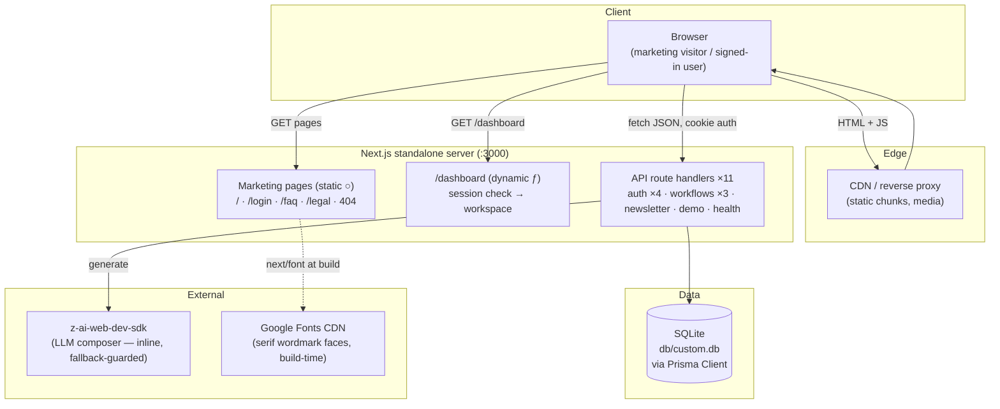
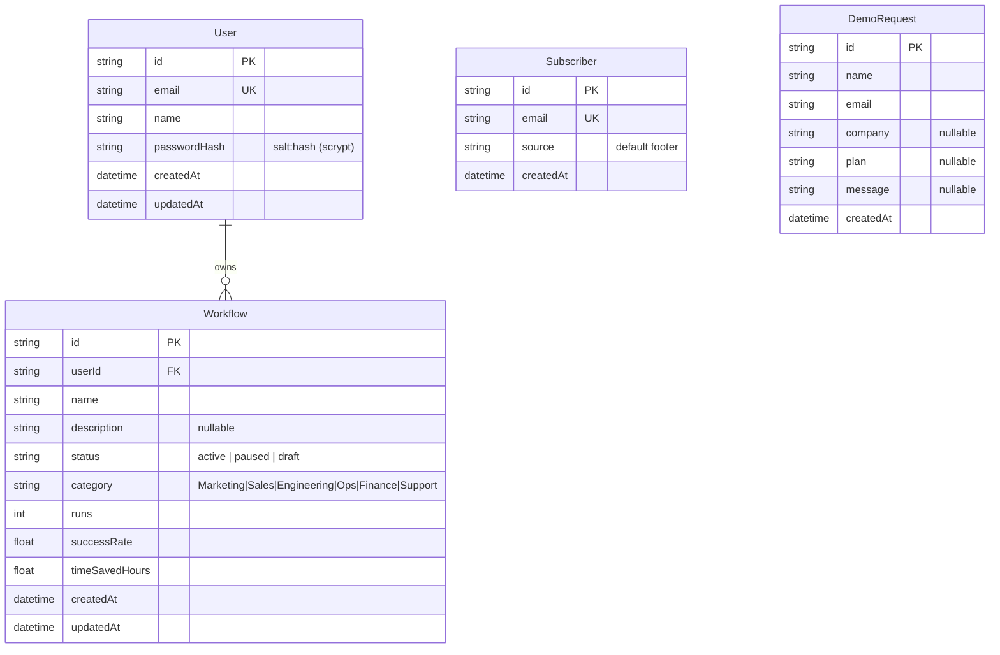

# SAAS Company — Master Project Architecture Document (PAD) v1.0

**Classification:** Internal Engineering Reference
**Status:** DEFINITIVE, PRODUCTION-LOCKED BLUEPRINT
**Companion Documents:** `README.md` (user-facing), `CLAUDE.md` (agent contract), `AGENTS.md` (operator notes)
**Last Updated:** 2026-10-07
**Audience:** Senior Engineers, Tech Leads, DevOps, and Onboarding Engineers
**Rule:** Every architectural decision in this document traces to a specific rationale. Nothing is here "because it's popular."

#### Revision Block — v1.0

- `[NOTE]` **Session 7 remediation (2026-10-07)** — a TYPOGRAPHY-LAYER +
  asset-inventory + interaction-robustness audit (the first systematic
  computed-`letter-spacing` + first-resolved-`font-family` survey of every
  text element, live vs clone — plus the full network/asset inventory, a
  22-step keyboard Tab walk, an axe-core run, edge viewports 1920/320, and
  the mobile menu's resize-while-open behavior) found and fixed eight
  clone-side gaps (see `docs/remediation-plan-session7.md` F1–F8 → R1–R8):
  **the reference's SPA bundle DOUBLES Tailwind's two widest tracking
  steps** (`tracking-wider` → 0.1em, `tracking-widest` → 0.2em — measured:
  the 12px hero badge at 1.2px, the 14px "Trusted by" label at 2.8px, the
  12px eyebrows at 2.4px) while its login bundle keeps the standard scale —
  the clone had shipped v4 defaults (half the reference's tracking on every
  eyebrow for six sessions); fixed via `@theme` overrides + a login-scoped
  `--tracking-wider` pin (the route's own `<style>`); the **Thrune
  wordmark renders DM SERIF DISPLAY** on the live (its three serif
  wordmarks carry INLINE `font-family` styles — the clone had rendered all
  three Playfair-first via `font-serif`); the Testimonials H2's
  `tracking-tight` restored (the clone had `tracking-normal`); the
  Gasparyan logo's `alt="Logo"` matched verbatim; the star-rating rows'
  aria-label made VALID ARIA (`role="img"` + decorative `aria-hidden`
  stars — axe flagged the bare div); **the mobile menu's resize-while-open
  bug fixed** (crossing 768px with the menu open used to leave the page
  scroll-locked — a `matchMedia` listener now closes the menu on md entry);
  and a WORKING self-hosted apple-touch-icon added app-wide (the live's
  own URL is dead — storage 404). ALSO DOCUMENTED (live-side): the live's
  favicon URL is DEAD (media.base44.com storage 404 — the clone's working
  favicon is the superset); the D32 burger pointer-block is STILL
  confirmed; the live's css ships dead keyframes (`lens-flare`,
  `.animate-wave-flow`) and a `<style>` node nested inside its H1.
  Byte-verified clean: the hero video (md5-identical) and the Gasparyan
  SVG; edge viewports 1920/320 exact; the 22-step Tab order identical with
  the violet/50 focus ring everywhere. Gate re-locked at **227 checks**
  (80 unit + 109 e2e incl. the new typography-parity suite + 38 smoke);
  VLM hero 100 / pricing 99 (logo-cloud flags dismissed with DOM evidence
  — reveal-timing artifacts); word parity 1.0000 on all 8 routes.

- `[NOTE]` **Session 6 remediation (2026-10-07)** — a class-string-layer +
  head-metadata audit (the first full-DOM class-string skeleton diff of the
  landing page — tag + class + key attrs, live vs clone — plus a per-route
  `<head>` map of all 8 live routes and REAL-POINTER hover probes) found
  and fixed seven clone-side gaps (see
  `docs/remediation-plan-session6.md` F1–F7 → R1–R8): the testimonial
  avatars were ALL violet→purple-600 while the live cycles FOUR per-person
  gradients (violet→purple-600 / electric-blue→blue-600 /
  purple-500→violet / blue-500→electric-blue); the Enterprise "Custom"
  price rendered at 48px in the numeric-price markup (the live: a plain
  30px DIV); the testimonial strip's edge fades were direction-SWAPPED
  (no darkening at the actual edges); the One-Platform AI-suggestion
  paragraph rendered 50% white (the live's own class is a broken inert
  token — it INHERITS full white); the per-route `<head>` pattern
  ("X | SAAS Company" og:title + "X on SAAS Company. …" description +
  per-route og:url/canonical) was missing, plus a WORKING self-hosted
  og:image (the live's URL 404s) and a self-hosted web app manifest; the
  `<body>` carried invented classes + `-webkit-font-smoothing:
  antialiased` (the live: bare body, `auto`); three invented/dead class
  extras removed (the nav pill's `group-hover:text-black`, the burger's
  `transition-colors`, the mockup link's dead overlay span). ALSO FOUND
  (live-side, kept as supersets): the live's own mobile burger is
  POINTER-BLOCKED by its empty toast portal (z-100, 390×32,
  pointer-events auto) — the live's menu is unopenable by a real tap at
  390; the clone keeps the working burger (D32). Gate re-locked at
  **215 checks** (80 unit incl. the new seo suite + 97 e2e incl. the new
  section-parity/head-metadata suites + 38 smoke); VLM 99/99/98 (all
  remaining flags dismissed with DOM evidence — the D20 randomization
  class and animation-phase misreads); word parity 1.0000 on all 8
  routes.

- `[NOTE]` **Session 5 remediation (2026-10-07)** — a font-forensics +
  interactive-state audit (the login card's alternate modes driven natively
  on the live — sign-up / forgot / wrong-password / mismatch / reset-success
  — plus performance-entry font tracing no prior session ran) found and
  fixed five clone-side gaps (see `docs/remediation-plan-session5.md`
  F1–F5 → R1–R4): **the UI typeface was the wrong font** — the reference
  renders GOOGLE's "Vend Sans" variable font (wght 300–700, gstatic), not
  the Wix Madefor files Session 1 self-hosted (the Wix faces are declared
  only in the live's unused login bundle; +2.4% glyph width had drifted
  every text surface for four sessions — the pricing pills, the D19
  Pro-card delta, the testimonials strip); the login card's alternate
  states rebuilt to the measured layouts (back-button + h2 + form, no
  logo/Google/divider, shadcn alert banners BETWEEN field and submit,
  "Invalid email or password" / "Passwords do not match" / the green
  check-your-email view; the register API's `name` is now optional); the
  keyboard focus ring matched (the reference's universal
  `outline-color: violet/50` on the UA default ring — this repo's
  `:focus-visible` rule was an invention); the Pro card's inert scale
  utilities removed (the reference's markup carries them but its css never
  emits them — 540 × 1.05 was the exact old 567px); the testimonials strip
  made full-bleed. **D19 RESOLVED.** Gate re-locked at **192 checks** (73
  unit + 81 e2e incl. the new typeface/focus/login-states pins + 38 smoke);
  VLM 97/100/100/100/98; section offsets now match the live EXACTLY
  (features 3323 / how-it-works 4179 / pricing 4800 / testimonials 5826 at
  1440; identical at 1280 and 390).

- `[NOTE]` **Session 4 remediation (2026-10-07)** — a behavior-level re-audit
  (deep computed-style probes of 13 previously-unprobed surface groups + the
  first scroll-state navbar survey — Sessions 1–3 only ever inspected the
  nav at scrollY 0) found and fixed six clone-side gaps (see
  `docs/remediation-plan-session4.md` F1–F6 → R1–R8): the login route now
  swaps the body theme exactly like the reference's own /login css bundle
  (white bg, zinc-950 text, system font — typed input text had rendered
  near-invisible WHITE on the light slate inputs through the dark theme's
  inherited `--color-card-foreground`); the pricing model corrected to the
  reference's truth (**the toggle defaults to ANNUAL** — Pro $49/mo monthly,
  $39/mo annual; Session 1 had read the $39 annual price without checking
  which pill was active; the caption is plain `/month` in both states); the
  navbar rebuilt as **section-aware** (always `bg-transparent` — the
  scrolled-glass bar was an invention that survived three sessions because
  full-page screenshots only draw the nav over the dark hero; scroll-spy
  pills; light-mode chrome swap over the white features section); the
  dashboard mockup made **static** like the reference (zero animations;
  solid purple list dots — the unlayered `.skeleton-wave` class had
  OVERRIDDEN the layered `bg-primary/80` utility); the FAQ accordion now
  animates with the reference's Radix keyframes (0.2s ease-out height)
  and **unmounts closed panels** — closing the long-standing FAQ
  word-parity 0.6052 DOM artifact (word parity is now **1.0000 on every
  page**); and `apple-mobile-web-app-status-bar-style: black` emitted.
  Also logged: the colon-spelled arbitrary aspect ratio build break (use
  the slash form) and the turbopack CSS-transform cache that masked the
  fix. Gate re-locked at **179 checks** (73 unit + 68 e2e incl. the new
  navbar-behavior/login-theme/mockup/accordion suites + 38 smoke).
- `[NOTE]` **Session 3 remediation (2026-10-07)** — a token-level re-measurement
  against the live's compiled CSS (`/assets/index-*.css`) found the brand
  tokens had been read from the reference's UNMOUNTED `.dark` block in
  Session 1: `:root` is what renders — primary = hsl(267 100% 57%) =
  **#8624ff** (not the 290° magenta) and accent/electric-blue = hsl(220 100%
  50%) = **#0055ff** (not #008cff); `violet` (290° magenta) was already
  correct. Also fixed: the body font now renders the Display cut like the
  live (`--font-body: "Vend Sans", …` — no element on the live ever resolves
  the Text cut), testimonial/AI-suggestion quotes are straight ASCII like
  the live, page titles use the live's `X | SAAS Company` pattern, the 404
  card quotes the missing pathname, **Lenis 1.3** smooth scrolling runs like
  the live (`window.lenis`), the login shell carries the Vite noscript
  fallback (login route only), and the apple-mobile-web-app-title meta is
  emitted. Word parity after remediation: **1.0 on every page** (FAQ's
  collapsed-accordion DOM artifact aside). Gate re-locked at **165 checks**
  (73 unit + 54 e2e incl. the new brand-parity suite + 38 smoke). See
  `docs/remediation-plan-session3.md` (F1–F11 → R1–R10).
- `[NOTE]` **Full rebuild against the CURRENT reference (2026-10-06/07 survey).** The live app at `saas-company.base44.app` was redeployed as the dark-theme "NovaAI" SaaS marketing site; this repository's previous cycle (the ORBITAL PM-workspace clone, v2.x with 115 e2e checks) targeted the OLD deployment and was retired wholesale — its specs, seed, and chrome were replaced. Parity was re-established with a fresh paired survey (agent-browser computed styles at 1440/768/390 + VLM side-by-side comparisons: hero ≈ 90% → fixed → full-page ≈ 96%), and the clone ships a functional superset (real auth, workflow dashboard, capture forms) where the reference has dead links (`/checkout` 404s on the live).
- `[NOTE]` **Gate status at lock:** lint ✓ · typecheck ✓ · Vitest 69/69 ✓ · build ✓ · smoke 38/38 ✓ · Playwright 36/36 ✓.
- `[NOTE]` **Session 2 remediation (2026-10-07)** — parity re-audit against the
  (unchanged) live reference found and fixed five clone-side gaps (see
  `docs/remediation-plan-session2.md`): the accessibility page's two reference
  lists + the no-caption rule; the login page's extra back-link (bare-card
  parity); the hero indicator's motion profile (`animate-scroll-dot`); the
  features card rebuilt per tab from the live DOM (12-bar chart with exact
  gradients/heights, stat chips, numbered builder steps, per-tab check icons);
  and the dependency chain hardened (vitest 3.2.7→5.0.3 resolving the critical
  tinypool/@vitest/mocker advisories; `overrides` for
  braces/micromatch/fast-glob/deepmerge-ts — the residual braces advisory has
  no patched release upstream and is lint-toolchain-only, documented as F10).
  Gate at re-lock: lint ✓ · typecheck ✓ · Vitest 73/73 ✓ · build ✓ · smoke
  38/38 ✓ · Playwright 54/54 ✓ (165 checks — Session 3 added the 13-check
  brand-parity suite). VLM parity: full-page 98, mobile
  menu 98, features 95, hero 95.

## Table of Contents

1. [System Overview & Decisions](#1-system-overview--decisions)
2. [High-Level System Topology](#2-high-level-system-topology)
3. [Application Architecture](#3-application-architecture)
4. [Data Architecture](#4-data-architecture)
5. [Design System Reference](#5-design-system-reference)
6. [Security Architecture](#6-security-architecture)
7. [Testing Strategy](#7-testing-strategy)
8. [Build & Deployment](#8-build--deployment)
9. [Developer Handbook](#9-developer-handbook)
10. [Known Issues & Outstanding Tasks](#10-known-issues--outstanding-tasks)
11. [Key Files Reference](#11-key-files-reference)
12. [Glossary](#12-glossary)

*(Worker / background-service architecture is not applicable: the system runs no queues, cron jobs, or async workers. The AI composer executes inline within a request; see ADR-005.)*

---

## 1. System Overview & Decisions

### 1.1 Document Metadata & Purpose

SAAS Company is a self-hosted clone of the reference Base44 marketing site for the "NovaAI" automated-workflows product, rebuilt as a single deployable Next.js unit **and extended into a functional superset**: where the reference shows a dead "Dashboard" demo link, this app runs a real, session-gated workflow workspace with an AI composer; where the reference's footer form does nothing, this app persists subscribers. This PAD is the engineering source of truth for onboarding, debugging, and replication. Anyone touching authentication, the AI composer, or the parity-critical chrome must read §5 and §6 before changing anything.

### 1.2 Technology Stack Summary

| Layer | Technology | Version | Key Rationale |
|-------|-----------|---------|---------------|
| Web framework | Next.js (App Router) | 16.1.x | One deployable unit for marketing pages + API routes; standalone output yields a portable production artifact |
| UI runtime | React | 19.x | Required by Next 16 |
| Language | TypeScript | 5 (strict, `noImplicitAny: false`) | Type safety; the explicit `typecheck` gate covers what `ignoreBuildErrors` skips |
| Styling | Tailwind CSS | 4 (CSS-first) | The reference ships v4-serialized CSS; tokens live in `@theme` — see `docs/Tailwind-V4-Validation-Report.md` |
| ORM / DB | Prisma 6 / SQLite | — | Zero-config bootstrap; typed queries; `db push` (no migrations by design) |
| Auth | Node `crypto` | — | scrypt + HMAC cookies; auditable, zero external services |
| AI planner | z-ai-web-dev-sdk | 0.0.x | Server-side workflow composition; deterministic fallback keeps the feature alive without it |
| Fonts | Self-hosted **Google "Vend Sans"** (variable wght 300-700, the exact gstatic subsets) + next/font (Playfair, DM Serif Display) | — | Byte-identical type rendering with the reference's served font files (Session 5 forensics) |
| Tests | Vitest 5 / Playwright 1.63 / bash+curl | — | Three layers over three seams: pure logic, browser, production HTTP |
| Smooth scroll | lenis 1.3.x | — | The reference's momentum scrolling; client wrapper, reduced-motion guarded |

### 1.3 Architecture Decision Records (ADRs)

**ADR-001: Conventional multi-route App Router site (no SPA rewrites)**

- **Context:** The reference is a Vite SPA, but with only eight real routes and one interactive view switch (the features tabs, the pricing toggle, the FAQ accordion) — nothing demands client-side routing.
- **Decision:** Standard Next.js routes: `/`, `/login`, `/faq`, `/privacy`, `/terms`, `/accessibility`, `/refund-policy`, `/dashboard`, plus `not-found.tsx`. Interactive state (tabs, toggles, accordion, mobile menu) is local component state.
- **Rationale:** Real URLs, per-route metadata, static prerendering for the marketing/legal pages (the build shows them `○`), and no history-API plumbing to maintain.
- **Consequences:** The features section's tab content is client state — if deep-linkable tabs are ever required, add `?tab=` handling in that component only.
- **Alternatives Rejected:** Path rewrites onto one page (the previous cycle's approach — necessary then for a view-switching SPA, dead weight here); react-router inside Next (duplicates the router Next provides).

**ADR-002: Prisma + SQLite with `db push` (no migrations)**

- **Context:** A fresh checkout must reach a running demo with no database server and no migration history.
- **Decision:** Prisma over a gitignored SQLite file at `<repo>/db/custom.db`; schema applied with `prisma db push`; canonical demo data via an idempotent TS seed that wipes and reinserts.
- **Rationale:** Zero-config bootstrap; moving to Postgres later is a `datasource` change plus a `DATABASE_URL` swap (`.env.example` documents it).
- **Consequences:** No schema-history artifacts; SQLite's single-writer model caps write concurrency (acceptable for this workload).
- **Alternatives Rejected:** Drizzle (fewer generated conveniences at this scale); Postgres (breaks the zero-config story).

**ADR-003: Hand-rolled cookie sessions (scrypt + HMAC-SHA256)**

- **Context:** Email/password auth is required; external auth services, JWT libraries, and OAuth machinery are not.
- **Decision:** `src/lib/auth.ts` implements scrypt hashing (`salt:hash`, 64-byte key), stateless tokens `userId.expiry.signature` signed with `AUTH_SECRET`, delivered as an httpOnly `novaai_session` cookie (7-day TTL, `SameSite=Lax`, `Secure` in production).
- **Rationale:** Auditable crypto from Node built-ins; `timingSafeEqual` on both password and signature comparisons; tokens verify without a session store.
- **Consequences:** Rotating `AUTH_SECRET` invalidates every session (README troubleshooting). Registration signs the fresh account in immediately (the sign-up → workspace flow the e2e suite pins).
- **Alternatives Rejected:** NextAuth (template-era weight for email/password only); JWT libraries (unnecessary for cookie-carried claims); a session table (state without benefit).

**ADR-004: The AI composer degrades, never fails**

- **Context:** The dashboard's differentiator ("Automated Workflows, Powered by AI") drafts a workflow from a one-line idea. The LLM dependency must not be able to take the feature down.
- **Decision:** `POST /api/workflows/generate` calls `z-ai-web-dev-sdk` server-side inside a try/catch: any import failure, timeout, malformed JSON, or under-sanitized output falls back to `templateWorkflow(idea)` (deterministic, category-inferring). `sanitizeGeneratedWorkflow` clamps name ≤ 120, description ≤ 500, and category to the fixed vocabulary before anything persists.
- **Rationale:** Self-hosting stays zero-config; prompt-injected LLM output is bounded before it reaches the database or the UI.
- **Consequences:** Environments without SDK access get useful (if generic) drafts; both paths are unit-tested (`workflow.test.ts`) and the e2e composer spec asserts the persisted row regardless of which path produced it.
- **Alternatives Rejected:** A hard SDK dependency (breaks self-hosting); client-side generation (exposes prompting to the browser).

**ADR-005: Uniform API envelope `{ ok, data } | { ok, error }`**

- **Context:** Eleven route handlers must return predictable, typed JSON that one client pattern can consume.
- **Decision:** `src/lib/api.ts` exports `ok(data, status)` / `fail(code, message, status)` / `requireSession()`; every handler returns one of these. The client surfaces `error.message` inline.
- **Rationale:** One response contract; machine-readable codes; the smoke suite asserts the envelope on every endpoint it touches.
- **Alternatives Rejected:** HTTP-status-only signalling (loses the code/message pair); throwing across the action boundary (no error boundary to rely on).

**ADR-006: Standalone output with pinned file-tracing root**

- **Context:** Production must run from a portable artifact; Next's tracing rewrites paths when a parent workspace lockfile exists.
- **Decision:** `output: "standalone"` with `outputFileTracingRoot` pinned to the project directory; the build script copies `.next/static` + `public/` into `.next/standalone/`; `start` runs `server.js` from the repo root.
- **Rationale:** Guarantees the canonical `.next/standalone/server.js` layout regardless of clone location.
- **Consequences:** The server must start from the project root (npm scripts guarantee the CWD the SQLite path resolution relies on).

**ADR-007: Vitest on the pure domain seams + Playwright on the chrome + curl on the HTTP surface**

- **Context:** Regressions cluster in three places: pure logic, the parity-critical chrome, and the API contract.
- **Decision:** Unit specs cover exactly the pure modules (`src/lib/*.test.ts` + `tests/db-path.test.ts`, 69 checks); Playwright drives the real UI in Chromium (36 checks, single worker against a seeded `db/e2e.db`); the bash smoke suite exercises the production build over HTTP (38 checks, its own `db/smoke.db`).
- **Rationale:** Each layer runs where the risk lives; all three are fast (~1s, ~1min, ~40s).
- **Consequences:** New pure logic ships with a spec; new endpoints extend the smoke suite; chrome changes re-run the mobile-navigation suite first.
- **Alternatives Rejected:** Component testing (views are thin over data); one mega-framework (less signal per second).

**ADR-008: Fixed-window per-IP rate limiting on the mutating public endpoints**

- **Context:** `/api/auth/*` and `/api/newsletter` are the brute-force/abuse surface.
- **Decision:** `src/lib/rate-limit.ts` implements a pure fixed-window limiter — `checkRate(buckets, key, limit, windowMs, now)` — with auth at 10 attempts/IP/15 min and newsletter at 5/IP/10 min; throttled requests get `429 RATE_LIMITED` (+ `Retry-After` semantics through the message).
- **Rationale:** Pure-function core keeps the window math unit-testable; the fixed window is the simplest policy that materially raises abuse cost.
- **Consequences:** Buckets are per-process — restart clears them; a multi-instance deploy needs a shared store (§10).

**ADR-009: Parity by measurement, superset by documentation**

- **Context:** The reference is a moving target (it was a different app in this repo's previous cycle) and several of its surfaces are dead ends (the `/checkout` demo link 404s; "Continue with Google" has no credentials a clone can use).
- **Decision:** Visual parity comes from a fresh paired survey (computed styles via agent-browser at 1440/768/390; VLM side-by-side comparisons of every section; verbatim copy extraction into `src/lib/*-content.ts`). Every functional divergence is an explicit, documented superset or deviation (§5.4).
- **Rationale:** Prevents silent drift in either direction — chrome regressions surface in the e2e pins, and scope creep surfaces in the deviations table.
- **Consequences:** If the live app is redeployed again, re-run the paired survey before touching chrome.

---

## 2. High-Level System Topology



- **Client layer** — a standard browser; no PWA/service worker.
- **Application layer** — one Node process. Marketing/legal pages are statically prerendered; `/dashboard` is dynamic (session-resolved); API routes are dynamic. Stateless between requests (sessions are cookie-carried), so horizontal scaling is trivial behind a balancer.
- **Data layer** — a single SQLite file at the repo root. The Prisma CLI and the runtime resolve the SAME relative `DATABASE_URL` through the SAME schema-anchored rule (`src/lib/db-path.ts`, unit-tested) — one string, one file, every context.
- **External services** — the AI composer (inline, degrade-guarded) and Google Fonts (build-time only, for the two serif wordmark faces; the UI font is self-hosted).

---

## 3. Application Architecture

### 3.1 The Layer Model

```
Layer 0: Prisma schema (prisma/schema.prisma) — the source of truth.
         Rule: every entity starts here; regenerate after any change.

Layer 1: Route handlers (src/app/api/**/route.ts) — validation,
         persistence, rate limiting. Rule: business logic lives here
         and only here; handlers never import components.

Layer 2: Domain modules (src/lib/*.ts) — pure logic + DTO vocabulary
         (pricing, workflow statuses, validation, auth crypto, rate
         limiting, content). Rule: pure and unit-tested; no React, no
         Prisma client imports (auth/db thin-wire the runtime pieces).

Layer 3: Pages & components — presentation. Server pages resolve
         sessions and load initial state; client components mutate
         through the API envelope and re-fetch. Rule: no direct DB
         access from components.
```

**Golden Rule:** dependencies point downward only. A change flows schema → handler → lib → page/component.

### 3.2 Annotated Directory Structure

```
├── prisma/
│   ├── schema.prisma              ← 4 models; status vocabulary in comments
│   └── seed.ts                    ← idempotent demo workspace (wipes + reseeds)
├── public/
│   ├── favicon.svg                ← brand mark (four-petal pinwheel)
│   └── media/
│       ├── hero-ai-loop.mp4       ← the reference's looping hero video (1.9MB)
│       └── gasparyan-logo.svg     ← the image-based client logo
├── scripts/
│   └── smoke-test.sh              ← 38-check suite; boots prod on :3200,
│                                    pins its own DATABASE_URL (the env trap)
├── src/
│   ├── app/
│   │   ├── page.tsx               ← the landing (10 sections, static)
│   │   ├── layout.tsx             ← fonts (Vend Sans @font-face via CSS,
│   │   │                            serif via next/font), metadata, viewport
│   │   ├── globals.css            ← Tailwind 4 @theme tokens + measured
│   │   │                            custom classes + keyframes (§5)
│   │   ├── login/page.tsx         ← the reference auth card: sign-in /
│   │   │                            sign-up / forgot states, ?from_url
│   │   ├── faq/page.tsx           ← six-question accordion (verbatim copy)
│   │   ├── privacy|terms|accessibility|refund-policy/page.tsx ← legal views
│   │   ├── dashboard/page.tsx     ← session-gated workspace (redirects to
│   │   │                            /login?from_url=/dashboard)
│   │   ├── not-found.tsx          ← the reference's light 404 card
│   │   ├── sitemap.ts · robots.ts
│   │   └── api/
│   │       ├── health/route.ts            ← public liveness probe
│   │       ├── auth/{register,login,logout,me}/route.ts  ← ADR-003/008
│   │       ├── workflows/route.ts         ← list / create (session-gated)
│   │       ├── workflows/[id]/route.ts    ← get / patch / delete
│   │       ├── workflows/generate/route.ts ← the AI composer (ADR-004)
│   │       ├── newsletter/route.ts        ← footer subscribe (upsert)
│   │       └── demo/route.ts              ← book-a-demo capture
│   ├── components/
│   │   ├── site/
│   │   │   ├── navbar.tsx         ← fixed nav, glass pill (md+), LOG IN +
│   │   │   │                        Get Started, mobile burger dropdown
│   │   │   ├── footer.tsx         ← 4 columns + working subscribe form
│   │   │   ├── logo.tsx           ← exact SVG wordmark + animated petals
│   │   │   ├── reveal.tsx         ← IntersectionObserver scroll reveals
│   │   │   └── legal-page-view.tsx← shared legal template
│   │   ├── sections/              ← hero, dashboard-preview, logo-cloud,
│   │   │                            problem, features, how-it-works,
│   │   │                            pricing, testimonials, cta
│   │   └── dashboard/
│   │       └── dashboard-app.tsx  ← stats, AI composer, workflow list,
│   │                                pause/resume/delete, runs chart
│   └── lib/
│       ├── auth.ts                ← scrypt + HMAC + cookie lifecycle
│       ├── api.ts                 ← ok()/fail()/requireSession() envelope
│       ├── db.ts + db-path.ts     ← Prisma singleton + URL resolution seam
│       ├── rate-limit.ts          ← pure fixed-window limiter (ADR-008)
│       ├── pricing.ts             ← plans, periods, 20% annual discount
│       ├── validation.ts          ← email/password/string bounds
│       ├── workflow.ts            ← statuses, template + sanitizer (ADR-004)
│       ├── legal-content.ts       ← verbatim reference copy (4 pages)
│       ├── faq-content.ts         ← verbatim reference Q&A (6 items)
│       └── utils.ts               ← cn() class merge
├── tests/
│   ├── db-path.test.ts            ← the URL-resolution contract
│   └── e2e/                       ← landing · mobile-navigation · auth ·
│                                    dashboard · pages + global-setup
└── docs/                          ← screenshots, deployment, SSH runbook,
                                     Tailwind v4 validation report, PAD
```

### 3.3 Critical Code Patterns

**Pattern A — The response envelope and its client**

```typescript
// src/lib/api.ts — every handler returns one of these two shapes.
export function ok<T>(data: T, status = 200) {
  return NextResponse.json({ ok: true as const, data }, { status });
}
export function fail(code: string, message: string, status: number) {
  return NextResponse.json({ ok: false as const, error: { code, message } }, { status });
}

// Client components treat !ok as an inline error string — never a throw:
const payload = await res.json().catch(() => null);
if (res.ok && payload?.ok) { /* use payload.data */ }
else { setError(payload?.error?.message ?? "Something went wrong."); }
```

*Why:* one contract for eleven endpoints; failures degrade to visible inline copy, so a network or validation error can never throw into React render.

**Pattern B — SQLite URL resolution (the two-anchor problem)**

```typescript
// src/lib/db-path.ts (excerpt) — the Prisma CLI resolves relative file:
// URLs against prisma/schema.prisma; the runtime engine anchors against
// CWD. Resolve to ONE absolute path BEFORE the first client is built.
export function resolveDatabaseUrl(envUrl: string | undefined, anchors: string[]): string {
  const schemaRoot =
    anchors.find((root) => existsSync(path.join(root, "prisma", "schema.prisma"))) ?? …;
  if (!envUrl) return `file:${path.resolve(schemaRoot, "prisma", DEFAULT_RELATIVE_DB)}`;
  if (/^file:/i.test(envUrl)) {
    const raw = envUrl.replace(/^file:/i, "");
    if (path.isAbsolute(raw) || /^[A-Za-z]:[\\/]/.test(raw)) return `file:${raw}`;
    return `file:${path.resolve(schemaRoot, "prisma", raw)}`; // CLI rule
  }
  return envUrl;
}
```

*Why:* without it, `db:push`/`db:seed` (schema anchor) and the standalone server (CWD anchor — it `chdir`s into `.next/standalone`) can open *different* database files. The anchor list also detects the standalone-in-repo case and repairs to the real repo root. `tests/db-path.test.ts` pins the contract.

**Pattern C — Degrade-not-fail AI composition**

```typescript
// src/app/api/workflows/generate/route.ts (abridged)
let generated = templateWorkflow(idea.value);      // deterministic fallback
try {
  const { default: ZAI } = await import("z-ai-web-dev-sdk");
  const completion = await zai.chat.completions.create({ … });
  const sanitized = sanitizeGeneratedWorkflow(JSON.parse(jsonText), idea.value);
  if (sanitized) generated = sanitized;            // clamped before persisting
} catch { /* SDK unavailable or malformed — the template stands */ }
return ok(generated);
```

*Why:* the feature must work in every environment the app can be cloned into; the sanitizer bounds what untrusted LLM output can write.

**Pattern D — Session-gated pages**

```typescript
// src/app/dashboard/page.tsx — resolve the session BEFORE render; anonymous
// visitors never see the workspace shell.
const userId = await sessionUserId();
if (!userId) redirect("/login?from_url=/dashboard");
const workflows = await db.workflow.findMany({ where: { userId }, … });
return <DashboardApp user={user} initialWorkflows={workflows} />;
```

*Why:* the gate lives on the server (no client-side flash of gated content), and `?from_url` returns the user to the workspace after signing in.

---

## 4. Data Architecture

### 4.1 Database Schema



| Model | Rows (seeded demo) | Purpose |
|-------|--------------------|---------|
| `User` | 1 | Login identity (`demo@novaai.app` / `Demo1234!`) |
| `Workflow` | 6 | The workspace: seeded automations with realistic stats (7,120 total runs, 160h saved) |
| `Subscriber` | 2 | Footer newsletter signups (idempotent upsert on email) |
| `DemoRequest` | 0 | Book-a-demo / contact-sales captures |

### 4.2 Status Vocabularies

| Vocabulary | Values | Set by |
|------------|--------|--------|
| Workflow status | `active` `paused` `draft` | Create/patch (validated in `src/lib/workflow.ts`); the dashboard's pause/resume toggles `active ⇄ paused` |
| Workflow category | `Marketing` `Sales` `Engineering` `Ops` `Finance` `Support` | Create (AI composer infers it; template keyword-matches it) |
| Billing period | `monthly` `annual` | The pricing toggle (pure math in `src/lib/pricing.ts`) |

### 4.3 Persistence Strategy

- **Client singleton:** one `PrismaClient` per process, memoized on `globalThis` in dev to survive HMR; query logging in dev, errors-only in production (`src/lib/db.ts`).
- **Schema evolution:** `prisma db push` — no `migrations/` folder by design (ADR-002). The seed is idempotent: it wipes the domain tables and reinserts the canonical demo workspace.
- **Referential actions:** `Workflow.user` → `Cascade` (deleting a user deletes their workflows).
- **Indexes:** `User.email` (unique); `Workflow.{userId, status}`; `DemoRequest.createdAt` — matching the list endpoints' filter shapes.
- **Isolated test databases:** E2E uses `db/e2e.db` (global-setup pushes + seeds); smoke uses `db/smoke.db`. Both gitignored; neither touches dev data.

---

## 5. Design System Reference

### 5.1 Typographic System

| Face | Weights | Usage |
|------|---------|-------|
| **Vend Sans** (self-hosted Google variable font, latin + latin-ext) | 300–700 variable | EVERYTHING — headings AND body (`--font-heading` = `--font-body` = `"Vend Sans", sans-serif`) |
| Playfair Display / DM Serif Display (next/font) | 400–700 / 400 | The client-logo wordmarks in the trusted-by strip |

The reference's "Vend Sans" is **Google Fonts' actual Vend Sans variable font** (wght 300–700) served from `fonts.gstatic.com/s/vendsans/v1/…` — traced in Session 5 via performance resource entries + document.fonts + fontTools name tables (the Session-1 belief that it was "Base44-hosted Wix Madefor" was wrong: the Wix faces are declared only in the live's unused login-bundle css, whose route renders the system stack). This repo self-hosts the SAME two gstatic subsets in `src/fonts/` — identical bytes, identical metrics, zero runtime dependency. Base heading tracking is `0.02em` (the reference's base rule); the hero H1 overrides to `-0.02em` inline, with `mix-blend-mode: screen` + `brightness(1.1)` over the video. The login route's headings render the SYSTEM stack (its own bundle has no heading-font rule — the route style restores `font-family: inherit`).

### 5.2 Color Tokens (measured from the reference's compiled CSS)

| Token | Hex | Usage |
|-------|-----|-------|
| `--color-background` | `#000000` | Page canvas |
| `--color-card` | `#0f0f0f` (hsl 0 0% 6%) | Raised dark surfaces |
| `--color-border` / `--color-input` | `#242424` (hsl 0 0% 14%) | Hairlines |
| `--color-primary` | `#8624ff` (hsl 267 100% 57%) | The reference's `:root` primary — the purple gradient partner (mockup bars, glows, icon chips, stats). Session 3: corrected from the unmounted `.dark` block's 290° magenta |
| `--color-accent` / `--color-electric-blue` | `#0055ff` (hsl 220 100% 50%) | Electric blue — the gradient end (Most Popular badge, chart bars) |
| `--color-violet` | `#d500ff` (hsl 290 100% 50%) | The brand magenta for text/border/bg-violet surfaces (distinct from primary on the live) |
| `--color-destructive` | `#ef4444` | Problem cards, delete affordances |
| Slate scale (login/404) | slate-50…900 | The reference's light auth + 404 pages |

### 5.3 Component Primitives & Motion

No component library — the chrome is bespoke against measured values: the fixed nav (z-50, transparent → `black/80` blur at 24px scroll), the center glass pill (`bg-white/10 backdrop-blur-md`), the Get Started white pill with the `get-started-shimmer` hover fill, the mobile dropdown (`md:hidden bg-black/95 backdrop-blur-xl border-b border-white/5`, `px-6 py-4 flex flex-col gap-2`, 44px rows), the pricing cards (Pro: `border-2 border-violet/40` + gradient tint + `scale-105`), and the testimonial drag-strip with edge fades. Motion is CSS-only and restrained: `organic-gradient` (hero heading), `border-shimmer` (beta badge), `logo-ns/ew/sn/we` (brand petals), `marquee`, `float`, `pulse-glow`, `skeleton-wave` (dashboard mockup), plus the IntersectionObserver `Reveal` entrances. `prefers-reduced-motion` collapses all of it.

### 5.4 Deviations & SuperSet Ledger (the honest table)

_Session 2 additions (post-remediation state):_ D9 and D10 document the two
  parity restorations; the login page and the features cards are now byte-for
  DOM-structure parity with the reference.

| # | Surface | Reference | Clone | Class |
|---|---------|-----------|-------|-------|
| D1 | "Dashboard" demo link | `/checkout` → 404 | `/dashboard` — real session-gated workspace | **Superset** |
| D2 | Footer subscribe | no-op | persists via `/api/newsletter` | **Superset** |
| D3 | Pricing CTAs | anchors only | anchors kept; `/api/demo` capture exists for contact flows | **Superset** |
| D4 | Continue with Google | OAuth (Base44 credentials) | renders for parity, degrades to an inline notice | **Deviation** (documented) |
| D5 | "Built on Base44" footer | yes | kept verbatim (parity copy) | Parity |
| D6 | `bg-white/10`-style computed colors | rgba strings | Tailwind v4 serializes through `oklab()` — rendering-identical | **Deviation** (engine artifact; tests accept either) |
| D7 | Hero video | Base44 CDN | self-hosted `public/media/hero-ai-loop.mp4` (same encode) | Parity (asset relocation) |
| D8 | Legal/FAQ copy | Wix templates | captured verbatim into `src/lib/*-content.ts` (Session 2 completed the accessibility page's lists + no-caption rule) | Parity |
| D9 | Login page | a bare dead-end auth card (no nav/footer/anchors) | back-link removed; zero-anchor pin in the e2e suite | Parity (Session 2) |
| D10 | Features card + hero motion | per-tab DOM (chart/steps) + rAF-driven indicator | rebuilt from the live DOM (ANALYTICS_BARS, stat chips, builder steps, per-tab icons); `animate-scroll-dot` matches the sampled motion | Parity (Session 2) |
| D11 | Brand tokens | `:root` block: primary #8624ff (267°), accent/electric-blue #0055ff (220°) | restored to the `:root` values (Session 3) — Session 1 had shipped the unmounted `.dark` block's magenta/#008cff | Parity (Session 3) |
| D12 | Body typeface | "Vend Sans" (the Display cut) for EVERY element | `--font-body` now resolves the Display cut first, like the live (the Text cut stays as fallback) | Parity (Session 3) |
| D13 | Scroll feel | Lenis 1.3.23, defaults, `html.lenis` | lenis 1.3.x client wrapper (`src/components/site/smooth-scroll.tsx`), reduced-motion guarded | Parity (Session 3) |
| D14 | Page titles / 404 / quotes / noscript | `X \| SAAS Company` titles; 404 quotes the pathname; straight quotes; login-only noscript + apple-web-app-title | all matched (Session 3, pinned by `tests/e2e/brand-parity.spec.ts`) | Parity (Session 3) |
| D15 | Login route body theme | /login loads its OWN css bundle: body white + zinc-950 + the system font stack; light `:root` vars | route-scoped `<style>` swaps the body theme (+ restores the reference's v3-style space-y gap inside forms — v4's margin-bottom is lost on inline labels); unmounts with the page | Parity (Session 4) |
| D16 | Pricing model | toggle DEFAULTS TO ANNUAL; Pro $49/mo monthly, $39/mo annual; caption `/month` in both states | corrected domain (`pricing.ts` monthlyPrice 49) + component default `annual` + no-whitespace Annual pill (161px like the live) | Parity (Session 4) |
| D17 | Navbar scroll behavior | `bg-transparent` at every depth; scroll-spy pills (white/30 dark, black/15 light); light-mode chrome over white sections | section-aware navbar (scroll-spy at the ⅔ viewport line, `[data-nav-theme="light"]` overlap detection); the scrolled-glass bar removed as an invention | Parity (Session 4) |
| D18 | FAQ accordion DOM | Radix: `data-[state=*]:animate-accordion-*` keyframes; closed panels UNMOUNTED | measured keyframes in `@theme` + unmount-after-close — closes the old 0.6052 word-parity artifact | Parity (Session 4) |
| D19 | Pro-card micro-spacing | card 540px at 1440 (unscaled — its `scale-[1.02] md:scale-105` classes are INERT on the live: its css never emits them) | card 540px, `scale: none` — RESOLVED in Session 5: the old +27px was v4's scale utilities actually scaling (540×1.05=567) + the Wix font's wider glyphs | Parity (Session 5; was an accepted deviation in Session 4) |
| D20 | Mockup bar heights | randomized per load (e.g. 45.93%) | deterministic measured snapshot (42…95%) | Parity (Session 4, documented) |
| D21 | Mobile-menu anchor click | the live's click updates the URL hash but NEVER scrolls (scrollY stays 0 — a live bug; desktop clicks do scroll) | the clone closes the menu and smooth-scrolls to the section — the intended UX | **Superset** (Session 5, intentional) |
| D22 | Login input a11y attrs | no autoComplete attrs; burger has no aria-expanded/aria-label | autoComplete (email/current-password/new-password) + aria-expanded + aria-label kept — invisible UX/a11y supersets | **Superset** (Session 5, documented) |
| D23 | Forgot-password reset | sends a real email via Base44 | no mail transport in the self-hosted clone — the live's unconditional "Check your email" success view is mirrored verbatim (the live itself never enumerates) | Parity (view) + **Deviation** (no email sent; Session 5) |
| D24 | Register payload | (Base44-internal) | `name` optional on `/api/auth/register` (falls back to the email local-part) — the reference's sign-up card has no name field | Superset-friendly (Session 5) |
| D25 | Testimonials strip | full-bleed (`scrollWidth` 2408 = 8×280 + 7×24, zero padding) | matched (the old px-6 pb-4 had inset the cards 24px and stretched scrollWidth +48px) | Parity (Session 5) |
| D26 | Testimonial avatar gradients | FOUR per-person combos cycling in card order: violet→purple-600, electric-blue→blue-600, purple-500→violet, blue-500→electric-blue (cards 5–8 repeat) | matched — per-testimonial `gradient` field (the pre-fix clone rendered ALL as violet→purple-600) | Parity (Session 6) |
| D27 | Enterprise "Custom" price | a plain `div.font-heading.text-3xl` "Custom" (30px/36px, direct child of the mb-8 block) | matched — the null-price branch renders the live's structure (the pre-fix clone reused the numeric text-5xl span at 48px) | Parity (Session 6) |
| D28 | Testimonial edge fades | LEFT fade `bg-gradient-to-r from-black` (black AT the left edge), RIGHT `to-l` | matched — the pre-fix directions were swapped (no darkening at the edges, a hard cut 64–128px inside) | Parity (Session 6) |
| D29 | AI-suggestion paragraph | the live's class carries a BROKEN inert token (`text-sl(var(--foreground))]`) — the paragraph INHERITS full white | matched to the RENDERED truth (`text-white`); the pre-fix clone shipped text-white/50 | Parity (rendered truth; Session 6) |
| D30 | Per-route `<head>` | per-route og:title/`"X on SAAS Company. …"` description/og:url/canonical; a manifest; og:image + twitter:image (the live's image URL **404s**) | full per-route pattern via `src/lib/seo.ts` (`routeMetadata`); self-hosted WORKING `/og-image.png` (1200×630) + `/manifest.json`; NO theme-color, NO viewport-fit (the live ships neither). `twitter:url` is not expressible through Next's metadata API — accepted engine deviation (og:url carries it) | Parity + **Superset** (working image; Session 6) |
| D31 | `<body>` | NO class attribute; `body{}` stylesheet rule paints it; `-webkit-font-smoothing: auto` | matched — bare `<body>`, the base-layer rule paints it, the invented antialiased declaration deleted | Parity (Session 6) |
| D32 | Mobile burger clickability | the live's burger is POINTER-BLOCKED by its own empty toast portal (fixed top-0 z-[100], 390×32, pointer-events auto) — the live's menu is UNOPENABLE by a real tap at 390 (a JS `.click()` still opens it; the panel itself is byte-identical: 0,56 390×397, 7 rows @44px) | the clone's burger WORKS (real-tap opens the byte-identical panel) — the intended UX | **Superset** (Session 6, intentional — D21-class) |
| D33 | Tracking scale (SPA bundle) | `tracking-wider` = **0.1em**, `tracking-widest` = **0.2em** (measured: hero badge 1.2px @12px, "Trusted by" 2.8px @14px, eyebrows 2.4px @12px) — the live's config doubles the two widest steps | `@theme` overrides `--tracking-wider: 0.1em; --tracking-widest: 0.2em;` — every eyebrow renders at the live's tracking (the clone had v4 defaults = half, for six sessions) | Parity (Session 7) |
| D34 | Tracking scale (login bundle) | the live's /login css bundle keeps the STANDARD scale — its "or" divider computes 0.6px (0.05em @12px) | the login route's scoped `<style>` pins `--tracking-wider: 0.05em` back (the custom property inherits; v4 utilities emit `letter-spacing: var(--tracking-wider)`) | Parity (Session 7, route-scoped) |
| D35 | Logo-cloud wordmark fonts | the live's three serif wordmarks carry INLINE `font-family` styles: Zphlix/Melpyx `"Playfair Display", serif`, **Thrune `"DM Serif Display", serif`** (italic) — no font class on the spans | the same inline styles verbatim (the spans carry no `font-serif` class — class-string parity too); the faces load via next/font (DM Serif incl. the italic cut) | Parity (Session 7) |
| D36 | Testimonials H2 tracking | `tracking-tight` → computed −1.2px at 48px | matched (the clone had `tracking-normal` = `normal` since Session 1) | Parity (Session 7) |
| D37 | Gasparyan logo alt | `alt="Logo"` | matched verbatim (was "Gasparyan logo") | Parity (Session 7) |
| D38 | Star-rating ARIA | NO aria at all (the live's own axe report is worse: unnamed buttons/links, 103 landmark-less nodes) | `role="img"` + `aria-label="5 out of 5 stars"` + decorative `aria-hidden` stars — a VALID-ARIA a11y superset (axe-core: the bare aria-label div was `aria-prohibited-attr`) | **Superset** (Session 7) |
| D39 | Body scroll-lock (mobile menu open) | the live does NOT lock body scroll when its menu is open (verified via JS-click) | the clone locks `overflow:hidden` while the menu is open — the intended modal UX; a `matchMedia("(min-width: 768px)")` listener closes the menu on md entry so a resize never strands the lock | **Superset** (Session 7, documented; the resize bug fixed) |
| D40 | apple-touch-icon | the live's login route links one whose URL is DEAD (media.base44.com storage 404 — the same class as its favicon and og:image) | a WORKING self-hosted `/favicon.svg` apple-touch-icon emitted app-wide | **Superset** (Session 7; the D30 working-asset pattern) |

### 5.5 Tailwind v4 Trap Log (enforced here)

1. **Bare-HSL triplets under `@theme` resolve to transparent** — tokens are full hex values.
2. **v4 preflight sets no pointer** — `button, [role="button"] { cursor: pointer }` lives in the base layer.
3. **`@theme` var() chains can drop** — the serif token is declared in `@theme inline` so the next/font variable survives.
4. **Alpha colors serialize through `oklab()`** — computed strings differ from v3-era rgba; rendering does not (D6).
5. **Auto content detection ignores nothing here** (single app, `src/**` scanned) — no `@source` directives needed.
6. **Arbitrary aspect ratios use the SLASH form** — the colon spelling of the ratio inside `aspect-[…]` emits the invalid `aspect-ratio: 16:9` and postcss fails the whole build with an opaque `Missed semicolon` at a flattened column; turbopack then CACHES the broken transform (Session 4 — `rm -rf .next` if the error outlives the fix), and Tailwind's scanner reads candidates from MARKDOWN too (docs/ is `@source not`-ed in globals.css).
7. **Unlayered custom CSS beats layered utilities** — the old unlayered `.skeleton-wave` background overrode the layered `bg-primary/80` on the mockup dots (Session 4 F4); keep custom classes out of the utility cascade or scope them tightly.
8. **v4 `space-y-*` puts margin on the PRECEDING sibling** (`:not(:last-child)` margin-bottom) — vertical margins are lost on INLINE children (the login form's labels), and an explicit negative margin on the preceding child CANCELS the gap entirely (the login alternate-states' back button carries the reference's `-mb-2`: under v4 the back→h2 gap rendered −8px vs the live's +8px — a 16px card delta the VLM caught). The login route style restores the measured pattern inside forms (`.space-y-1\.5`) and the auth stacks (`.auth-stack`, `.auth-stack-sm6` — the latter also restores the forgot variant's `sm:space-y-6` 24px gaps).
9. **Never trust a font's NAME — trace its bytes** (Session 5): the reference's computed `font-family` read `"Vend Sans"` but the RENDERED face was Google Fonts' Vend Sans variable font (gstatic), NOT the "Base44-hosted Wix Madefor" Session 1 identified from @font-face declarations in an unused bundle. Four sessions of sub-pixel drift (pill widths, the D19 card delta, testimonials scrollWidth) were the wrong-file metrics (+2.4% glyph width at 14px). The authoritative probes: `performance.getEntriesByType('resource')` for the woff2 URLs, `document.fonts` for the weight census, and fontTools name tables for the file identity. (`document.fonts.check()` is UNRELIABLE — it returns true for unknown families.)
10. **The reference ships INERT classes** (Session 5): its markup carries utilities its compiled css never emits — the pricing Pro card's `scale-[1.02] md:scale-105` renders UNSCALED (`scale: none`, 540px at every width). Match the RENDERED computed style, not the class string: v4 here WOULD emit those utilities (540 × 1.05 = the exact 567px we used to render).
11. **The reference's Tailwind CONFIG overrides scale values — survey the TYPOGRAPHY layer** (Session 7): the live's SPA bundle doubles the two widest tracking steps (`tracking-wider` 0.1em, `tracking-widest` 0.2em) while its login bundle keeps the defaults — v4's `--tracking-*` theme variables are the override point (utilities emit `letter-spacing: var(--tracking-wider)`), and route-scoped pins handle bundle-level divergence (the login route's `<style>` pins the standard value back). The same audit found the live's wordmarks styled via INLINE `font-family` — classes alone hid that the third face (DM Serif Display) never rendered here.
12. **Resize-while-open is a real failure class for breakpoint-mounted chrome** (Session 7): a menu mounted below md and hidden by `md:hidden` above it keeps its state (and any body scroll-lock) alive across the boundary — a `matchMedia` close-on-md listener is the standard guard (see the mobile-navigation testing taxonomy).

---

## 6. Security Architecture

### 6.1 Security Rules

| # | Rule | Enforcement |
|---|------|-------------|
| 1 | Every API route except `/api/health`, `/api/auth/{login,register}`, `/api/newsletter`, `/api/demo` requires a session | `requireSession()` first line; 401 envelope otherwise |
| 2 | Passwords never stored or logged in plaintext | scrypt, per-user 16-byte salt, 64-byte key (`src/lib/auth.ts`) |
| 3 | Session tokens cannot be forged or altered | HMAC-SHA256 over `userId.expiry`; `timingSafeEqual` on both comparisons |
| 4 | Cookies are invisible to scripts and scoped | `httpOnly`, `SameSite=Lax`, `Secure` in production, `path=/`, 7-day TTL |
| 5 | All input validated server-side | `src/lib/validation.ts` in every handler: trim, length caps, enum membership, email shape |
| 6 | SQL injection structurally impossible | All queries through Prisma's parameterized client |
| 7 | No secrets in the repository | `.gitignore` rejects `.env`, `*.key`, `ssh-key.txt`; keys supplied out-of-band per the SSH-wrapper runbook |
| 8 | LLM output is untrusted | `sanitizeGeneratedWorkflow` clamps before persistence (ADR-004) |
| 9 | Mutating public endpoints throttled per IP | Fixed-window limiter (ADR-008): auth 10/15min, newsletter 5/10min → `429 RATE_LIMITED` |
| 10 | Redirect targets are path-fixed | `/login` honors only `?from_url` values the app itself emits; the dashboard always emits the literal `/dashboard` |

### 6.2 Threat Model

| Vector | Mitigation | Residual risk |
|--------|------------|---------------|
| Session forgery | HMAC + timing-safe compare | Weak `AUTH_SECRET` in prod if the operator ignores the README warning |
| Password brute force | scrypt per attempt + per-IP rate limit | Buckets are per-process (multi-instance deploys need a shared store) |
| CSRF | `SameSite=Lax` + JSON-only bodies | Lax allows top-level GET navigations; all mutations are POST/PATCH/DELETE with JSON |
| XSS | React auto-escaping; no `dangerouslySetInnerHTML` anywhere in `src/` | None known |
| Prompt-injected LLM output | Sanitizer clamps (≤120/500 chars, fixed category vocabulary) | Well-formed-but-malicious task text can appear (user-deletable) |
| Open registration | By design (demo parity) | §10 lists gating options |

---

## 7. Testing Strategy

### 7.1 Test Distribution

| Category | Files | Checks | Location | Framework |
|----------|-------|--------|----------|-----------|
| Unit (pure seams) | 8 + db-path | 80 | `src/lib/*.test.ts`, `tests/` | Vitest 5 (`npm run test`) |
| Browser E2E | 11 specs | 109 | `tests/e2e/` | Playwright 1.63 (`npm run test:e2e`) |
| Production HTTP smoke | 1 | 38 | `scripts/smoke-test.sh` | bash + curl + python3 |

### 7.2 What each layer pins

- **Unit:** pricing math (plan prices, the 20% annual discount, captions incl. Custom-with-no-suffix), the fixed-window limiter (limit boundary, window reset, eviction, retry-after, key isolation, IP extraction), validation (email/password/string bounds), the workflow template + sanitizer (category inference, clamps, rejection paths), auth crypto (hash/verify round-trip, salt uniqueness, token round-trip, tamper/garbage rejection), content integrity (6 FAQ items, 4 legal pages with sections), the SEO helpers (the per-route description/og:title templates + the routeMetadata assembly — Session 6), and the SQLite URL resolution (anchors, absolute passthrough, standalone repair).
- **Playwright:** the landing structure (hero, all nine sections, footer columns, anchor scroll, 404, health envelope), **the mobile navigation suite** — the highest-regression-risk chrome: fixed nav geometry, burger→X swap, the dropdown's measured rows (44px, exact hrefs, order), close-on-navigate, Escape, the 768 tablet pill — the auth round-trip (three login states, wrong-password rejection, registration→dashboard→sign-out, session-gated redirect), the dashboard superset (seeded stats, composer end-to-end with cleanup, pause/resume, 401 envelope), the FAQ accordion, the pricing toggle, all four legal pages, the newsletter API pair, **the section-parity suite** (the per-person avatar gradients with an inert-class guard, the Custom-price structure, the edge-fade directions, the AI-suggestion color, body parity, the F7 class strings — Session 6), and **the head-metadata suite** (per-route title/description/og:*/canonical/image/manifest across seven routes, the absence of theme-color/viewport-fit — Session 6), and **the typography-parity suite** (the doubled SPA tracking scale incl. the login route's standard pin, the wordmark inline font-families, the Testimonials H2 tracking, the Gasparyan alt, the star-rating ARIA — Session 7).
- **Smoke:** boots the standalone production server on :3200 with its own `db/smoke.db` (schema-pushed + seeded), then asserts: health envelope, login (valid/wrong/short/duplicate), session me (authed/anon/post-logout), workflow CRUD + invalid-status rejection, newsletter + demo endpoints, all eight pages (incl. the 307/200 dashboard pair), landing content markers, the 404 guard, and the sitemap.

### 7.3 Coverage Thresholds

- **Gate (mandatory before push):** `npm run lint` → `npm run typecheck` → `npm run test` (**80/80**) → `npm run build` → `./scripts/smoke-test.sh` (**38/38**) → `npm run test:e2e` (**109/109**). No hosted CI; the local gate is the only gate. The `typecheck` step is not optional: the build sets `ignoreBuildErrors`.
- Line/branch coverage is not measured — the seam list is deliberately small and complete.

### 7.4 Conventions

- E2E runs single-worker against one seeded `db/e2e.db`; mutating specs clean up after themselves (the composer spec deletes its row).
- Auth specs keep real login attempts well under the rate-limiter budget (the limiter trap the previous cycle documented).
- Computed-color assertions accept both rgba and oklab spellings (D6) — never "fix" the CSS to chase a byte-parity that rendering already achieves.

---

## 8. Build & Deployment

### 8.1 Production Build

```bash
npm run build
# = next build
#   && cp -r .next/static .next/standalone/.next/
#   && cp -r public .next/standalone/
npm run start    # NODE_ENV=production node .next/standalone/server.js (:3000)
```

The standalone tree carries the traced `node_modules`, the static chunks, and `public/` (including the 1.9MB hero video). `outputFileTracingRoot` (ADR-006) pins the layout; the server must start from the repo root — the npm scripts guarantee the CWD that the SQLite resolution and the standalone trace rely on.

### 8.2 Environment Variables

| Name | Required | Description | Default |
|------|----------|-------------|---------|
| `DATABASE_URL` | Yes | SQLite file. Relative `file:` URLs resolve against `prisma/schema.prisma` — for the CLI **and** the runtime (`src/lib/db-path.ts`). | `file:../db/custom.db` |
| `AUTH_SECRET` | Production | HMAC secret for session tokens (`openssl rand -hex 32`). Unset ⇒ insecure dev-only constant (loudly documented). | — |
| `NEXT_PUBLIC_SITE_URL` | Recommended | Canonical origin for metadata, `sitemap.xml`, `robots.txt`. | `http://localhost:3000` |

**The exported-variable trap:** a shell-exported absolute `DATABASE_URL` overrides `.env` for the Prisma CLI and the Next runtime alike — the server silently opens a foreign file. Every script that boots a server or runs Prisma (`smoke-test.sh`, `playwright.config.ts` webServer, `global-setup.ts`) pins its own value; keep that discipline (it is the historical 12/30 smoke failure mode).

### 8.3 Docker / CI

None ship with v1.0. The standalone artifact is Docker-ready (single Node entrypoint, no build tools at runtime); containerization and a lint+typecheck+test+build+smoke workflow mirroring §7.3 are tracked in §10.

### 8.4 Pushing

No hosted CI. The pipeline is the local gate (§7.3) followed by an authenticated push: `python3 docs/ssh_git_wrapper_v3.py --key-file <key outside the repo>` — the wrapper materializes the key into a 0600 temp file, preflights with `ls-remote`, pushes `HEAD:refs/heads/main`, verifies the remote ref equals local HEAD, syncs the tracking ref, then shreds the key. Full runbook: `docs/how-to-git-push-using-ssh-wrapper_SKILL.md`.

---

## 9. Developer Handbook

### 9.1 Local Setup

```bash
git clone https://github.com/nordeim/saas-company.git && cd saas-company
npm install
cp .env.example .env
npm run db:push && npm run db:seed
npm run dev               # http://localhost:3000
```

Demo login: `demo@novaai.app` / `Demo1234!`. Full verification: the §7.3 gate.

### 9.2 Common Commands

| Command | Purpose |
|---------|---------|
| `npm run dev` | Dev server on :3000 (logs to `dev.log`) |
| `npm run build` / `npm run start` | Production build / serve standalone |
| `npm run lint` / `npm run typecheck` | ESLint / `tsc --noEmit` (the real type gate) |
| `npx prisma generate` | Regenerate the client after schema edits |
| `npm run db:push` / `npm run db:seed` | Apply schema / reset to demo data |
| `npm run test` / `npm run test:e2e` | 80 unit / 109 browser checks |
| `./scripts/smoke-test.sh` | 38-check suite against the production build |
| `npx playwright test tests/e2e/mobile-navigation.spec.ts` | Re-run the chrome suite alone |

### 9.3 Code Style

TypeScript strict (with the template-era `noImplicitAny: false`); ESLint flat config extends `eslint-config-next`. Conventions that matter in review: the layer model (§3.1), the envelope (Pattern A), the degrade-not-fail doctrine (ADR-004), content-as-code (`src/lib/*-content.ts`), and parity changes re-measured against the live reference before merge.

### 9.4 Git Workflow

- **`main` only** — no feature branches (operator contract).
- **Commits:** Conventional Commits with emoji prefixes: `:art: feat: …`, `:memo: docs: …`, `:bug: fix: …`.
- **Push:** via `docs/ssh_git_wrapper_v3.py` with an externally supplied key — never a resident `~/.ssh` dependency.
- **Never committed:** `.env`, `*.key`, `db/*.db`, `node_modules/`, `dev.log`/`server.log`, `tests/e2e/.auth/` (all gitignored).

---

## 10. Known Issues & Outstanding Tasks

| Priority | Issue | Impact | Status |
|----------|-------|--------|--------|
| MEDIUM | Open registration (any visitor can create an account) | Workspace open to the public internet once deployed | Open — gate behind invite codes or an `ALLOW_REGISTRATION` flag |
| LOW | Rate-limit buckets are in-process | A multi-instance deploy would need a shared store (Redis) | Accepted (single-node by design); documented in §6.2 |
| LOW | `tsconfig.json` sets `noImplicitAny: false` | Weaker inference than full strict | Accepted (template default); tighten when convenient |
| LOW | No Dockerfile / hosted CI | Deployment and gate rely on the operator machine | Open — standalone artifact is Docker-ready; mirror §7.3 in a workflow |
| INFO | AI composer falls back to the deterministic template without SDK access | Generic-but-useful drafts offline | By design (ADR-004) |
| INFO | "Continue with Google" renders but degrades to a notice | No OAuth credentials in a self-hosted clone | By design (deviation D4); wire a provider if needed |
| INFO | `AUTH_SECRET` dev fallback constant | Insecure sessions if deployed unset | By design; README + §8.2 warn loudly |
| INFO | Reference is a moving target | A future redeploy of the live app shifts parity | Mitigated by ADR-009 (re-survey before chrome work) |
| LOW | `braces` GHSA-vfj7-8cjw-p6xm (stack-exhaustion DoS) — no patched version exists upstream (vulnerable ≤ 3.0.3, the latest published) | Lint toolchain only; no attacker-controlled input reaches braces in this repo | Accepted (F10); `npm audit fix --force` rejected — it would downgrade eslint-config-next 16→14; monitor for an upstream patch |

---

## 11. Key Files Reference

| File | Purpose |
|------|---------|
| `src/app/globals.css` | Tailwind 4 `@theme` tokens, the Vend Sans `@font-face` blocks, every measured custom class + keyframe, the reduced-motion query |
| `src/components/site/smooth-scroll.tsx` | The Lenis wrapper — the reference's momentum scrolling (reduced-motion guarded) |
| `src/components/site/navbar.tsx` | The fixed nav: glass pill, LOG IN + Get Started, the measured mobile burger dropdown (highest-regression chrome) |
| `src/components/site/logo.tsx` | The reference's exact SVG wordmark + animated four-petal mark |
| `src/components/sections/hero.tsx` | Video hero: shimmer badge SVG, gradient heading, Book a Demo |
| `src/components/sections/pricing.tsx` | Monthly/Annual toggle + the three plan cards (pure math in `src/lib/pricing.ts`) |
| `src/components/dashboard/dashboard-app.tsx` | The superset workspace: stats, AI composer, workflow list, runs chart |
| `src/app/login/page.tsx` | The reference auth card — sign-in / sign-up / forgot states, `?from_url` |
| `src/app/api/workflows/generate/route.ts` | The AI composer with the deterministic fallback (ADR-004) |
| `src/lib/auth.ts` | scrypt hashing, HMAC session tokens, cookie lifecycle (ADR-003) |
| `src/lib/seo.ts` | The reference's per-route head pattern: `pageDescription` / `pageTitle` / `routeMetadata` (Session 6; unit-tested) |
| `src/lib/db-path.ts` + `tests/db-path.test.ts` | The SQLite URL-resolution seam + its contract (Pattern B) |
| `src/lib/rate-limit.ts` | Pure fixed-window limiter (ADR-008) |
| `src/lib/pricing.ts` | Plans, periods, the 20% annual discount (unit-tested) |
| `src/lib/workflow.ts` | Status/category vocabularies, template + sanitizer (ADR-004) |
| `src/lib/legal-content.ts` / `faq-content.ts` | Verbatim reference copy (content-as-code) |
| `prisma/schema.prisma` / `prisma/seed.ts` | 4 models / idempotent demo workspace |
| `scripts/smoke-test.sh` | 38-check production HTTP suite (pins its own `DATABASE_URL`) |
| `tests/e2e/mobile-navigation.spec.ts` | The chrome pins: burger dropdown rows, close-on-navigate, tablet pill, close-on-md resize |
| `tests/e2e/typography-parity.spec.ts` | The Session-7 typography pins: the tracking scale (+ the login pin), wordmark fonts, H2 tracking, alt, star ARIA |
| `tests/e2e/brand-parity.spec.ts` | The Session-3 token/copy/metadata pins: gradient stops (oklab-converted), font chain, straight quotes, titles, 404 pathname, Lenis, noscript |
| `docs/Tailwind-V4-Validation-Report.md` | The v4 trap log this codebase enforces |
| `docs/how-to-git-push-using-ssh-wrapper_SKILL.md` | The push runbook |

---

## 12. Glossary

| Term | Definition |
|------|------------|
| **The reference** | The live Base44 app at `saas-company.base44.app` — the dark "NovaAI" marketing site this clone mirrors |
| **Superset** | A functional extension beyond the reference (real dashboard, working forms) — always a documented ledger entry (§5.4) |
| **Deviation** | A deliberate divergence from reference behavior, documented in §5.4 (e.g. Google sign-in degrading) |
| **Envelope** | The uniform API response `{ ok, data }` or `{ ok, error: { code, message } }` |
| **The composer** | `POST /api/workflows/generate` — LLM-backed workflow drafting with a deterministic fallback |
| **Vend Sans** | The reference's UI typeface — GOOGLE FONTS' actual Vend Sans variable font (wght 300-700), self-hosted here from `src/fonts/` (the exact gstatic subsets; Session 5 forensics) |
| **The env trap** | A shell-exported `DATABASE_URL` overriding `.env`, silently pointing every tool at a foreign database file |
| **The glass pill** | The nav's centered `bg-white/10 backdrop-blur-md` link container (md+) |
| **Paired survey** | The parity method: same-viewport computed styles + VLM side-by-side comparison of live vs clone |
| **Smoke suite** | `scripts/smoke-test.sh` — the 38-check production-server verification gate |
