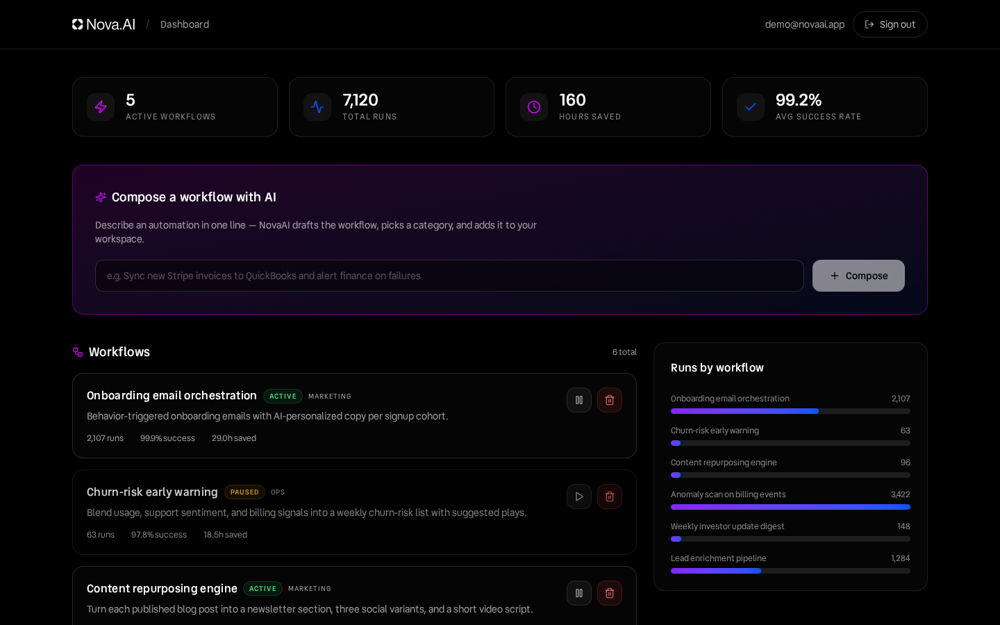
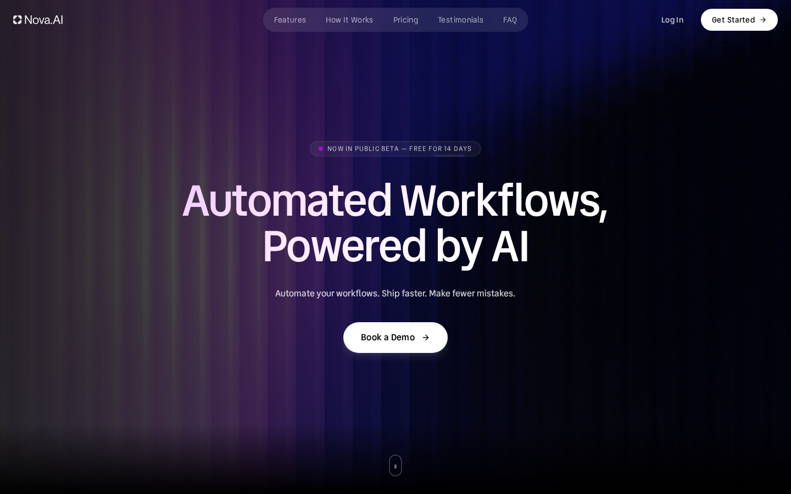
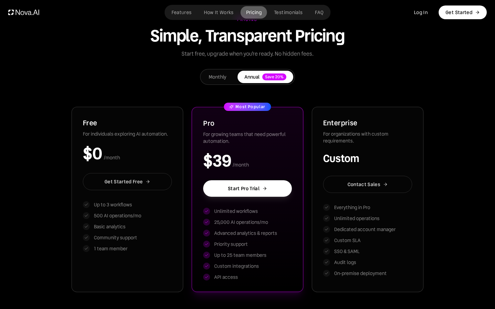
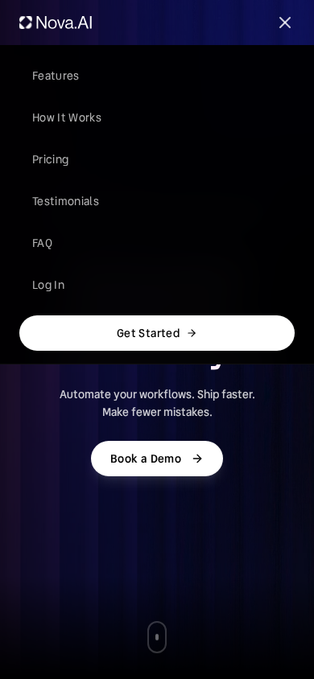

# SAAS Company — NovaAI Marketing Site + Workspace


A production-grade, self-hosted clone of the reference dark-theme SaaS
marketing site [`saas-company.base44.app`](https://saas-company.base44.app/)
(the "NovaAI" automated-workflows product) — rebuilt as one deployable
Next.js application, and extended into a **functional superset**: the
reference's dead demo link becomes a real authenticated workflow dashboard,
the footer subscribe form persists, and every surface is tested.

## Overview

The reference is a Base44-hosted marketing site: a video hero, a trusted-by
logo strip, problem/solution sections, a features tab trio, pricing with a
Monthly/Annual toggle, testimonials, FAQ, and legal pages — plus a login
card. This clone reproduces all of it (measured tokens, self-hosted fonts,
verbatim copy) and then goes further: cookie-session auth, a workflow
workspace with an AI composer (`z-ai-web-dev-sdk` with a deterministic
fallback), newsletter + demo-request capture, sitemap/robots, a health
probe, Lenis smooth scrolling, per-route SEO metadata with a working og-image + web app
manifest, and 388 automated checks across three test layers.

| Dashboard | Landing hero |
|:---:|:---:|
|  |  |

| Pricing | Mobile menu |
|:---:|:---:|
|  |  |

## Key Features

| Feature | Description |
|---------|-------------|
| 🎬 **Faithful landing page** | Looping AI-video hero with the shimmer-bordered beta badge and animated gradient heading, dashboard mockup with the browser-chrome skeleton, trusted-by logo cloud (serif wordmarks), problem cards, "One Platform" showcase, white features tabs, how-it-works steps, pricing (Monthly/Annual — **defaults to Annual like the reference**: Pro $39/mo annual, $49/mo monthly, "Save 20%"), testimonial drag-strip, CTA, and the four-column footer |
| 🧭 **Reference chrome** | Fixed transparent nav with the center pill (md+), LOG IN + white Get Started pill, and the measured mobile burger dropdown (black/95 blur panel, 44px rows) — the nav is **section-aware** like the reference: scroll-spy highlights the section in view (white/30 pill on dark, black/15 on light) and the chrome swaps to black variants over the white features section; plus the slate login card (light body theme + system font, exactly as the reference's login bundle) and light 404 |
| 🔐 **Cookie-session auth** | scrypt password hashing + HMAC-signed sessions, per-IP rate limiting on auth endpoints (10/15 min) with machine-readable `Retry-After` headers on 429s, register/login/logout/me — sign-up lands straight in the workspace (**constant-time verification** — the unknown-email path burns the same scrypt cost as the wrong-password path, so response latency cannot enumerate registered addresses, CWE-208; and an optional `ALLOW_REGISTRATION=false` deployment gate returns `403 REGISTRATION_CLOSED` while login keeps working), and the post-login redirect only ever targets same-site paths (the `from_url` open-redirect guard) |
| ⚡ **Workflow dashboard (superset)** | The reference's "Dashboard" demo link 404s — here it's real: stats cards, a workflow list with pause/resume/delete, a runs chart, and an AI composer that drafts workflows from one-line ideas (server-side SDK + deterministic fallback, sanitized before persistence — rate-limited per user at 10 generations/15 min so the LLM endpoint carries its own abuse ceiling while the composer degrades to the template on 429) |
| 📰 **Working capture forms** | Footer newsletter subscribe (idempotent upsert) and a first-class **/demo Book-a-Demo page** (dark-brand form mirroring the API's validation, with the composer's fault contract and a polite screen-reader confirmation — the formerly-unreachable demo API's front half, listed in the sitemap) |
| ❓ **Interactive FAQ + legal** | The reference's six-question accordion and four legal pages, copy captured verbatim |
| 🧪 **388 automated checks** | 126 Vitest unit checks (pure domain seams incl. the SEO helpers, the motion engine, the rate-limit overrides, the redirect-target guard, the SDK hang seam, the constant-time login decoy, the registration gate, and the P2002 race classifier), 197 Playwright browser checks (incl. the mobile-navigation, navbar scroll-behavior, per-tab features-card, login-theme, login alternate-states, brand-parity, section-parity, head-metadata, typography-parity, motion-parity, palette-parity, mockup-motion-parity, hydration-health, resource-hygiene, fault-resilience, session-lifecycle, error-boundary, demo-reachability, reduced-motion, and redirect-target suites + the composer 429-degrade row), 65 curl smoke checks against the production build (incl. the four security-header pins, the asset-caching pin, the PATCH name-contract pins, the lazy-img no-preload contract, the /demo page pin, the 429 Retry-After pins, the generate-limiter trip, the API no-store pins, the X-Powered-By absence pins, the login timing-parity pin, the parallel-register race-envelope pin, and the closed-registration gate pins) |
| 🛡️ **Production headers** | The reference's security posture — `X-Content-Type-Options: nosniff`, `X-Frame-Options: DENY`, `Referrer-Policy: strict-origin-when-cross-origin`, `Strict-Transport-Security` — emitted via `next.config.ts` and pinned by the smoke suite, plus the reference CDN's asset caching (`public, max-age=604800` on `public/` assets), `Cache-Control: private, no-store` on every API response (authenticated data never transits a cache without an explicit directive), and no `X-Powered-By` banner (the reference ships none) |
| 🔎 **Per-route SEO head parity** | The reference's per-route `<head>` pattern — "X | SAAS Company" og:titles, "X on SAAS Company. …" descriptions, per-route og:url/canonical, a web app manifest — plus a WORKING self-hosted og-image (the live's own URL 404s); assembled in `src/lib/seo.ts` (`routeMetadata`) and pinned by the head-metadata e2e suite |
| 🌗 **Measured design system** | Tailwind v4 CSS-first tokens: #000 canvas, #8624FF primary, #0055FF accent, #D500FF violet, self-hosted **Google Fonts' "Vend Sans" variable font** (wght 300-700 — the exact gstatic bytes the reference serves; Session 5 font forensics replaced the Session-1 Wix Madefor misidentification), the reference's keyframes (organic-gradient, border-shimmer, logo petals, marquee) |

## Tech Stack

| Layer | Technology | Version | Purpose |
|-------|-----------|---------|---------|
| Web framework | Next.js (App Router) | 16.1 | Pages + 11 API route handlers; standalone output |
| UI runtime | React | 19 | Component model |
| Language | TypeScript | 5 (strict) | Type safety end-to-end |
| Styling | Tailwind CSS | 4 | CSS-first tokens + measured custom classes |
| State | React hooks + fetch | — | Server pages load initial state; client components mutate via the API envelope |
| ORM | Prisma | 6 | Schema, client, `db push`, seed |
| Database | SQLite | — | Zero-config persistence at `db/custom.db` |
| Auth | Node `crypto` (scrypt + HMAC) | — | Cookie sessions, no external auth service |
| AI | z-ai-web-dev-sdk | 0.0.x | Server-side workflow composition (degrades to a template) |
| Icons | lucide-react | 0.5.x | Icon set |
| Smooth scroll | lenis | 1.3.x | The reference's momentum scrolling (`window.lenis`, reduced-motion aware) |
| Fonts | Self-hosted Google "Vend Sans" (variable 300-700) + next/font Google (Playfair/DM Serif) | — | Reference typography — the SAME gstatic woff2 bytes the live serves (Session 5 forensics) |
| Unit tests | Vitest | 5 | Pure domain seams |
| E2E tests | Playwright | 1.63 | Browser suite (Chromium) |
| Smoke | bash + curl | — | 48 checks against the production build |

## Architecture

```mermaid
flowchart LR
    B[Browser] -->|GET / · /login · /faq · /legal| P[Next.js pages<br/>server components]
    B -->|GET /dashboard (session-gated)| P
    B -->|fetch JSON, cookie auth| A["API route handlers (11)<br/>auth · workflows · newsletter · demo · health"]
    A -->|Prisma Client| D[("SQLite<br/>db/custom.db")]
    A -->|server-side| Z[z-ai-web-dev-sdk<br/>workflow composer + fallback]
```

## File Hierarchy

```
📂 prisma/
  📄 schema.prisma            # 4 models: User, Subscriber, DemoRequest, Workflow
  📄 seed.ts                  # Idempotent demo workspace (demo user + 6 workflows)
📂 public/
  📂 media/                   # hero-ai-loop.mp4, gasparyan-logo.svg
  📄 favicon.svg              # Brand mark (four-petal pinwheel)
📂 scripts/
  📄 smoke-test.sh            # 60-check E2E suite (boots the prod build on :3200)
📂 src/
  📂 app/
    📄 page.tsx               # Landing (10 sections)
    📄 layout.tsx             # Fonts, metadata, global styles
    📄 globals.css            # Tailwind 4 tokens + measured custom classes
    📂 login/ faq/ privacy/ terms/ accessibility/ refund-policy/
    📂 dashboard/             # Session-gated workspace (the superset)
    📂 api/                   # health · auth/* · newsletter · demo · workflows/*
    📄 not-found.tsx sitemap.ts robots.ts
  📂 components/
    📂 site/                  # navbar (+ mobile menu), footer, logo, reveal, legal view
    📂 sections/              # hero, dashboard-preview, logo-cloud, problem,
    #                          # features, how-it-works, pricing, testimonials, cta
    📂 dashboard/             # dashboard-app (stats, composer, workflow list, chart)
  📂 lib/                     # auth, api, db, db-path, rate-limit, pricing,
    #                          # validation, workflow, legal-content, faq-content
📂 tests/
  📄 db-path.test.ts          # SQLite URL resolution contract
  📂 e2e/                     # landing, mobile-navigation, auth, dashboard, pages
📄 docs/                      # screenshots, deployment, SSH push runbook, PAD…
```

## Quick Start

Requires **Node.js ≥ 20** (Bun ≥ 1.1 also works for the scripts).

```bash
# 1. Install dependencies
npm install

# 2. Configure environment
cp .env.example .env           # defaults are correct for local use

# 3. Create + seed the database (db/custom.db at the repo root)
npm run db:push
npm run db:seed

# 4. Start the dev server
npm run dev                    # http://localhost:3000
```

Open <http://localhost:3000>, then sign in to the dashboard at
<http://localhost:3000/login> with the seeded demo account:

| Email | Password |
|-------|----------|
| `demo@novaai.app` | `Demo1234!` |

### Verify Setup

```bash
curl http://localhost:3000/api/health
# {"ok":true,"data":{"status":"ok","app":"saas-company","ts":"…"}}

# Full verification (388 checks across three layers)
npm run lint && npm run typecheck && npm run test   # 126 unit checks
npm run build && ./scripts/smoke-test.sh            # 65 smoke checks
npm run test:e2e                                    # 197 browser checks
```

### Production

```bash
npm run build                  # next build + standalone assembly
npm run start                  # serves .next/standalone/server.js on :3000
```

A production `Dockerfile` also ships (multi-stage over the standalone
artifact, non-root, `/app/db` volume, healthcheck) — see
[`docs/DEPLOYMENT.md`](docs/DEPLOYMENT.md) §8 for the image runbook.

## Environment Variables

| Variable | Required | Description | Default |
|----------|----------|-------------|---------|
| `DATABASE_URL` | Yes | SQLite connection string. Relative `file:` URLs resolve against `prisma/schema.prisma` (the CLI rule) — `src/lib/db-path.ts` implements the same rule for the runtime, so `file:../db/custom.db` points at `<repo>/db/custom.db` in every context (dev, build, standalone server). | `file:../db/custom.db` |
| `AUTH_SECRET` | Production | HMAC secret for session cookies. Generate with `openssl rand -hex 32`. Falls back to an insecure dev constant when unset. | — |
| `AUTH_RATE_LIMIT_MAX` | Optional | Auth attempts (login + register) per IP per 15-minute window. Raise behind shared egress IPs; the Playwright webServer pins 50 for the e2e suite's own sign-ins. | `10` |
| `GENERATE_RATE_LIMIT_MAX` | Optional | AI-composer generations per USER per 15-minute window (the LLM endpoint's abuse ceiling — the composer degrades to the deterministic template when it engages, so the feature never hard-fails). The Playwright webServer pins 50; the smoke server pins 2 for its deterministic 429 trip. | `10` |
| `ALLOW_REGISTRATION` | Optional | Set to the exact string `false` to close registration: `POST /api/auth/register` returns `403 REGISTRATION_CLOSED` and the login card shows "Registration is currently closed." Unset (or any other value) keeps registration open — the default preserves the demo workspace story. Login stays open on a closed deployment. | open |
| `NEXT_PUBLIC_SITE_URL` | Recommended | Canonical public origin — used for metadata, `sitemap.xml`, `robots.txt`. | `http://localhost:3000` |

## API Reference

All endpoints return `{ "ok": true, "data": … }` or
`{ "ok": false, "error": { "code", "message" } }`. 🔒 = requires session cookie.

| Endpoint | Method | Description |
|----------|--------|-------------|
| `/api/health` | GET | Liveness probe |
| `/api/auth/register` | POST | Create account + sign in (name, email, password ≥ 8) — rate-limited; duplicate emails (sequential **or** concurrent) get `409 EMAIL_TAKEN`; set `ALLOW_REGISTRATION=false` to close the route (`403 REGISTRATION_CLOSED`) |
| `/api/auth/login` | POST | Sign in, sets session cookie — rate-limited (10/IP/15 min → `429 RATE_LIMITED`) |
| `/api/auth/logout` | POST | Clear session |
| `/api/auth/me` | GET | Current user or `null` |
| `/api/workflows` 🔒 | GET / POST | List / create workflows (status: active·paused·draft) |
| `/api/workflows/[id]` 🔒 | GET / PATCH / ⚠️ DELETE | Workflow detail / update / delete |
| `/api/workflows/generate` 🔒 | POST | AI workflow composer — one-line idea → draft (deterministic fallback; per-user rate limit 10/15 min → `429 RATE_LIMITED` with `Retry-After`) |
| `/api/newsletter` | POST | Footer subscribe (idempotent, rate-limited) |
| `/api/demo` | POST | Book-a-demo / contact-sales capture |

## Design System

Measured from the reference (2026-10 survey) — a dark, glass-on-black
system with magenta and electric-blue brand gradients:

| Token | Value | Usage |
|-------|-------|-------|
| `--color-background` | `#000000` | Page canvas |
| `--color-card` | `#0f0f0f` | Raised dark surfaces |
| `--color-border` | `#242424` | Hairline borders |
| `--color-primary` | `#8624ff` | The reference's `:root` primary — hsl(267 100% 57%), the purple gradient partner (mockup bars, glows, icon chips) |
| `--color-accent` / `--color-electric-blue` | `#0055ff` | Electric blue — hsl(220 100% 50%), the blue gradient end (badge, chart bars) |
| `--color-violet` | `#d500ff` | Brand magenta — hsl(290 100% 50%) for text/border/bg-violet surfaces |
| `--color-destructive` | `#ef4444` | Problem cards, delete affordances |
| `--font-heading` / `--font-body` | "Vend Sans" / "Vend Sans" | Google Fonts' Vend Sans variable font (wght 300-700), self-hosted — the exact gstatic latin/latin-ext subsets the reference serves (Session 5; the chain is `"Vend Sans", sans-serif` like the live's `:root`) |
| `--font-serif` | Playfair Display → DM Serif Display | Client wordmarks |

The scroll entrances reproduce the reference's framer-motion engine
dependency-free (`src/lib/motion.ts` + `Reveal`: per-frame rAF inline
opacity/transform writes, easeOut cubic-bezier(0, 0, 0.58, 1), per-element
y/duration/stagger — Session 8's motion-layer audit). Custom classes in
`globals.css`: `.workflows-gradient-text` (the animated
hero heading fill), `.animated-gradient-text`, `.border-shimmer-*` (the beta
badge's traveling stroke), `.anim-logo-*` (the four-petal logo choreography),
`.get-started-shimmer`, `.skeleton-wave`, `.accordion-panel`, plus the
marquee/float/pulse-glow keyframes, plus the hero's `scroll-dot` — the
reference's rAF-sampled indicator motion (translateY 0→8px, ≈1.7 s). Type
details: `h1`–`h6` carry the
reference's base `letter-spacing: .02em` (the hero overrides to `-0.02em`
inline); the login card and 404 page run the reference's light slate theme.

## Testing

```bash
npm run test              # unit — 126 checks on the pure domain seams
npm run test:e2e          # Playwright — 197 browser checks (needs a build)
./scripts/smoke-test.sh   # curl E2E — 65 checks against the production build
```

The unit layer pins the pure logic: pricing math (plans, the 20% annual
discount, captions), the fixed-window rate limiter, input validation, the
workflow template/sanitizer, scrypt + HMAC auth, content integrity (FAQ +
legal — including the accessibility page's two reference lists and its
no-caption rule), and the SQLite URL resolution (incl. the standalone-server
`chdir`
trap). The Playwright layer drives the real UI in Chromium: the landing
structure, the **mobile navigation suite** (the highest-regression-risk
chrome — burger dropdown rows at the measured 44px, close-on-navigate, the
768 pill), the auth round-trip, the dashboard superset (composer
end-to-end, pause/resume), the FAQ accordion, the pricing toggle, all four
legal pages, the **per-tab features-card parity suite** (AI caption, analytics
chart + stats, builder steps), the **login bare-card pin** (zero anchors — the
reference's dead-end auth card), the **login alternate-states suite**
(sign-up / forgot / reset-success / error-banner structures measured from
the live), the newsletter API pair, and the **palette-parity suite** (the
rendered v3 hex on every drifted default-palette surface — the stars, the
problem reds, the avatar gradient endpoints, every login slate — plus the
Sign in's slate-950 keyboard ring, the inputs' slate-400 rings, the
::selection removal, and the login overscroll/border pins). The smoke
suite boots the production standalone server on
:3200 with its own scratch database (`db/smoke.db`) — it never touches dev
data.

## Troubleshooting

| Symptom | Cause | Fix |
|---------|-------|-----|
| `Error code 14: Unable to open the database file` | Server started with an inherited/absolute `DATABASE_URL` pointing elsewhere | Start via `npm run dev`/`npm run start`, or unset the exported variable; scripts pin their own `DATABASE_URL` |
| Prisma `P1003` / missing tables | Database not initialized | `npm run db:push && npm run db:seed` |
| Login suddenly returns 429 | Per-IP rate limit engaged (10 attempts / 15 min) | Wait for the window — the response carries a machine-readable `Retry-After` header (seconds) alongside the message |
| "Continue with Google" shows a notice instead of signing in | Expected — the self-hosted clone carries no OAuth credentials (documented deviation) | Use email sign-in |
| Fonts differ from the reference | The UI font is self-hosted Google "Vend Sans" (variable 300-700) from `src/fonts/` — the same gstatic bytes the live serves | Keep the `@font-face` blocks in `globals.css` intact |
| `oklab(...)` colors in computed styles | Tailwind v4 serializes alpha colors through oklab — rendering-identical to rgba | Expected; assertions accept either spelling |
| Hero indicator dot travels instead of bouncing | The reference drives it with a JS oscillation; this repo ships the measured `animate-scroll-dot` keyframe | Intended parity (rAF-sampled); `prefers-reduced-motion` collapses it |
| The 404 page briefly shows empty quotes before the pathname fills | The statically-prerendered 404 ships the placeholder at SSR and fills the real URL one commit after hydration (the React-#418-free pattern — `usePathname()` would render the internal route id `/_not-found` post-settle) | Expected; pinned by `tests/e2e/hydration.spec.ts` |
| E2E suite intermittently 429s mid-run locally | The suite's own UI sign-ins share the in-memory auth limiter's budget | The Playwright webServer pins `AUTH_RATE_LIMIT_MAX=50`; production keeps the default 10 unless overridden |
| The Gasparyan logo (trusted-by cloud) loads on scroll, not at page load | `loading="lazy"` suppresses React Float's automatic preload — without it, the Next.js RSC prefetch injected the preload link into every navbar route, triggering console warnings + wasted fetches (Session 12) | Intended resource hygiene; the logo appears instantly when scrolled into view (a 4KB local SVG) |
| The dashboard shows a red "Could not …" banner after a failed action | The mutation handlers' fault-resilience contract: network/HTTP failures surface a visible `role="alert"` banner instead of an uncaught error (Session 12) | Intended; retry the action or check the connection |
| The dashboard suddenly redirects to the login page mid-action | The session-expiry contract: a 401 from any dashboard API call (the 7-day cookie TTL expired) redirects to `/login?from_url=/dashboard` — the same behavior as loading /dashboard signed-out (Session 13) | Intended; sign in again — retrying with a dead session would 401 forever |
| A page shows the dark "Something went wrong" card | The branded render-fault boundary: a client-side render error (e.g. malformed API data) surfaces the recovery card with Try again + Go to home — never the unbranded default error page (Session 13) | Click Try again (restores the page); if it persists, check the API/console for the underlying fault |
| Visiting `/login` while signed in lands on `/dashboard` | The authenticated-navigation gate: a user who already holds a session and asks for `/login` is redirected to the workspace — the honest contract every production auth system upholds (Session 14) | Intended; sign out first if you want the login card |
| `/demo` renders a Book-a-Demo form | The demo-request superset surface — the front half of the demo capture API (the live reference 404s /demo; this page is a deliberate extension) | Submit the form to persist a demo request; rate-limited like the newsletter |
| Signing in from `/login?from_url=…` with an external URL lands on `/dashboard` | The open-redirect guard (CWE-601): only same-site absolute paths survive the `from_url` parameter — absolute URLs, protocol-relative `//…`, and backslash variants all fall back to the dashboard | Intended (Session 15); internal paths like `from_url=/faq` round-trip normally |
| Sign-in attempts for a nonexistent email take exactly as long as a wrong password | The constant-time login contract (CWE-208): the unknown-email path burns the same scrypt cost as the wrong-password path via a fixed dummy hash — response latency cannot enumerate which addresses hold accounts | Intended (Session 17); both paths return the identical 401 envelope |
| Registration returns `403 REGISTRATION_CLOSED` | The deployment gate: the server was booted with `ALLOW_REGISTRATION=false` | Intended (Session 17); unset the variable (or set any other value) to reopen; existing users can always sign in |
| Two simultaneous sign-ups with the same email both get valid JSON (one `201`, one `409`) | The register race contract: the loser's unique-constraint violation is converted to the standard duplicate envelope — never a bare 500 | Intended (Session 17) |
| Composing more than 10 workflows within 15 minutes still creates rows, but named after the raw idea | The AI composer's per-user abuse ceiling (10 generations/15 min, `GENERATE_RATE_LIMIT_MAX`): a rate-limited generate call degrades to the client-side deterministic template (name = the idea text) — the feature never hard-fails, the limiter only caps the LLM spend; the 429 carries `Retry-After` | Intended (Session 16); the next generation lands when the window resets |

## License

No license file is present in this repository; all rights are reserved by
default. Add an explicit license before redistributing.
